# EZNews 系统架构设计文档（ARCHITECTURE）

> 文档类型：系统架构设计 ｜ 语言：简体中文 ｜ 版本：**v1.1.6**（账号体系增补 + 配置键/环境变量统一 + 传输通道语义 + DEC-14 行身份不变量）
> 项目代号：EZNews ｜ 工作区：`D:/dev/project/EZ/EZNews`
> 设计依据：[`docs/PRD.md`](./PRD.md)（v1.1）+ [**`docs/PRD-ACCOUNT.md`**](./PRD-ACCOUNT.md)（账号体系增量 PRD）
> 配套契约：[`docs/api/openapi.yaml`](./api/openapi.yaml)
> 本轮交付范围：**仅设计文档与接口契约，不写实现代码**。
>
> **v1.1 变更要点**：PRD 原 Q1「不需要账号体系」已被**推翻**，产品形态改为「**游客可用 + 可选登录**」双态。
> 本版新增 **第 9 章「账号体系与数据同步」**，并同步修订数据模型（+6 张表 + `source.owner_user_id`）、
> 模块划分、接口契约、文件清单、依赖包、任务分解与共享知识。**原第 9–17 章顺序顺延为第 10–18 章**，内容未变。
> 逐条对照 PRD-ACCOUNT.md §9 的 15 条差异清单，架构侧落点见 §18.2。

---

## 0. 阅读指引

本文档按"**先冻结边界，再设计内部**"的顺序组织：

| 章节 | 内容 | 主要读者 |
| --- | --- | --- |
| 第 1 章 | 系统总览与边界 | 所有人 |
| 第 2 章 | 技术选型与论证 | 决策者 |
| **第 3 章** | **★ 跨系统契约：Ingest API（本轮第一优先级，PRD-Q7）** | **采集器开发者 / 服务端工程师** |
| 第 4 章 | SQLite 数据模型（DDL / 索引 / 归档 / LRU） | 服务端工程师 |
| 第 5 章 | 增量拉取游标统一语义 | 服务端 + 两端工程师 |
| 第 6 章 | TTS 合成机制与状态机 | 服务端工程师 |
| 第 7 章 | 单体内部模块划分 | 服务端工程师 |
| 第 8 章 | 查询侧 API（文章 / 源 / 音频 / 运维） | 两端工程师 |
| **第 9 章** | **★ 账号体系与数据同步（v1.1 新增：认证 / 会话 / 游客合并）** | **所有人** |
| 第 10 章 | 三条核心链路时序图（登录/合并见第 9 章） | 所有人 |
| 第 11–12 章 | Web / Android 端设计 | 两端工程师 |
| 第 13 章 | 配置与运维 | 运维 / 自托管用户 |
| 第 14–16 章 | 文件清单 / 依赖包 / 任务分解 | 工程师 |
| 第 17–18 章 | 共享知识 / 待明确事项 | 所有人 |

---

## 1. 系统总览与边界

### 1.1 部署形态

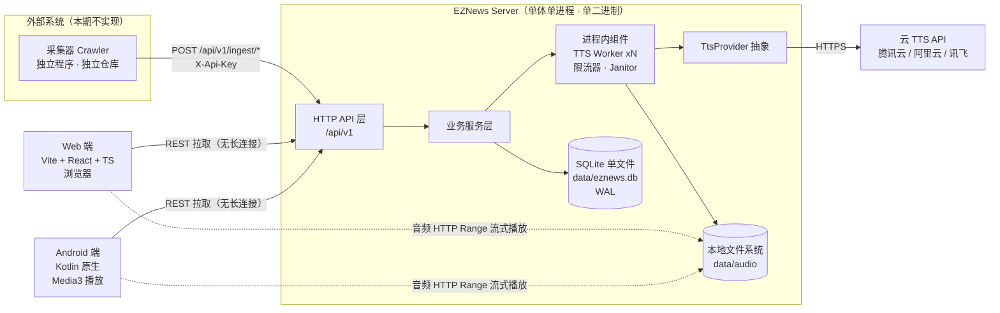

### 1.2 系统边界（硬约束，不可越界）

| 边界 | 归属 | 说明 |
| --- | --- | --- |
| 采集 / 爬取 / RSS 解析 / 正文抓取 | ❌ **服务端不做** | 服务端**没有**任何定时采集任务、没有 RSS 解析库、没有 HTTP 客户端去抓新闻站点（TTS 出网除外）。 |
| 文章标准化与提交 | ✅ 外部采集器 | 采集器自行抓取解析，按第 3 章契约调用 ingest 写入。 |
| 接收 / 存储 / 查询 / 合成 | ✅ 服务端 | 单体进程内的全部能力。 |
| 语音合成 | ✅ 服务端（唯一） | 客户端**只播放**，禁止端侧 TTS。 |
| 数据同步 | ✅ 客户端主动拉 | 无 WebSocket / 无 SSE / 无 FCM / 无极光 / 无长连接。 |

> **边界守卫**：服务端代码库中**不允许出现** `net/http.Client` 用于抓取新闻源（只允许 TTS SDK 出网）；代码评审时以此为准则。未来接入真实采集器，**服务端代码零改动**——这是本架构的核心承诺。

### 1.3 资源预算（对齐 PRD 第 7 章）

| 维度 | 目标 | 达成手段 |
| --- | --- | --- |
| 常驻内存 | **< 150 MB**（实际预期 25–45 MB） | Go 运行时基线 ~8 MB；SQLite 页缓存限 16 MB；无 ORM、无连接池膨胀 |
| 空闲 CPU | 近 0 | 无轮询；Janitor 使用低频定时器（默认 1 次/小时）；worker 阻塞在 channel 上 |
| 部署体积 | 镜像 **< 100 MB**（实际预期 **20–35 MB**） | Go 静态二进制 + `scratch`/`distroless-static` 基础镜像；无运行时依赖 |
| 中间件 | 0 个 | 无 Redis / MQ / ES / Nginx（可选由部署层提供 HTTPS 反代） |
| 磁盘 | DB 单文件 + 音频目录 | 90 天文章保留 + 音频容量上限 LRU |

---

## 2. 技术选型与论证

### 2.1 服务端语言与框架（★ 待用户确认项 A1）

评选标准严格按用户给定：**省资源 > 单文件部署 > SQLite 生态 > TTS SDK 可用性**。

| 维度（权重） | **Go 1.22+（首选）** | Node.js 20 + TS（Fastify） | Python 3.12 + FastAPI |
| --- | --- | --- | --- |
| 部署形态 | **单个静态二进制**，`CGO_ENABLED=0` 交叉编译；镜像可用 `scratch` | 需 Node 运行时 + `node_modules`；单文件需 pkg/nexe（不成熟） | 需解释器 + venv；单文件需 PyInstaller（体积 80 MB+，启动慢） |
| 镜像体积 | **20–35 MB** | 90–180 MB（slim/alpine） | 150–300 MB |
| 常驻内存基线 | **8–20 MB** | 45–90 MB（V8 heap + 基线） | 40–100 MB（解释器 + uvicorn） |
| 空闲 CPU | **近 0**（GPM 调度，阻塞在 netpoll） | 低（事件循环，但 GC 有抖动） | 低（GIL + asyncio，但内存回收抖动） |
| SQLite 生态 | **成熟**：`modernc.org/sqlite`（纯 Go，无 CGO）/ `mattn/go-sqlite3`（CGO，性能最佳）；原生支持 UPSERT、FTS5、行值比较 | `better-sqlite3`（需 node-gyp 原生编译）/ `node:sqlite`（实验性） | 内置 `sqlite3`（自带，FTS5 视发行版而定） |
| 云 TTS SDK | **官方 Go SDK**（`tencentcloud-sdk-go/tencentcloud/tts`），也易自签 TC3-HMAC | 官方 JS SDK 可用 | 官方 Python SDK 最成熟 |
| 进程内 worker / 限流 | **goroutine + channel + `x/time/rate`，零额外依赖** | worker_threads / async 队列 | asyncio + 信号量，需额外库 |
| 批量写入吞吐 | **远超 500 篇/秒** | 达标 | 达标（GIL 下需批事务优化） |
| 开发迭代速度 | 中（类型安全、编译快） | 高（与 Web 端同语言、共享 TS 类型） | 最高 |
| 主要风险 | 团队若偏 TS 需额外学习 | 内存接近 150 MB 上限；原生模块编译 | 内存与镜像体积最不达标 |

**结论（推荐）**：

- **服务端：Go 1.22+**
- **HTTP 层：标准库 `net/http`**（Go 1.22 的 `ServeMux` 已支持 `METHOD /path/{id}` 路由），**不引入** Gin/Chi/Echo。理由：省掉第三方路由依赖，自写中间件链仅需约 80 行；Chi 亦为可接受备选（体积 <1 MB，纯标准库之上）。
- **数据库驱动：`modernc.org/sqlite`**（纯 Go，**无 CGO**，交叉编译零成本）。备选 `mattn/go-sqlite3`（性能约高 20–30%，但需 cgo 工具链）。
- **日志：标准库 `log/slog`**（Go 1.21+ 内置结构化日志，零依赖）。
- **限流：`golang.org/x/time/rate`**（官方扩展包，极小）。

> 备选 **Node.js + Fastify** 的唯一强理由是"与 Web 端共享 TypeScript 类型定义"。若团队认为该收益大于资源代价（内存接近上限、镜像翻倍），可通过 `openapi.yaml` **生成两端 TS 类型**来等价替代（见 §17.7），从而保住 Go 的资源优势。

### 2.2 Web 端

| 项 | 选择 | 理由 |
| --- | --- | --- |
| 构建 | **Vite 5** | 快、产物小 |
| 框架 | **React 18 + TypeScript** | 团队默认栈 |
| 样式 | **Tailwind CSS 3.4**（+ PostCSS） | 原子化、产物按需裁剪，gzip 后通常 5–15 KB |
| 组件库 | ❌ **不引入 MUI** | MUI + Emotion 运行时约 90–130 KB gzip 且引入 runtime CSS-in-JS 开销，与"轻量"目标冲突。改为**自研 8 个基础组件**（Button / Modal / Switch / SearchBox / Skeleton / Tabs / Badge / EmptyState），总量 <5 KB |
| 请求/缓存 | **@tanstack/react-query v5** | 约 13 KB gzip；提供重试、失效刷新、分页缓存，显著降低增量刷新代码量 |
| 轻量状态 | **zustand** | 约 1.2 KB；播放器状态 + 本地偏好 |
| 图标 | **lucide-react** | 按需 tree-shaking |
| 字体 | Noto Sans SC（子集化或系统字体回退） | 沿用 PRD 视觉约定 |

### 2.3 Android 端

| 项 | 选择 | 理由 |
| --- | --- | --- |
| 语言 | **Kotlin**（PRD-D1） | — |
| UI | **Jetpack Compose + Material3** | 官方主推、代码量小、与 Media3 集成良好；APK 增量约 1.5–3 MB。备选 XML+RecyclerView（体积略小但代码量翻倍） |
| 网络 | **Retrofit 2 + OkHttp 3 + kotlinx.serialization** | 稳定轻量；Moshi 亦可 |
| 图片 | **Coil（coil-compose）** | 约 0.4 MB，Kotlin 优先 |
| 播放 | **AndroidX Media3（exoplayer + session）** | 前台服务 + MediaStyle 通知 + 音频焦点 + 锁屏控制的官方方案 |
| 本地偏好 | **DataStore Preferences** | 比 SharedPreferences 更好的异步 API，体积远小于 Room |
| 离线缓存 | **暂不引入 Room**（见待确认 Q-A3） | 音频缓存用"文件 + DataStore 索引（上限 200 条）" |
| 后台定时 | ❌ 不使用 WorkManager 做周期性拉取 | 与 D3（无推送/轮询）一致；冷启动 + 下拉刷新即足够。仅可用于低频缓存清理（可选） |

- `minSdk = 26`（Android 8.0，PRD-Q5 推荐），`targetSdk = 34`。

### 2.4 账号体系相关库选型（v1.1 新增）

> 选型前提（PRD-ACCOUNT.md §0.2、§3.5）：**不引入 Redis / MQ / OAuth / SMTP**，全部落在同一 SQLite 文件；账号体系常驻内存增量 **< 5 MB**；高频路径零 DB 查询。

| 能力 | 候选 | 结论 | 体积 / 资源影响 |
| --- | --- | --- | --- |
| JWT（HS256）签发与验签 | ① `github.com/golang-jwt/jwt/v5` ② 自写 HS256（约 60 行，用 `crypto/hmac` + `encoding/base64` + `encoding/json`） | **① golang-jwt/jwt/v5**：经过安全审计、API 稳定、纯标准库之上无传递依赖 | 二进制 **+~200 KB**；常驻内存可忽略 |
| 密码哈希 Argon2id | ① `golang.org/x/crypto/argon2`（官方扩展包，**纯 Go、无 CGO**）② `libargon2` CGO 绑定 | **① x/crypto/argon2**；PHC 字符串编解码自写（约 60 行）或可选 `github.com/alexedwards/argon2id`（单文件封装） | +~100 KB；**无常驻开销**（仅登录/注册瞬时占用，见下方内存峰值分析） |
| Refresh Token 随机串 | 标准库 `crypto/rand` + `base64.RawURLEncoding`（32 字节） | **标准库**，零依赖 | 0 |
| SHA-256（Refresh Token 入库哈希） | 标准库 `crypto/sha256` | **标准库** | 0 |
| 登录失败限流 | 复用 §3.7 的**进程内令牌桶 + LRU**（按 `username` / `IP` 维度）+ SQLite 计数兜底 | **复用现有机制**，不引入新组件 | ~几 KB |
| 会话 / 合并 / 同步 | 自写（标准库 + 现有 repo 层） | **自写**，无 ORM、无框架 | 0 |

> 明确排除：`casbin`（权限框架，本期无多角色需求，`role` 仅预留字段）、`oauth2` 系列、`goth`、`bcrypt`（OWASP 已不首选，抗 GPU 能力弱于 Argon2id）。

### 2.5 ★ Argon2id 并发内存峰值控制（v1.1 新增，重要）

PRD-ACCOUNT.md §7.2 指定 `m = 19 MiB, t = 2, p = 1`，**单次哈希瞬时占用约 19 MB**。与 §1.3 的「常驻内存 < 150 MB」并不冲突，但存在**并发叠加风险**：

| 并发登录数 | Argon2id 瞬时占用 | 叠加后进程峰值（基线 ~15 MB） | 是否触及 150 MB |
| --- | --- | --- | --- |
| 1 | ~19 MB | ~34 MB | 否 |
| 4 | ~76 MB | ~91 MB | 否（但已偏高） |
| 8 | ~152 MB | ~167 MB | **是** ❌ |

**架构措施（强制，PRD-DEC-9 —— 非可选优化）**：

1. 登录/注册路径设置 **Argon2id 并发信号量** `auth.argon2MaxConcurrency`（默认 **2**）→ 峰值约 `19 × 2 ≈ 38 MB`（叠加基线后远低于 150 MB）。
2. 超出信号量的请求**排队等待**，超时 `auth.argon2QueueTimeoutMs`（默认 **3000 ms**）→ 返回 **`503 SERVICE_BUSY` + `Retry-After`**（注意：是 503 而非 429，区别于 §3.7 的限流）。
3. `auth.argon2.memory`（**单位 KiB**，默认 `19456` = 19 MiB）可下调至 `12288`（12 MiB）以适配 256 MB 级 NAS；参数写入 PHC 字符串，**存量密码不受影响**（校验按各自 PHC 中的参数执行）。
4. 登录接口单独限流（§3.7 的 L2 机制扩展 `login` 维度：默认 5 req/min/username、20 req/min/IP）—— 限流**先于**信号量生效，减少无谓排队。
5. 该信号量与 TTS worker（§6.3）、ingest 写锁（§3.8）**相互独立**，互不影响。

> **命名约定（v1.1.2 修订）**：全表配置项（含账号相关）统一 **lowerCamelCase**，与 Go 结构体字段一一对应；环境变量仍为 `SCREAMING_SNAKE_CASE`。`PRD-ACCOUNT.md` §10.2 已同步。详见 §13.1「配置键命名约定」。

---

## 3. ★ 跨系统契约：Ingest API（本轮第一优先级）

> 本章是**采集器 ↔ 服务端**两个独立程序之间的边界。一旦冻结，服务端与采集器即可并行开发。
> 完整机器可读版本见 [`docs/api/openapi.yaml`](./api/openapi.yaml)（OpenAPI 3.1）。

### 3.1 端点总览

| 方法 | 路径 | 说明 | 鉴权 |
| --- | --- | --- | --- |
| `POST` | `/api/v1/ingest/articles` | 提交单篇文章 | ✅ `X-Api-Key` |
| `POST` | `/api/v1/ingest/articles/batch` | 批量提交（默认上限 200 篇/请求） | ✅ `X-Api-Key` |
| `GET` | `/api/v1/sources` | 采集器拉取源清单（含 `key`、`suggestInterval`） | ❌ 可选鉴权 |

### 3.2 鉴权方案

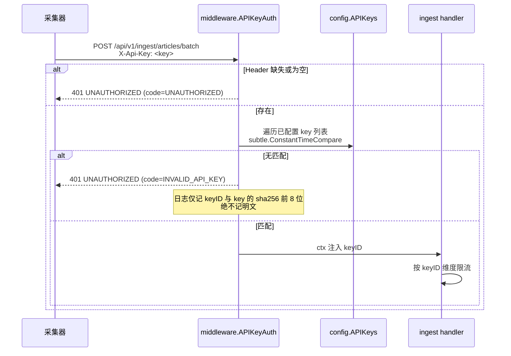

| 项 | 设计 |
| --- | --- |
| 传递方式 | 请求头 **`X-Api-Key: <token>`**（不使用 query 参数，避免出现在访问日志/代理日志中） |
| 配置 | `auth.apiKeys: [{id: "crawler-01", key: "${EZNEWS_API_KEY_1}"}]`，支持多 key 便于**按采集器隔离与轮换** |
| 比较算法 | 常数时间比较（`crypto/subtle.ConstantTimeCompare`），防时序侧信道 |
| 失败响应 | `401` + `{"code":"INVALID_API_KEY", ...}`，**不区分**"key 不存在"与"key 错误"（避免探测） |
| 日志脱敏 | 日志中只出现 `keyID` 与 `sha256(key)[:8]`；**永不打印明文 key** |
| 未配置时的行为 | 若 `auth.apiKeys` 为空 → 服务启动时**拒绝启动**（fail-fast），避免"裸奔上线" |
| 客户端（Web/Android）API | 查询类接口**不需要** `X-Api-Key`（按需可通过 `auth.requireKeyForRead` 开启） |

### 3.3 请求 Schema：`ArticleIngestItem`

**单篇** `POST /api/v1/ingest/articles`：请求体即一个 `ArticleIngestItem` 对象。
**批量** `POST /api/v1/ingest/articles/batch`：`{"items": [ArticleIngestItem, ...]}`，`items` 长度 `1..200`。

| 字段 | 类型 | 必填 | 约束 | 说明 |
| --- | --- | --- | --- | --- |
| `sourceKey` | string | 二选一 | 1–64；`[a-z0-9][a-z0-9_-]*` | **推荐**。源的稳定业务键（如 `sspai`、`36kr`），由 `GET /api/v1/sources` 获取 |
| `sourceId` | integer | 二选一 | int64 > 0 | `sourceKey` 的备选；两者都给且不一致 → `400 VALIDATION_FAILED` |
| `externalId` | string \| null | 条件 | ≤ 128 | 采集器侧唯一 ID。**有值时**与 `sourceId` 组成**去重键 1** |
| `url` | string(uri) | ✅ | ≤ 2048；必须 `http`/`https` | 原文链接。**必填**，规范化后为**去重键 2** |
| `title` | string | ✅ | trim 后 1–512 | 标题 |
| `summary` | string \| null | ❌ | ≤ 2000 | 摘要 |
| `content` | string \| null | ❌ | ≤ 20000 | 正文；服务端按 `ingest.storeContent`（默认 **false**）决定是否落库（PRD-Q3） |
| `category` | string \| null | ❌ | 枚举（见下表），未知值回落 `other` | 分类。**缺省（缺失 / `null` / `""`）时继承所属 `source` 的 `category`**；显式传值（含显式 `other`）以采集器值为准；源分类为空或非法时回落 `other` |
| `author` | string \| null | ❌ | ≤ 128 | 作者/媒体名 |
| `imageUrl` | string(uri) \| null | ❌ | ≤ 2048 | 缩略图 |
| `publishedAt` | string(date-time) | ✅ | RFC 3339 / ISO 8601，需带时区（无时区按 `ingest.defaultTimezone` 解析，默认 `UTC`） | 发布时间。校验：`now-365d ≤ publishedAt ≤ now+24h`，否则 `422 UNPROCESSABLE` |
| `language` | string \| null | ❌ | BCP 47，≤ 16，默认 `zh-CN` | 语言 |
| `tags` | string[] \| null | ❌ | ≤ 10 项，每项 1–32 | 标签 |

**`category` 枚举**：`tech` `finance` `sports` `world` `china` `ent` `life` `auto` `military` `science` `health` `other`。缺省时继承所属源的分类；显式传值时以传入值为准。

> ★ **逐轮覆盖语义，不是「首次落库即终态」**。每一轮摄入提交的 category 都是权威值，
> 缺省时的权威值 = 源分类。所以显式传 `other` 的文章，下一轮若改为缺省提交，会被源分类
> 覆盖（回执 `updated`）。
>
> **对采集器的硬要求**：每轮都要提交确定的 category —— 要么每轮都显式传（值可任意，含
> `other`），要么每轮都缺省（跟随源分类变化）。**禁止「首轮显式、后续缺省」**，那种写法会让
> 分类在两轮之间来回跳变，并持续刷新 `updated_at` 污染增量游标。
>
> 这条规则同时也解释了为什么 `category` 参与 contentHash：分类是客户端需要感知的真实变更，
> 用户改自定义源分类后，该源文章下次摄入回执 `updated` 是**刻意行为**而非缺陷。
> （注：默认源不允许改 category，只有自定义源可改，见 `SourceService.Update`。）

**示例**

```json
POST /api/v1/ingest/articles/batch
X-Api-Key: crawler-01-xxxxxxxxxxxx
Content-Type: application/json

{
  "items": [
    {
      "sourceKey": "sspai",
      "externalId": "sspai:91234",
      "url": "https://sspai.com/post/91234?utm_source=feed&from=timeline",
      "title": "新一代折叠屏手机发布，铰链寿命提升至 40 万次",
      "summary": "厂商公布新一代折叠屏，铰链寿命、屏幕平整度均有提升……",
      "content": null,
      "category": "tech",
      "author": "少数派编辑部",
      "imageUrl": "https://cdn.sspai.com/2025/10/cover.jpg",
      "publishedAt": "2025-10-06T09:12:30+08:00",
      "language": "zh-CN",
      "tags": ["折叠屏", "手机"]
    }
  ]
}
```

### 3.4 幂等去重语义（★ 含 `updated_at` 污染分析）

#### 3.4.1 问题：PRD 原始语义会污染增量游标

PRD §6.4 定义"命中已存在 → UPDATE 并刷新 `updated_at`"。但采集器的典型行为是**周期性重跑列表页**（如每 5 分钟抓一次最近 50 条全量提交）。若每次提交都刷新 `updated_at`：

```
09:00  采集器提交 50 篇 → 全部 created，updated_at = 09:00
09:05  采集器再次提交同样 50 篇（内容无变化）→ 全部 updated，updated_at = 09:05
09:10  同上 → updated_at = 09:10
...
→ 客户端每次增量拉取（cursor=上次水位）都会拉到这 50 篇"没变过的文章"
→ 增量拉取退化为全量拉取，带宽与客户端合并成本全部浪费，违背 PRD §1 原则 3
```

**结论：PRD 的原始语义会造成游标污染，必须修正。** 修正方案如下（不推翻产品决策，只是把 `updated` 细分为"`updated` 真实变更"与"`skipped` 无变化"）。

#### 3.4.2 修正方案：内容指纹比对 + 三态回执

**Step 1 — 计算规范化指纹 `contentHash`**

```
canonical = join("\n",
    trim(title),
    trim(summary),
    content      or "",
    imageUrl     or "",
    author       or "",
    category,
    str(publishedAt_ms))
contentHash = "v1:" + hex(sha256(canonical))[:32]
```

> 指纹**不包含** `url` / `externalId` / `tags`（URL 变动不代表内容变动，避免误判变更）；带 `v1:` 前缀便于算法演进。
>
> `category` 参与指纹，且缺省时会在**解析到源之后**（拿到 `source.category`）才定值并重算指纹。因此用户修改某个源的分类后，该源下所有文章在下次摄入时都会回执 `updated` —— 这是刻意设计：分类变更是客户端需要感知的真实变更，不应被指纹去重静默吞掉。

**Step 2 — URL 规范化 → `urlNorm` / `urlHash`**

```
1. trim
2. scheme、host 转小写
3. 去除默认端口（:80 / :443）
4. 去除 fragment（# 之后全部）
5. 解析 query，删除追踪参数（utm_*、spm、from、ref、share_*、share_source、hmsr 等，列表可配）
6. 剩余 query 按 key 升序重排后重建
7. path 去掉末尾 "/"（保留根 "/"）
urlHash = hex(sha256(urlNorm))[:32]
```

**Step 3 — 查找与判定（单个写事务内批量完成）**

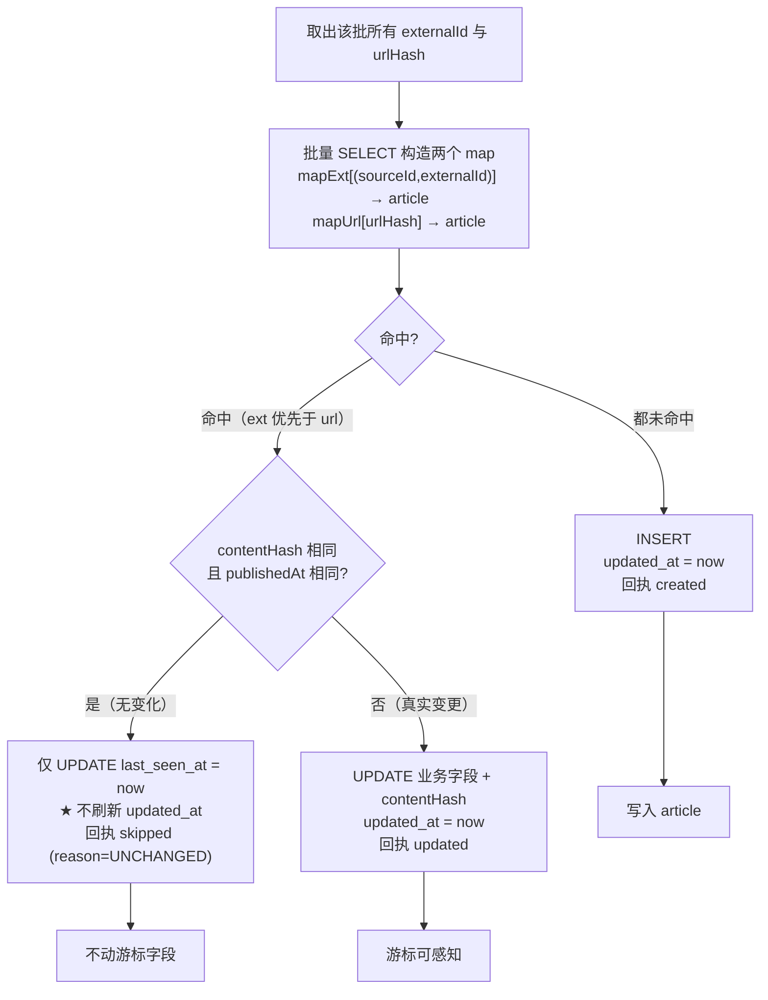

| 命中场景 | 判定 | 行为 | 回执 | `updated_at` |
| --- | --- | --- | --- | --- |
| 新文章 | 无命中 | `INSERT` | `created` | = now |
| 已存在 + 内容**有**变化 | `contentHash` 不同 | `UPDATE` 业务字段 | `updated` | **= now** ✅ |
| 已存在 + 内容**无**变化 | `contentHash` 相同 | 只刷 `last_seen_at` | `skipped`（`reason=UNCHANGED`） | **不变** ✅ |
| 两个去重键命中**不同**记录 | 冲突 | 不写库 | `failed`（`reason=DEDUP_CONFLICT`） | 不变 |

**关键设计点**

1. `updated_at` **只在语义真实变更时刷新** → 增量游标保持纯净（与第 5 章协同）。
2. `last_seen_at`（每次被提交时刷新，**不参与游标**）用于：采集器活跃度观测、未来"长期未被采集到的源"健康检查、以及可选的"僵尸文章"清理。
3. `externalId` 去重键**优先于** `url` 去重键（同一篇文章 URL 变更但 externalId 稳定时，应更新而非新增）。
4. 命中两条不同记录（`externalId` 指向 A、`url` 指向 B，A≠B）→ 判为 `failed`/`DEDUP_CONFLICT`，交由人工/采集器修正，避免静默数据错乱。
5. 去重键 1 使用**部分唯一索引**（`external_id IS NOT NULL AND external_id <> ''`），允许"无 externalId"的文章共存；此时由 url 去重键兜底。
6. 实现细节：UPDATE 使用 `WHERE content_hash <> ?` 条件，通过 `RowsAffected()==0` 判定为 `skipped`，避免"先查后写"的 TOCTOU 竞争。

**未知来源处理**：`sourceKey`/`sourceId` 找不到对应源时 → 该条 `failed`（`reason=SOURCE_NOT_FOUND`）。可由配置 `ingest.autoCreateSource=true`（默认 **false**）开启自动建源——默认关闭以防采集器脏数据污染源表。

### 3.5 回执结构

**成功（HTTP 200，即使有 failed 条目也返回 200，因为是"业务级部分成功"）**

```json
{
  "code": "OK",
  "message": "ok",
  "requestId": "V1StGXR8_Z5jdHi6B-myT",
  "data": {
    "received": 200,
    "created": 118,
    "updated": 32,
    "skipped": 45,
    "failed": 5,
    "durationMs": 87,
    "results": [
      { "index": 7,  "status": "failed", "reason": "VALIDATION_FAILED",
        "field": "title", "message": "title 不能为空",
        "externalId": "sspai:91299", "url": "https://sspai.com/post/91299" },
      { "index": 42, "status": "failed", "reason": "SOURCE_NOT_FOUND",
        "message": "未找到 sourceKey=unknown-site", "sourceKey": "unknown-site" }
    ]
  }
}
```

| 字段 | 类型 | 说明 |
| --- | --- | --- |
| `received` | int | 收到的条目数 |
| `created` / `updated` / `skipped` / `failed` | int | 恒等式：`created + updated + skipped + failed = received` |
| `results` | array \| null | **默认只含 `failed` 明细**（避免响应体膨胀）；`?verbose=all` 时返回全部条目（含 `articleId`），最多 200 条 |
| `results[].index` | int | 在 `items` 中的下标（0-based），批量定位用 |
| `results[].status` | enum | `created` / `updated` / `skipped` / `failed` |
| `results[].reason` | string | `UNCHANGED` / `VALIDATION_FAILED` / `SOURCE_NOT_FOUND` / `DEDUP_CONFLICT` / `INTERNAL` |
| `results[].articleId` | int64 \| null | 成功（含 skipped）时的服务端文章 ID；`verbose=all` 才有 |

**失败（HTTP 非 2xx）**：整批拒绝，无 `data.results` 中的计数。

```json
{
  "code": "VALIDATION_FAILED",
  "message": "请求参数校验失败",
  "requestId": "V1StGXR8_Z5jdHi6B-myT",
  "data": {
    "details": [
      { "field": "items[3].url", "message": "必须是合法的 http/https URL" },
      { "field": "items[5].publishedAt", "message": "发布时间超出允许区间" }
    ]
  }
}
```

### 3.6 错误码表

| HTTP | `code` | 触发条件 | 采集器建议动作 |
| --- | --- | --- | --- |
| 400 | `BAD_REQUEST` | JSON 解析失败 / 结构不符 | 修 bug，不重试 |
| 400 | `VALIDATION_FAILED` | 字段必填、长度、格式、枚举校验失败（含 `details[]`） | 修正该条后重投 |
| 401 | `UNAUTHORIZED` | 缺少 `X-Api-Key` | 检查配置 |
| 401 | `INVALID_API_KEY` | Key 无效/已吊销 | 更新密钥，不重试 |
| 404 | `NOT_FOUND` | 路径不存在 | 修 bug |
| 409 | `CONFLICT` | 并发写入导致唯一约束冲突（兜底路径） | 重试该条 |
| 413 | `PAYLOAD_TOO_LARGE` | Body > 4 MB 或 `items` > `ingest.maxBatchItems` | **拆分为更小的批次** |
| 422 | `UNPROCESSABLE` | 语义校验失败（如 `publishedAt` 超区间、source 已停用） | 修正数据 |
| 429 | `RATE_LIMITED` | 触发限流（响应头带 `Retry-After`） | **按 `Retry-After` 退避重试** |
| 500 | `INTERNAL_ERROR` | 未预期错误 | 指数退避重试（幂等保证重试安全） |
| 503 | `DB_BUSY` | SQLite 写锁争用超过 `busy_timeout` | 退避重试（幂等安全） |

> **重试安全性**：ingest 接口是**幂等**的（去重键保证），采集器对 `429/500/503` 可**无条件安全重试**。

### 3.7 限流方案（无 Redis 前提）

进程内三层保护，全部基于标准库 + `golang.org/x/time/rate`，零中间件：

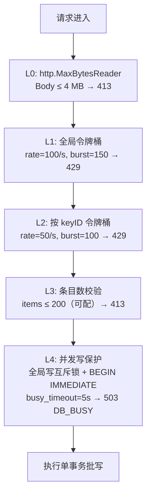

| 层 | 机制 | 默认值 | 内存开销 |
| --- | --- | --- | --- |
| L0 体量 | `http.MaxBytesReader` | 4 MB | 0 |
| L1 全局速率 | 令牌桶 `rate.NewLimiter(100, 150)` | 100 req/s | ~100 B |
| L2 单 key 速率 | 惰性 `map[string]*rate.Limiter` + LRU（上限 1024）+ 清理 goroutine（每 10 min 淘汰 30 min 未用） | 50 req/s / key | 每 key ~150 B，上限 ~150 KB |
| L3 条目数 | 长度校验 | 200 篇/请求 | 0 |
| L4 写并发 | `sync.Mutex` 串行化写事务 + `PRAGMA busy_timeout=5000` | 并发写 = 1 | 0 |
| L5 队列深度（TTS） | buffered channel | 512 | ~4 KB |

- 触发限流时返回 `429` + 响应头 `Retry-After: 1` + `X-RateLimit-Limit` / `X-RateLimit-Remaining`。
- **已知限制**：进程内限流在多实例部署下不共享。本项目按**单进程单实例**部署（PRD-D6），该限制可接受；若未来横向扩容，需在网关层限流（已在文档标注）。

### 3.8 批量写入事务策略（性能关键）

```
1. 获取全局写互斥锁
2. BEGIN IMMEDIATE                    -- 立即取写锁，避免锁升级死锁
3. 批量 SELECT 构造 mapExt / mapUrl   -- 每条 SQL 用 IN 分批（每批 ≤500）
4. 逐条判定：INSERT / UPDATE(WHERE content_hash <> ?) / 仅刷新 last_seen_at
   - 每条独立处理，坏条目记 failed 后跳过（不中断整批）
5. 同步更新 FTS 虚表（若启用）
6. COMMIT（或遇不可恢复错误 → ROLLBACK 整批）
7. 释放锁
```

- 单批 200 篇在**一个事务**内提交，实测可轻松超过 PRD 目标 500 篇/秒（SQLite 批事务下单表写入通常 >10k 行/秒）。
- 预编译语句（`sql.Stmt`）复用，避免重复解析 SQL。
- `PRAGMA synchronous=NORMAL` + WAL：崩溃时最多丢失最后一个 checkpoint 之后的提交，对新闻数据可接受。

### 3.9 OpenAPI 3.1 核心片段（内联）

> 完整版见 [`docs/api/openapi.yaml`](./api/openapi.yaml)。

```yaml
openapi: 3.1.0
info:
  title: EZNews Ingest & Query API
  version: 1.0.0
  summary: 外部采集器写入 + Web/Android 读取契约
servers:
  - url: http://localhost:8080
security:
  - ApiKeyAuth: []
paths:
  /api/v1/ingest/articles:
    post:
      tags: [ingest]
      operationId: ingestArticle
      security: [{ ApiKeyAuth: [] }]
      requestBody:
        required: true
        content:
          application/json:
            schema: { $ref: '#/components/schemas/ArticleIngestItem' }
      responses:
        '200': { description: 已接收并处理（含业务级失败明细）
          , content: { application/json: { schema: { $ref: '#/components/schemas/IngestReceipt' } } } }
        '400': { $ref: '#/components/responses/BadRequest' }
        '401': { $ref: '#/components/responses/Unauthorized' }
        '413': { $ref: '#/components/responses/PayloadTooLarge' }
        '429': { $ref: '#/components/responses/TooManyRequests' }

  /api/v1/ingest/articles/batch:
    post:
      tags: [ingest]
      operationId: ingestArticleBatch
      security: [{ ApiKeyAuth: [] }]
      parameters:
        - name: verbose
          in: query
          schema: { type: string, enum: [none, all], default: none }
          description: none=仅回传 failed 明细；all=回传全部条目（含 articleId）
      requestBody:
        required: true
        content:
          application/json:
            schema:
              type: object
              required: [items]
              properties:
                items:
                  type: array
                  minItems: 1
                  maxItems: 200
                  items: { $ref: '#/components/schemas/ArticleIngestItem' }
      responses:
        '200': { description: 已接收并处理
          , content: { application/json: { schema: { $ref: '#/components/schemas/IngestReceipt' } } } }
        '413': { $ref: '#/components/responses/PayloadTooLarge' }
        '429': { $ref: '#/components/responses/TooManyRequests' }

components:
  securitySchemes:
    ApiKeyAuth:
      type: apiKey
      in: header
      name: X-Api-Key

  schemas:
    ArticleIngestItem:
      type: object
      required: [url, title, publishedAt]
      properties:
        sourceKey:   { type: string, minLength: 1, maxLength: 64, pattern: '^[a-z0-9][a-z0-9_-]*$' }
        sourceId:    { type: integer, format: int64, minimum: 1 }
        externalId:  { type: [string, 'null'], maxLength: 128 }
        url:         { type: string, format: uri, maxLength: 2048 }
        title:       { type: string, minLength: 1, maxLength: 512 }
        summary:     { type: [string, 'null'], maxLength: 2000 }
        content:     { type: [string, 'null'], maxLength: 20000 }
        category:    { type: [string, 'null'], enum: [tech,finance,sports,world,china,ent,life,auto,military,science,health,other,'null'], description: 缺省继承 source.category }
        author:      { type: [string, 'null'], maxLength: 128 }
        imageUrl:    { type: [string, 'null'], format: uri, maxLength: 2048 }
        publishedAt: { type: string, format: date-time }
        language:    { type: [string, 'null'], maxLength: 16, default: 'zh-CN' }
        tags:        { type: [array, 'null'], maxItems: 10, items: { type: string, minLength: 1, maxLength: 32 } }
      # 语义校验：sourceKey 与 sourceId 至少提供其一

    IngestReceipt:
      type: object
      required: [received, created, updated, skipped, failed]
      properties:
        received:  { type: integer, minimum: 0 }
        created:   { type: integer, minimum: 0 }
        updated:   { type: integer, minimum: 0 }
        skipped:   { type: integer, minimum: 0 }
        failed:    { type: integer, minimum: 0 }
        durationMs:{ type: integer }
        results:
          type: [array, 'null']
          items:
            type: object
            required: [index, status]
            properties:
              index:      { type: integer, minimum: 0 }
              status:     { type: string, enum: [created, updated, skipped, failed] }
              reason:     { type: [string, 'null'], enum: [UNCHANGED, VALIDATION_FAILED, SOURCE_NOT_FOUND, DEDUP_CONFLICT, INTERNAL, 'null'] }
              field:      { type: [string, 'null'] }
              message:    { type: [string, 'null'] }
              articleId:  { type: [integer, 'null'], format: int64 }
              externalId: { type: [string, 'null'] }
              url:        { type: [string, 'null'] }
```

---

## 4. 数据模型（SQLite）

### 4.1 PRAGMA 与初始化

```sql
-- 连接建立后立即执行（init PRAGMA）
PRAGMA journal_mode = WAL;          -- 读写并发，写不阻塞读
PRAGMA synchronous  = NORMAL;       -- WAL 下兼顾性能与安全（崩溃最多丢最后 checkpoint）
PRAGMA foreign_keys = ON;
PRAGMA busy_timeout = 5000;         -- 写锁争用等待 5s，超时返回 SQLITE_BUSY → 503 DB_BUSY
PRAGMA cache_size   = -16000;       -- 页缓存约 16 MB（负值单位为 KB）
PRAGMA temp_store   = MEMORY;
PRAGMA wal_autocheckpoint = 1000;   -- 每 1000 页自动 checkpoint
PRAGMA auto_vacuum  = INCREMENTAL;  -- 仅对新库生效；存量库若非此模式则跳过并 warn
```

> **时间存储约定**：所有时间戳以 **INTEGER（Unix epoch 毫秒，UTC）** 存储。理由：① 索引更紧凑、比较更快；② 行值游标 `(updated_at, id) > (?, ?)` 无字符串排序歧义；③ 无时区/格式陷阱。API 层统一序列化为 **ISO 8601 UTC（毫秒精度，如 `2025-10-06T01:34:56.789Z`）**。

### 4.2 完整 DDL

```sql
-- ============ 1. 新闻源 ============
CREATE TABLE IF NOT EXISTS source (
  id               INTEGER PRIMARY KEY AUTOINCREMENT,
  key              TEXT    NOT NULL,                -- 稳定业务键，采集器引用
  name             TEXT    NOT NULL,
  url              TEXT    NOT NULL,
  type             TEXT    NOT NULL DEFAULT 'rss',  -- rss | atom | api | manual
  category         TEXT    NOT NULL DEFAULT 'other',
  is_default       INTEGER NOT NULL DEFAULT 0,      -- 1=系统默认源（不可删除）
  enabled          INTEGER NOT NULL DEFAULT 1,      -- 停用后其文章不进入默认列表
  suggest_interval INTEGER NOT NULL DEFAULT 1800,   -- 建议采集间隔(秒)，供采集器参考
  icon_url         TEXT,
  language         TEXT    NOT NULL DEFAULT 'zh-CN',
  remark           TEXT,
  owner_user_id    INTEGER REFERENCES user(id) ON DELETE CASCADE,  -- v1.1 预留：NULL=全局共享
  created_at       INTEGER NOT NULL,                -- epoch ms
  updated_at       INTEGER NOT NULL
);
CREATE UNIQUE INDEX IF NOT EXISTS ux_source_key    ON source(key);
CREATE INDEX        IF NOT EXISTS idx_source_list  ON source(enabled, category, name);
CREATE INDEX        IF NOT EXISTS idx_source_owner ON source(owner_user_id);  -- 未来隔离用

-- ============ 2. 文章 ============
CREATE TABLE IF NOT EXISTS article (
  id            INTEGER PRIMARY KEY AUTOINCREMENT,
  source_id     INTEGER NOT NULL REFERENCES source(id) ON DELETE CASCADE,

  -- 去重键 1：source_id + external_id（external_id 可为空，用部分唯一索引）
  external_id   TEXT,
  -- 去重键 2：规范化 URL 的哈希
  url           TEXT    NOT NULL,   -- 原始 URL（展示/跳转用）
  url_norm      TEXT    NOT NULL,   -- 规范化 URL（排错用）
  url_hash      TEXT    NOT NULL,   -- hex(sha256(url_norm))[:32]

  title         TEXT    NOT NULL,
  summary       TEXT    NOT NULL DEFAULT '',
  content       TEXT,                        -- 默认不落库（ingest.storeContent=false）
  content_hash  TEXT    NOT NULL,            -- "v1:"+hex(sha256(canonical))[:32]

  category      TEXT    NOT NULL DEFAULT 'other',
  author        TEXT,
  image_url     TEXT,
  language      TEXT    NOT NULL DEFAULT 'zh-CN',
  tags_json     TEXT    NOT NULL DEFAULT '[]',   -- JSON 数组；不建关联表（省资源）

  published_at  INTEGER NOT NULL,   -- 发布时间（采集器提供）
  created_at    INTEGER NOT NULL,   -- 入库时间
  updated_at    INTEGER NOT NULL,   -- ★ 增量游标依据：仅内容真实变更时刷新
  last_seen_at  INTEGER NOT NULL    -- 每次被提交时刷新；★ 不参与游标
);

CREATE UNIQUE INDEX IF NOT EXISTS ux_article_ext
  ON article(source_id, external_id)
  WHERE external_id IS NOT NULL AND external_id <> '';   -- 部分唯一索引
CREATE UNIQUE INDEX IF NOT EXISTS ux_article_url  ON article(url_hash);

CREATE INDEX IF NOT EXISTS idx_article_cursor   ON article(updated_at, id);              -- 增量游标
CREATE INDEX IF NOT EXISTS idx_article_pub      ON article(published_at DESC, id DESC);  -- 列表排序
CREATE INDEX IF NOT EXISTS idx_article_src_pub  ON article(source_id, published_at DESC, id DESC);
CREATE INDEX IF NOT EXISTS idx_article_cat_pub  ON article(category, published_at DESC, id DESC);
CREATE INDEX IF NOT EXISTS idx_article_seen     ON article(last_seen_at);                -- 采集活跃度/清理

-- ============ 3. TTS 合成任务 ============
CREATE TABLE IF NOT EXISTS audio_task (
  id            INTEGER PRIMARY KEY AUTOINCREMENT,
  article_id    INTEGER NOT NULL REFERENCES article(id) ON DELETE CASCADE,
  voice         TEXT    NOT NULL,
  speed         REAL    NOT NULL,
  status        TEXT    NOT NULL DEFAULT 'pending',   -- pending|processing|ready|failed
  provider      TEXT,                                  -- tencent | ali | xunfei
  audio_id      INTEGER,                               -- ready 后回填
  error_code    TEXT,
  error_msg     TEXT,
  retry_count   INTEGER NOT NULL DEFAULT 0,
  next_retry_at INTEGER,                               -- 退避重投时间
  text_chars    INTEGER NOT NULL DEFAULT 0,
  created_at    INTEGER NOT NULL,
  updated_at    INTEGER NOT NULL
);
CREATE UNIQUE INDEX IF NOT EXISTS ux_task_cache  ON audio_task(article_id, voice, speed); -- 防重复合成
CREATE INDEX        IF NOT EXISTS idx_task_queue ON audio_task(status, next_retry_at, id);

-- ============ 4. 音频 ============
CREATE TABLE IF NOT EXISTS audio (
  id             INTEGER PRIMARY KEY AUTOINCREMENT,
  task_id        INTEGER REFERENCES audio_task(id) ON DELETE SET NULL,
  article_id     INTEGER NOT NULL REFERENCES article(id) ON DELETE CASCADE,
  voice          TEXT    NOT NULL,
  speed          REAL    NOT NULL,
  format         TEXT    NOT NULL DEFAULT 'mp3',
  file_path      TEXT    NOT NULL,      -- 相对 audioDir 的路径
  size_bytes     INTEGER NOT NULL DEFAULT 0,
  duration_ms    INTEGER NOT NULL DEFAULT 0,
  sample_rate    INTEGER NOT NULL DEFAULT 16000,
  provider       TEXT,
  hit_count      INTEGER NOT NULL DEFAULT 0,
  last_access_at INTEGER NOT NULL,      -- LRU 依据
  created_at     INTEGER NOT NULL
);
CREATE UNIQUE INDEX IF NOT EXISTS ux_audio_cache ON audio(article_id, voice, speed);
CREATE INDEX        IF NOT EXISTS idx_audio_lru   ON audio(last_access_at, size_bytes);

-- ============ 5. 元数据 ============
CREATE TABLE IF NOT EXISTS schema_meta (
  key   TEXT PRIMARY KEY,
  value TEXT NOT NULL
);  -- 初始写入 schema_version = "1"

-- ============ 6. 全文检索（P1，可选启用） ============
CREATE VIRTUAL TABLE IF NOT EXISTS article_fts USING fts5(
  title,
  summary,
  content = 'article',
  content_rowid = 'id',
  tokenize = 'trigram'      -- 支持中文子串匹配，需 SQLite >= 3.42
);
-- 同步触发器
CREATE TRIGGER IF NOT EXISTS trg_article_ai AFTER INSERT ON article BEGIN
  INSERT INTO article_fts(rowid, title, summary) VALUES (new.id, new.title, new.summary);
END;
CREATE TRIGGER IF NOT EXISTS trg_article_ad AFTER DELETE ON article BEGIN
  INSERT INTO article_fts(article_fts, rowid, title, summary) VALUES('delete', old.id, old.title, old.summary);
END;
CREATE TRIGGER IF NOT EXISTS trg_article_au AFTER UPDATE ON article BEGIN
  INSERT INTO article_fts(article_fts, rowid, title, summary) VALUES('delete', old.id, old.title, old.summary);
  INSERT INTO article_fts(rowid, title, summary) VALUES (new.id, new.title, new.summary);
END;
```

> **FTS 降级方案**：若 SQLite < 3.42 无 `trigram`，退化为 `tokenize='unicode61'`（英文/空格分词良好，中文整段成词），或直接降级为 `LIKE '%kw%'`（数据量 ≤10 万时 P95 仍 <200 ms 可接受）。由 `search.enableFts` 配置开关控制。

### 4.3 账号体系表（v1.1 新增）

**迁移编排说明**：`user` 表放在 **`001_init.sql`**（因为 `source.owner_user_id` 需要外键引用它，而 SQLite 无法为已存在的表追加外键约束）；其余账号表放在 **`002_account.sql`**；FTS 顺延为 `003_fts.sql`。三份迁移按版本号顺序执行，全部落在**同一个 SQLite 文件**。

```sql
-- ============ 7. user（v1.1，位于 001_init.sql） ============
CREATE TABLE IF NOT EXISTS user (
  id             INTEGER PRIMARY KEY AUTOINCREMENT,
  username       TEXT    NOT NULL,                 -- 3–32 字符，大小写敏感
  password_hash  TEXT    NOT NULL,                 -- Argon2id PHC 字符串（含参数与盐）
  email          TEXT,                             -- 选填，本期不验证
  role           TEXT    NOT NULL DEFAULT 'user',  -- admin 预留
  token_version  INTEGER NOT NULL DEFAULT 1,       -- +1 使全部已签发 Access Token 失效
  created_at     INTEGER NOT NULL,
  updated_at     INTEGER NOT NULL,
  last_login_at  INTEGER
);
CREATE UNIQUE INDEX IF NOT EXISTS ux_user_name  ON user(username);
CREATE INDEX        IF NOT EXISTS idx_user_email ON user(email) WHERE email IS NOT NULL;

-- ============ 8. session（Refresh Token，v1.1） ============
CREATE TABLE IF NOT EXISTS session (
  id                  INTEGER PRIMARY KEY AUTOINCREMENT,  -- ★ 即 JWT 的 sid（DEC-14）；AUTOINCREMENT 防 rowid 复用
  user_id             INTEGER NOT NULL REFERENCES user(id) ON DELETE CASCADE,
  refresh_token_hash  TEXT    NOT NULL,            -- hex(sha256(token))，绝不明文
  device_name         TEXT,
  client_id           TEXT    NOT NULL,
  last_seen_at        INTEGER NOT NULL,
  expires_at          INTEGER NOT NULL,            -- 30 天
  revoked_at          INTEGER,                     -- P2 踢下线预留
  -- v1.1.1（DEC-7）：保留"前一代"token hash，用于 refresh reuse 宽限判定
  prev_refresh_token_hash TEXT,                    -- 上一代 refresh token 的 hash（轮换时挪入）
  prev_rotated_at         INTEGER,                 -- 上一代被轮换的时刻（60s 宽限窗口起算点）
  created_at          INTEGER NOT NULL
);
CREATE UNIQUE INDEX IF NOT EXISTS ux_session_rt    ON session(refresh_token_hash);
CREATE INDEX        IF NOT EXISTS idx_session_user  ON session(user_id, expires_at);
CREATE INDEX        IF NOT EXISTS idx_session_seen  ON session(user_id, last_seen_at DESC);
CREATE INDEX        IF NOT EXISTS idx_session_prev  ON session(prev_refresh_token_hash)
  WHERE prev_refresh_token_hash IS NOT NULL;       -- reuse 检测专用（部分索引）

-- ============ 9. user_favorite（收藏，含墓碑） ============
CREATE TABLE IF NOT EXISTS user_favorite (
  id          INTEGER PRIMARY KEY AUTOINCREMENT,
  user_id     INTEGER NOT NULL REFERENCES user(id)    ON DELETE CASCADE,
  article_id  INTEGER NOT NULL REFERENCES article(id) ON DELETE CASCADE,
  deleted_at  INTEGER,                 -- 墓碑：非 NULL = 已取消收藏
  created_at  INTEGER NOT NULL,
  updated_at  INTEGER NOT NULL         -- LWW 冲突判定依据
);
CREATE UNIQUE INDEX IF NOT EXISTS ux_fav      ON user_favorite(user_id, article_id);  -- ★ 幂等防翻倍
CREATE INDEX        IF NOT EXISTS idx_fav_sync ON user_favorite(user_id, updated_at, id);  -- 增量同步

-- ============ 10. user_read（已读，含墓碑） ============
CREATE TABLE IF NOT EXISTS user_read (
  id          INTEGER PRIMARY KEY AUTOINCREMENT,
  user_id     INTEGER NOT NULL REFERENCES user(id)    ON DELETE CASCADE,
  article_id  INTEGER NOT NULL REFERENCES article(id) ON DELETE CASCADE,
  deleted_at  INTEGER,
  created_at  INTEGER NOT NULL,
  updated_at  INTEGER NOT NULL
);
CREATE UNIQUE INDEX IF NOT EXISTS ux_read       ON user_read(user_id, article_id);
CREATE INDEX        IF NOT EXISTS idx_read_sync ON user_read(user_id, updated_at, id);

-- ============ 11. user_preference（偏好 KV） ============
CREATE TABLE IF NOT EXISTS user_preference (
  user_id     INTEGER NOT NULL REFERENCES user(id) ON DELETE CASCADE,
  key         TEXT    NOT NULL,        -- tts.voice / tts.speed / ui.density …（含 "." 命名空间）
  value       TEXT    NOT NULL,        -- JSON 标量或字符串
  updated_at  INTEGER NOT NULL,
  PRIMARY KEY (user_id, key)
) WITHOUT ROWID;                       -- 纯 KV 点查，去掉冗余 rowid

-- ============ 12. merge_log（合并幂等日志） ============
CREATE TABLE IF NOT EXISTS merge_log (
  id          INTEGER PRIMARY KEY AUTOINCREMENT,
  user_id     INTEGER NOT NULL REFERENCES user(id) ON DELETE CASCADE,
  client_id   TEXT    NOT NULL,
  nonce       TEXT    NOT NULL,
  result_json TEXT    NOT NULL,        -- 结果快照；重复提交直接回放
  created_at  INTEGER NOT NULL
);
CREATE UNIQUE INDEX IF NOT EXISTS ux_merge ON merge_log(user_id, client_id, nonce);  -- ★ 幂等落地
```

#### 4.3.1 关键设计决策

| 设计点 | 方案 | 理由 |
| --- | --- | --- |
| 收藏/已读幂等 | 唯一键 `(user_id, article_id)` + `INSERT ... ON CONFLICT DO UPDATE` | 合并请求重复提交**不会翻倍**（US-ACC-03 验收点） |
| 取消收藏的表达 | `deleted_at` **墓碑**，而非物理删除 | 防止"本地已取消、云端旧正向记录按 updated_at 胜出导致复活"（US-ACC-04 验收点） |
| LWW 冲突判定 | 比较两侧 `updated_at`，**较新者胜出**；`deleted_at` 作为其中一种状态参与判定 | 并集语义对用户损失最小 |
| 偏好存储形态 | **KV 表** `(user_id, key)` + `WITHOUT ROWID` | 新增偏好项不改表结构；点查最快；整包覆盖无需墓碑 |
| Refresh Token 存储 | 库内**仅存 SHA-256 哈希**，唯一索引 | 拖库后无法冒用；`ux_session_rt` 同时保证哈希唯一 |
| **Refresh reuse 宽限（DEC-7）** | `session` 保留**前一代** `prev_refresh_token_hash` + `prev_rotated_at`，轮换时挪入而非置空 | 支撑"60s 内同一 client_id 重放 = 弱网重试"的判定，避免误伤移动端 |
| 全局登出 | `user.token_version += 1`，JWT 验签后比对 `tv` claim | **替代 Redis 黑名单**，零中间件 |
| 越权防护 | 所有 `/me/**` 从 JWT `sub` 取 `user_id`，**不接受**路径/参数传参 | 架构级约束，见 §9.5 |
| 级联删除 | 全部 `ON DELETE CASCADE`（user ↔ session/favorite/read/preference/merge_log） | 注销账号（物理删除）一行搞定 |

#### 4.3.2 合并的 SQL 实现（LWW + 墓碑）

```sql
-- 单条收藏合并（在 /me/merge 的同一事务内逐条执行）
INSERT INTO user_favorite (user_id, article_id, deleted_at, created_at, updated_at)
VALUES (?, ?, ?, ?, ?)
ON CONFLICT(user_id, article_id) DO UPDATE SET
    deleted_at = excluded.deleted_at,
    updated_at = excluded.updated_at
WHERE excluded.updated_at > user_favorite.updated_at;   -- ★ 仅当来者更新才覆盖（LWW）
```

- `RowsAffected()==0` → 记为 `skipped`（本地数据更旧，被云端保留）。
- 墓碑与正向记录**共用同一行**，`deleted_at` 为 NULL / 非 NULL 表达两种状态，判定逻辑统一。
- 整个 `/me/merge` 请求在**一个 `BEGIN IMMEDIATE` 事务**内完成（含 `merge_log` 写入），保证幂等与原子。

### 4.4 ER 图

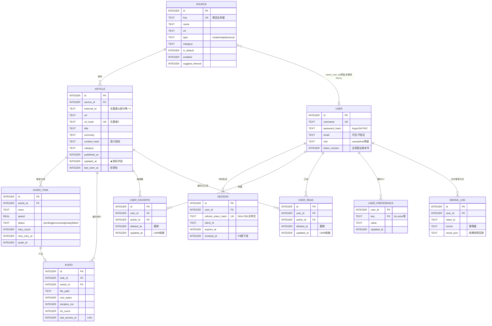

### 4.5 索引设计说明（含 v1.1 账号表）

| 索引 | 服务场景 | 备注 |
| --- | --- | --- |
| `ux_article_ext`（部分唯一） | 去重键 1 | 允许 `external_id` 为空的多篇文章共存 |
| `ux_article_url` | 去重键 2 | 用 hash 而非长 URL，索引更紧凑 |
| `idx_article_cursor (updated_at, id)` | **增量拉取游标**（第 5 章） | 行值比较直接命中 |
| `idx_article_pub (published_at DESC, id DESC)` | 列表首屏/翻页 | keyset 分页 |
| `idx_article_src_pub` / `idx_article_cat_pub` | 源筛选 / 分类筛选 | 组合列顺序 = 等值列在前、排序列在后 |
| `idx_audio_lru` | 音频 LRU 清理扫描 | 覆盖 `last_access_at` + `size_bytes` |
| `ux_fav` / `ux_read` | 收藏/已读幂等 | 唯一键保证合并重复提交**不翻倍** |
| `idx_fav_sync` / `idx_read_sync` | 收藏/已读增量同步 | `(user_id, updated_at, id)` —— 与文章列表**复用同一游标语义**（§5） |
| `ux_session_rt` | Refresh Token 查会话 | 唯一索引兼防哈希碰撞写入 |
| `idx_session_user` | 会话列表 / 过期清理 | `(user_id, expires_at)` |
| `idx_session_prev` | **refresh reuse 检测**（DEC-7） | 部分索引，仅覆盖 `prev_refresh_token_hash IS NOT NULL` 的少量行 |
| `ux_merge` | 合并幂等 | `(user_id, client_id, nonce)` |
| `idx_source_owner` | 未来源的个人归属隔离 | 本期恒 NULL，不影响当前查询计划 |

**停用源过滤**：列表查询用 `JOIN source s ON s.id = a.source_id AND s.enabled = 1`。10 万行规模下 JOIN 成本可忽略；若未来成为瓶颈，可冗余 `source_enabled` 列进 `article` 并加入索引（此时需在源启停时批量更新，故本期不做）。

### 4.6 归档与清理（Janitor）

进程内单个低频 goroutine（`time.Ticker`），默认 **1 小时**触发一次，串行执行以下三步：

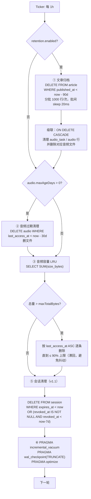

| 策略 | 配置项 | 默认值 | 说明 |
| --- | --- | --- | --- |
| 文章保留 | `retention.enabled` / `retention.days` | `true` / **90 天** | 按 `published_at` 判定（非入库时间），符合直觉 |
| 音频过期 | `audio.maxAgeDays` | **30 天** | 按 `last_access_at` |
| 音频容量 | `audio.maxTotalBytes` | **2 GiB**（待确认 Q-A4） | 触发后清理至 90% 上限 |
| 清理批量 | 内建 | 1000 行/批 | 避免长事务锁库 |
| 过期会话 | 内建（v1.1） | `expires_at < now`；已吊销的保留 7 天后删 | 与文章归档同轮执行，无需独立定时器 |
| 空间回收 | `PRAGMA incremental_vacuum` | 每次 Janitor 后 | 不做全量 `VACUUM`（需双倍磁盘且锁库） |
| 保护 | 内建 | — | 运行中每个子任务有超时（默认 30s），失败只记日志不中断进程 |

- **删除的可见性**：被归档删除的文章客户端不会收到"删除事件"（无推送）。客户端本地按 `publishedAt` 做 N 天过期清理即可保持一致。
- **文章删除对用户数据的级联**：`article` 被归档删除时，`user_favorite` / `user_read` 通过 `ON DELETE CASCADE` 一并清理，用户侧不留悬空引用（客户端本地若有残留条目，请求详情时返回 `404`，客户端应自行剔除）。
- **注销账号（v1.1）**：`DELETE /api/v1/me` 物理删除 `user` 行，session / favorite / read / preference / merge_log 全部级联删除；`source.owner_user_id` 为该用户的源一并删除（本期恒 NULL，无实际影响）。

---

## 5. 增量拉取游标统一语义

### 5.1 设计要点

| 问题 | 方案 |
| --- | --- |
| 游标依据 | `updated_at`（epoch ms）而非自增 `id`：因为**更新**也需被感知，纯 `id` 游标无法覆盖内容修正 |
| 同一毫秒多条 | 复合键 **`(updated_at, id)`**，用 `id` 打破平局，keyset 比较 `(updated_at, id) > (?, ?)`（SQLite 3.15+ 行值比较，直接走 `idx_article_cursor`） |
| 时钟/未来时间 | 入库时 `updated_at` 由**服务端**生成 = `now_ms`；`published_at` 已做 ≤ now+24h 校验 |
| 漏数据风险 | 水位取自"请求处理时刻 `now_ms - overlap(2s)`"，2 秒重叠窗口容忍写入延迟；客户端按 `id` 本地去重即可 |

### 5.2 两种模式的参数分离（避免游标语义混淆）

| 模式 | 触发 | 请求参数 | 排序 | 响应游标 |
| --- | --- | --- | --- | --- |
| **首屏 / 翻页** | 无 `cursor` | `limit`（默认 20，最大 100）、`pageCursor`、`category`、`sourceId`、`from`/`to`、`q` | `published_at DESC, id DESC` | `nextPageCursor` + **`syncCursor`**（服务端当前水位） |
| **增量同步** | 带 `cursor` | `cursor`、`limit`（默认 100，最大 200） | `updated_at ASC, id ASC` | `nextCursor` + `hasMore` |

```sql
-- 增量模式
SELECT a.* FROM article a
JOIN source s ON s.id = a.source_id AND s.enabled = 1
WHERE (a.updated_at, a.id) > (?, ?)
  [AND a.category = ?] [AND a.source_id = ?]
ORDER BY a.updated_at ASC, a.id ASC
LIMIT ?;

-- 首屏/翻页模式
SELECT a.* FROM article a
JOIN source s ON s.id = a.source_id AND s.enabled = 1
WHERE (a.published_at, a.id) < (?, ?)      -- pageCursor，空则不加此条件
  [AND a.category = ?] [AND a.source_id = ?]
ORDER BY a.published_at DESC, a.id DESC
LIMIT ?;
```

**游标编码**：`base64url("<epochMs>:<id>")`，例如 `MTczMDAwMDAwMDAwMDow` → 对客户端**不透明**（opaque），服务端可自由演进内部格式。

### 5.3 响应结构

```json
{
  "code": "OK", "message": "ok", "requestId": "...",
  "data": {
    "items": [ /* ArticleDTO[] */ ],
    "nextCursor": "MTczMDAwMDAwMDEyMzoxMjM=",   // 增量模式；hasMore=false 时为 null
    "nextPageCursor": "MTczMDAwMDAwMDAwMDo5OTk=", // 翻页模式；无更多时为 null
    "syncCursor": "MTczMDAwMDAwMjAwMDow",        // 服务端水位（now-2s），客户端保存用于下次增量
    "hasMore": true,
    "serverTime": "2025-10-06T01:34:56.789Z",
    "serverTimeMs": 1730000000000
  }
}
```

### 5.4 客户端同步算法（两端一致）

```
1. 冷启动：GET /articles?limit=20
   → 渲染首屏；本地持久化 syncCursor = 响应中的 syncCursor
2. 增量刷新（下拉刷新 / 定时 / 回到前台）：
   loop:
     GET /articles?cursor=<syncCursor>&limit=100
     → 本地按 id 合并（新增插入、已存在则更新）
     → syncCursor = 响应 nextCursor
     until hasMore == false
3. 翻页加载更多：GET /articles?pageCursor=<nextPageCursor>&limit=20
   → 追加到列表尾部
```

### 5.5 与"去重不刷新 updated_at"的协同

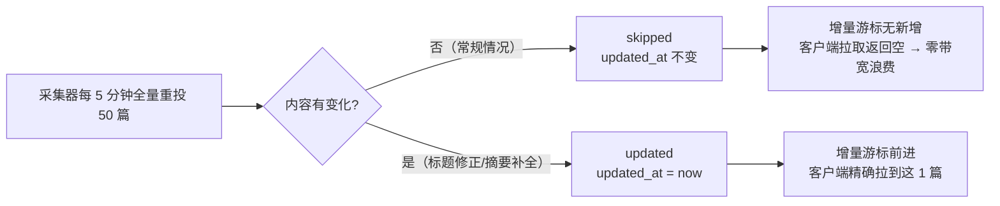

> 二者是**同一套设计的两半**：没有内容指纹，`updated_at` 会被"无变化重投"反复刷新，游标失效；有了内容指纹，游标才真正表达"数据变了"，增量拉取才有意义。

---

## 6. TTS 合成机制

### 6.1 AudioTask 状态机

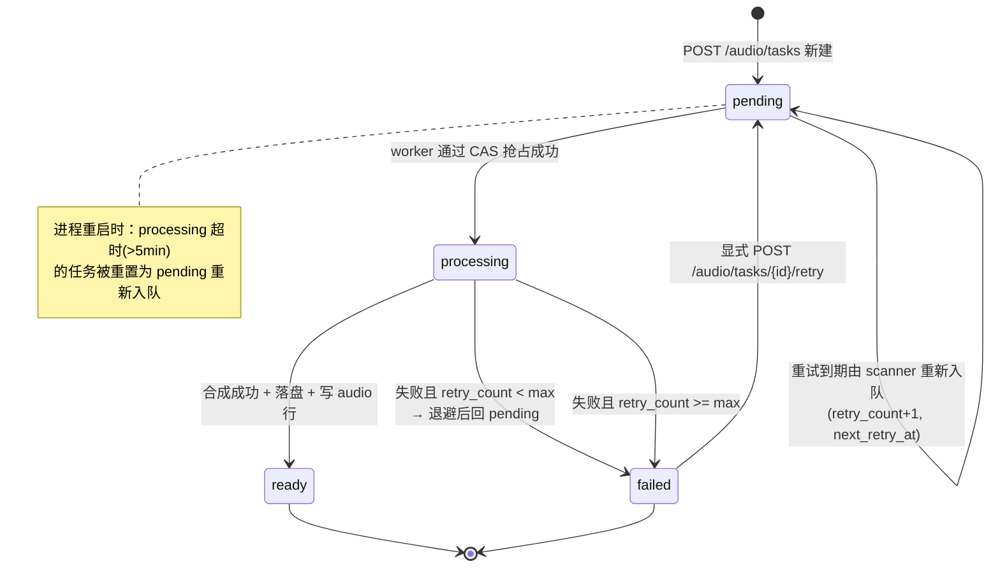

| 状态 | 含义 | 客户端表现 |
| --- | --- | --- |
| `pending` | 已入队，等待 worker | 轮询 / 显示"准备中" |
| `processing` | 正在调用云 TTS | 轮询 / 显示"合成中" |
| `ready` | 已完成，`audio_id` 已回填 | `GET /audio/{audioId}` 播放 |
| `failed` | 重试耗尽 | 显示"合成失败，点击重试" |

### 6.2 缓存键与请求流程

**缓存键 = `(article_id, voice, speed)`**（`ux_task_cache` 唯一索引保证），即同一篇文章同一音色语速**只合成一次**。

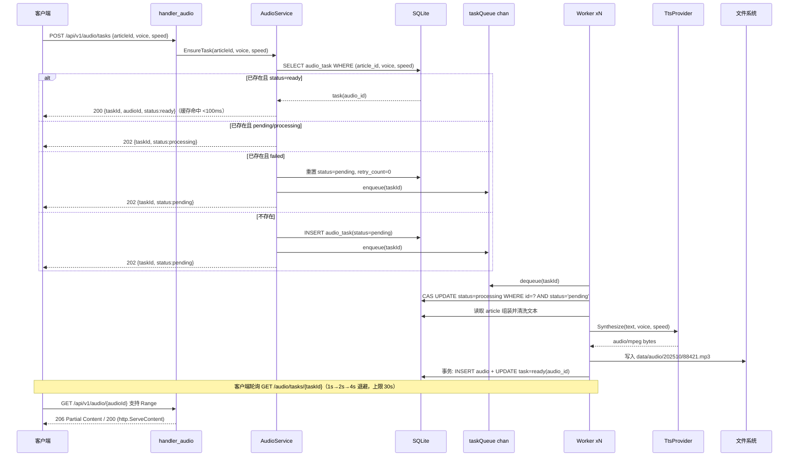

### 6.3 进程内受限并发 worker（不引入 MQ）

| 项 | 设计 |
| --- | --- |
| 队列 | `taskQueue chan int64`，缓冲 **512**；满则 `POST /audio/tasks` 返回 `429 RATE_LIMITED`（`TTS_QUEUE_FULL`） |
| Worker 数 | `tts.concurrency`，默认 **3**（PRD 要求 2~4） |
| 抢占 | `UPDATE audio_task SET status='processing' WHERE id=? AND status='pending'`，`RowsAffected()==1` 才算抢占成功（CAS，天然防重复） |
| 重试 | `tts.maxRetries=3`；退避 **1s → 5s → 20s**（带 ±20% jitter） |
| 重试调度 | 不占用 worker：失败任务写回 `pending` + `next_retry_at`，由独立 **scanner goroutine**（每 5s）`SELECT id FROM audio_task WHERE status='pending' AND next_retry_at <= now LIMIT 50` 重新入队 |
| 重启恢复 | 启动时 `UPDATE audio_task SET status='pending' WHERE status='processing' AND updated_at < now-5min` |
| 优雅退出 | 收到 SIGTERM → 关闭队列入口 → 等待在途任务完成（超时 30s）→ 关闭 DB |
| 内存开销 | 3 goroutine × ~8 KB 栈起 + 单个 TTS 响应缓冲（约 200 KB–2 MB，合成完即释放） |
| 超时 | 单次合成 `context.WithTimeout(tts.timeout=30s)` |

### 6.4 TtsProvider 抽象

```go
// internal/provider/tts/provider.go
type SynthRequest struct {
    Text       string   // 已清洗、已截断
    Voice      string   // 音色 ID（厂商自有命名，由配置映射）
    Speed      float32  // 0.5 ~ 2.0，默认 1.0
    Format     string   // "mp3"
    SampleRate int      // 默认 16000
}

type TtsProvider interface {
    Name() string                                          // "tencent" | "ali" | "xunfei"
    Synthesize(ctx context.Context, req SynthRequest) ([]byte, error)
    MaxChars() int                                         // 单次字符上限
}
```

| 实现 | 依赖 | 状态 |
| --- | --- | --- |
| `tencent.go` | `github.com/tencentcloud/tencentcloud-sdk-go/tencentcloud/tts/v20190823`（官方 SDK；仅 import tts 子包控制体积） | **默认**（PRD-Q2 推荐） |
| `ali.go` | 阿里云 SDK（`services/nls` 或自签 HTTPS） | P1 预留 |
| `xunfei.go` | 讯飞 WebSocket API 或 REST | P1 预留 |
| `manager.go` | 选路 + 健康标记：连续 3 次失败 → 该 provider 标记 unhealthy 30s → 切 `fallbackProvider` | P1 |

> **极致体积备选**：若不希望引入云 SDK（体积 +2~5 MB），可自行实现腾讯云 **TC3-HMAC-SHA256** 签名 + HTTP 调用（约 200 行、零依赖）。列为可选待确认项 Q-A5。

### 6.5 文本组装与清洗

```
raw   = title + "。" + summary            （summary 为空则仅 title）
清洗   = 去 HTML 标签 → 去 Markdown 语法 → 去 URL → 合并空白 → 去控制字符 → 可选去 emoji
截断   = 按 tts.maxChars（默认 800，厂商上限以下留安全余量）
         优先在句末标点（。！？.!?）处切断；无标点则硬切并加 "……"
计数   = 记录 text_chars（成本核算/统计用）
```

### 6.6 音频落盘与 Range 流式返回

| 项 | 设计 |
| --- | --- |
| 路径规则 | `{audioDir}/{yyyyMM}/{audioId}.{ext}`，例：`data/audio/202510/88421.mp3`。按月分目录 → Janitor 整月清理高效，且避免单目录文件过多 |
| 落盘方式 | 先写 `.part` 临时文件 → `fsync` → `rename` 原子替换，防止客户端读到半截文件 |
| 文件权限 | `0644`，目录 `0755` |
| 返回 | `http.ServeContent(w, r, name, modTime, file)` —— **原生支持** `Range`（206 + `Content-Range`）、`If-Range`、`If-Modified-Since`（304）、`Content-Type` 嗅探、`HEAD` |
| 缓存头 | `Cache-Control: public, max-age=31536000, immutable`（内容不可变，audioId 唯一）；`ETag` = `audioId-size-mtime` |
| 访问统计 | `hit_count++`、`last_access_at=now`；为省写放大，使用**内存去重集合 + 每 60s 批量刷盘** |

---

## 7. 服务端模块划分（单体内部）

### 7.1 目录结构

```
server/
├── cmd/eznews/main.go              # 进程入口：加载配置 → 装配依赖 → 启动 HTTP + worker + janitor → 优雅退出
├── internal/
│   ├── config/                     # 配置结构 + YAML/env 加载 + 校验（fail-fast）
│   ├── apierr/                     # 统一错误码、错误响应 envelope、HTTP 映射
│   ├── auth/                       # v1.1：JWT 签发/验签、Argon2id PHC 编解码、随机 token 生成
│   ├── model/                      # 领域实体（纯 struct，无依赖）
│   ├── store/                      # SQLite 打开、PRAGMA、schema 迁移
│   ├── repo/                       # 数据访问层：只写 SQL，不含业务规则
│   ├── service/                    # 业务层：ingest 去重判定、游标、TTS 编排 + 账号与同步
│   ├── httpapi/                    # 路由 + handler + middleware + DTO
│   ├── provider/tts/               # TtsProvider 抽象与各厂商实现 + 选路
│   ├── worker/                     # TTS worker pool / retry scanner / janitor
│   └── util/                       # sha256、URL 规范化、游标编解码、nanoid、文本清洗
├── migrations/                     # 001_init.sql / 002_account.sql / 003_fts.sql（按版本号）
├── config.example.yaml
├── Dockerfile                      # 多阶段构建 → distroless-static
├── Makefile
└── data/                           # 运行时（.gitignore）：eznews.db / audio/
```

**职责边界（严格单向依赖）**：

```
httpapi → service → repo → store → SQLite
                 ↘ provider/tts ↗
                 ↘ auth（JWT / Argon2id）↗
worker  → service（仅音频部分）
```

- `httpapi` **不得**直接写 SQL；`repo` **不得**含业务规则；`service` **不得**感知 HTTP。
- `provider/tts` 对外只暴露接口，切换厂商**零业务代码改动**（PRD §7.4）。
- 采集器相关**代码量为 0**；未来接采集器只需其按第 3 章契约调用，服务端不动。

### 7.2 核心类型（classDiagram）

```mermaid
classDiagram
    class Config {
        +ServerConf Server
        +DBConf DB
        +AuthConf Auth
        +IngestConf Ingest
        +AudioConf Audio
        +TTSConf TTS
        +RetentionConf Retention
        +Load(path string) Config
        +Validate() error
    }

    class ArticleRepo {
        +FindByDedupKeys(tx, sourceID, externalID, urlHash) *Article
        +BatchFindByExt(tx, keys) map
        +BatchFindByURL(tx, hashes) map
        +Insert(tx, a *Article) int64
        +UpdateIfChanged(tx, a *Article) bool
        +TouchLastSeen(tx, id int64, t int64)
        +ListPage(q ArticleQuery) []Article
        +ListDelta(q ArticleQuery) []Article
        +Get(id int64) *Article
    }

    class AudioRepo {
        +FindTask(articleID, voice, speed) *AudioTask
        +InsertTask(tx, t *AudioTask) int64
        +ClaimTask(id) bool
        +MarkReady(tx, taskID, a *Audio) int64
        +MarkFailed(tx, id, errCode, msg)
        +GetAudio(id) *Audio
        +ListForCleanup(limit) []Audio
    }

    class IngestService {
        -repo ArticleRepo
        -srcRepo SourceRepo
        -mu sync.Mutex
        +IngestBatch(ctx, items []Item, verbose) IngestReceipt
        -resolveSource(item) (int64, error)
        -normalize(item) NormalizedArticle
    }

    class ArticleService {
        -repo ArticleRepo
        +List(q ArticleQuery) ArticlePage
        +Delta(q ArticleQuery) ArticlePage
        +Get(id) Article
    }

    class AudioService {
        -repo AudioRepo
        -queue chan int64
        -tts tts.Manager
        +EnsureTask(articleID, voice, speed) TaskView
        +GetTask(id) TaskView
        +OpenAudio(audioID) *os.File
    }

    class TtsProvider {
        <<interface>>
        +Name() string
        +Synthesize(ctx, req SynthRequest) []byte
        +MaxChars() int
    }
    class TencentProvider { +Synthesize() }
    class TtsManager {
        -providers map[string]TtsProvider
        -primary string
        -fallback string
        +Synth(ctx, req) ([]byte, string, error)
    }

    class WorkerPool {
        -queue chan int64
        -n int
        -svc AudioService
        +Start()
        +Stop(ctx)
    }
    class RetryScanner {
        +Run(interval time.Duration)
    }
    class Janitor {
        -cfg RetentionConf
        +Run(interval time.Duration)
        -archiveArticles()
        -purgeAudioByAge()
        -purgeAudioByLRU()
    }

    class RateLimiter {
        -global *rate.Limiter
        -perKey map[string]*rate.Limiter
        +Allow(keyID string) bool
    }

    class AuthService {
        -repo UserRepo
        -jwt JWTManager
        -hasher Argon2Hasher
        -sem chan struct
        +Register(ctx, username, password, email) TokenPair
        +Login(ctx, username, password, clientID) TokenPair
        +Refresh(ctx, refreshToken) TokenPair
        +Logout(ctx, userID, refreshToken)
        +ChangePassword(ctx, userID, oldPwd, newPwd)
    }
    class SyncService {
        -repo UserStateRepo
        +Merge(ctx, userID, req) MergeResult
        +ListFavorites(ctx, userID, since) Page
        +SetFavorite(ctx, userID, articleID, deleted)
        +GetPrefs(ctx, userID) map
        +PutPrefs(ctx, userID, kv)
    }
    class UserRepo {
        +FindByUsername(username) *User
        +Create(tx, u *User) int64
        +BumpTokenVersion(tx, id)
        +InsertSession(tx, s *Session)
        +FindSessionByHash(hash) *Session
        +RotateSession(tx, oldID, s *Session)
        +RevokeAllSessions(tx, userID)
    }
    class UserStateRepo {
        +UpsertFavorite(tx, f *Favorite) bool
        +ListFavorites(userID, since, limit) []Favorite
        +UpsertRead(tx, r *Read) bool
        +GetPrefs(userID) map
        +PutPrefs(tx, userID, kv)
        +FindMergeLog(userID, clientID, nonce) *MergeLog
        +InsertMergeLog(tx, m *MergeLog)
    }
    class JWTManager {
        -secret []byte
        -ttl time.Duration
        +Sign(userID int64, tv int32) string
        +Parse(token) Claims
    }
    class Argon2Hasher {
        -memory uint32
        -time uint32
        -threads uint8
        +Hash(pwd string) string
        +Verify(pwd string, phc string) bool
    }

    IngestService --> ArticleRepo : uses
    ArticleService --> ArticleRepo : uses
    AudioService --> AudioRepo : uses
    AudioService --> TtsManager : uses
    WorkerPool --> AudioService : drives
    RetryScanner --> AudioRepo : requeues
    Janitor --> ArticleRepo : deletes
    Janitor --> AudioRepo : deletes
    TtsManager --> TtsProvider : selects
    TencentProvider ..|> TtsProvider : implements
    AuthService --> UserRepo : uses
    AuthService --> JWTManager : uses
    AuthService --> Argon2Hasher : uses
    SyncService --> UserStateRepo : uses
```

---

### 7.3 批量端点的校验顺序：错误码必须反映真实问题

本项目有三个「批量写」端点，结构同构：`/ingest/articles/batch`（≤200）、
`/me/state/batch`（≤500）、`/me/merge`（≤500）。它们共用同一条校验约定，
**改动任何一个都要保持这条顺序**，否则错误码会开始误导客户端。

#### 7.3.1 三条通用形态

| 顺序 | 规则 | 理由 |
|---|---|---|
| ① | **破坏性缺省字段先判** | 缺省值会造成静默数据损坏的字段必须第一个校验。`/me/state/batch` 的 `read` 是典型：裸 `bool` 分不清「漏传」与「显式 false」，而后者 = 写墓碑抹掉整批已读。改成 `*bool` + 缺省返 400，让漏传是**响亮的错误**。危害最大的检查不该被别的错误盖掉。 |
| ② | **越限先于存在性** | 客户端传 5000 条，真实问题是「批次太大」（该分片重试），而不是「文章不存在」（改 id 没用）。顺序颠倒会让 413 变成 404，客户端按错误码处理必然走错分支。 |
| ③ | **纯内存检查先于触库检查** | 存在性校验要打一次 `id IN (...)`，是最贵的一步。便宜的检查全做完再花钱，且避免为注定失败的请求开写事务。 |

#### 7.3.2 为什么读不出来

这三条在代码里只是几个 `if` 的先后，**读代码看不出意图**，而且后人对调两个 `if`
不会有任何编译错误、甚至不会有测试失败（现有冒烟只锁住了本端点的顺序，
换个人写新端点时根本不会意识到还有约定）。所以必须写在这里。

#### 7.3.3 怎么锁住

用**反证**：让请求穿过前一道校验、撞上后一道，用返回的错误码证明前一道确实放行了。

`server/smoke/smoke.sh` 第 9b 段的写法（`501` / `500` 两条）：

```
501 个不存在的 id + read:true  → 413   # 证明上限先于存在性
500 个不存在的 id + read:true  → 404   # 证明上限放行后落到存在性
500 个不存在的 id + 缺 read    → 400   # 证明 ① 早于 ② ③
```

**写新端点时照抄这个模式**：不要只测「越界返回 413」，还要测「刚好在界内时落到下一道校验」。

---

## 8. 查询侧 API 设计（Web / Android 共用）

### 8.1 端点清单

| 方法 | 路径 | 说明 | 鉴权 |
| --- | --- | --- | --- |
| `GET` | `/api/v1/articles` | 文章列表（首屏/翻页/增量） | 可选 |
| `GET` | `/api/v1/articles/{id}` | 文章详情 | 可选 |
| `GET` | `/api/v1/sources` | 源列表（含 `enabled`、`suggestInterval`） | 可选 |
| `POST` | `/api/v1/sources` | 新增自定义源 | 可选 |
| `PUT` | `/api/v1/sources/{id}` | 编辑源（默认源只允许改 `enabled`） | 可选 |
| `PATCH` | `/api/v1/sources/{id}/enabled` | 启停源 | 可选 |
| `DELETE` | `/api/v1/sources/{id}` | 删除源（默认源 → `409`） | 可选 |
| `POST` | `/api/v1/audio/tasks` | 提交合成任务 | 可选 |
| `GET` | `/api/v1/audio/tasks/{taskId}` | 查询合成状态 | 可选 |
| `POST` | `/api/v1/audio/tasks/{taskId}/retry` | 重试失败任务 | 可选 |
| `GET` | `/api/v1/audio/{audioId}` | 音频文件（**支持 Range**） | 可选 |
| `GET` | `/api/v1/articles/{id}/audio` | 缓存直查（命中返回 `audioId`，未命中 `404`） | 可选 |
| `GET` | `/api/v1/categories` | 分类枚举与计数 | 可选 |
| `GET` | `/healthz` `/readyz` | 健康检查 | ❌ |
| `GET` | `/metrics` | 简易 JSON 指标（P1） | 可选 |

> **账号相关接口（v1.1）见 §9.5 完整清单**（16 个：`/auth/*` 4 个 + `/me/**` 12 个）。
> 上表中的业务接口全部使用 **`OptionalAuth`**：带 Bearer 则解析用户上下文，不带则按**游客放行**，永不要求登录。

### 8.2 `GET /api/v1/articles` 参数

| 参数 | 类型 | 默认 | 说明 |
| --- | --- | --- | --- |
| `cursor` | string | — | 增量水位（有此参数 = 增量模式） |
| `pageCursor` | string | — | 分页游标（keyset on `published_at,id`） |
| `limit` | int | 20（增量模式 100） | 最大 100（增量模式 200） |
| `sourceId` / `sourceKey` | int/string | — | 源筛选（二选一） |
| `category` | string | — | 分类筛选 |
| `from` / `to` | string(int64 ms 或 ISO8601) | — | `published_at` 区间 |
| `q` | string | — | 关键词（P1，FTS/LIKE） |
| `includeDisabled` | bool | false | 是否含停用源的文章 |
| `withAudio` | bool | false | 返回每篇在**默认音色**下的合成状态（省去 N 次请求） |

### 8.3 ArticleDTO

```json
{
  "id": 88421,
  "sourceId": 3,
  "sourceKey": "sspai",
  "sourceName": "少数派",
  "category": "tech",
  "title": "新一代折叠屏手机发布…",
  "summary": "厂商公布新一代折叠屏……",
  "imageUrl": "https://cdn.sspai.com/2025/10/cover.jpg",
  "author": "少数派编辑部",
  "url": "https://sspai.com/post/91234",
  "publishedAt": "2025-10-06T01:12:30.000Z",
  "updatedAt": "2025-10-06T01:15:02.113Z",
  "tags": ["折叠屏", "手机"],
  "audio": { "status": "ready", "audioId": 5127, "voice": "zh-CN-XiaoxiaoNeural", "speed": 1.0 }
}
```

> `content` **不出现在列表接口**；详情接口仅当该文章实际存了正文才返回（默认无）。客户端详情的"阅读原文"跳转 `url`（PRD-Q3 的默认策略）。

---

## 9. ★ 账号体系与数据同步（v1.1）

> 依据 [`docs/PRD-ACCOUNT.md`](./PRD-ACCOUNT.md)。**原 PRD Q1「不需要账号体系」已被推翻**，产品形态为「**游客可用 + 可选登录**」双态。
> 架构红线：**不引入 Redis / MQ / OAuth / SMTP**，全部落在同一 SQLite 文件；高频路径**零 DB 查询**；账号体系常驻内存增量 **< 5 MB**。

### 9.1 双态模型与架构落点

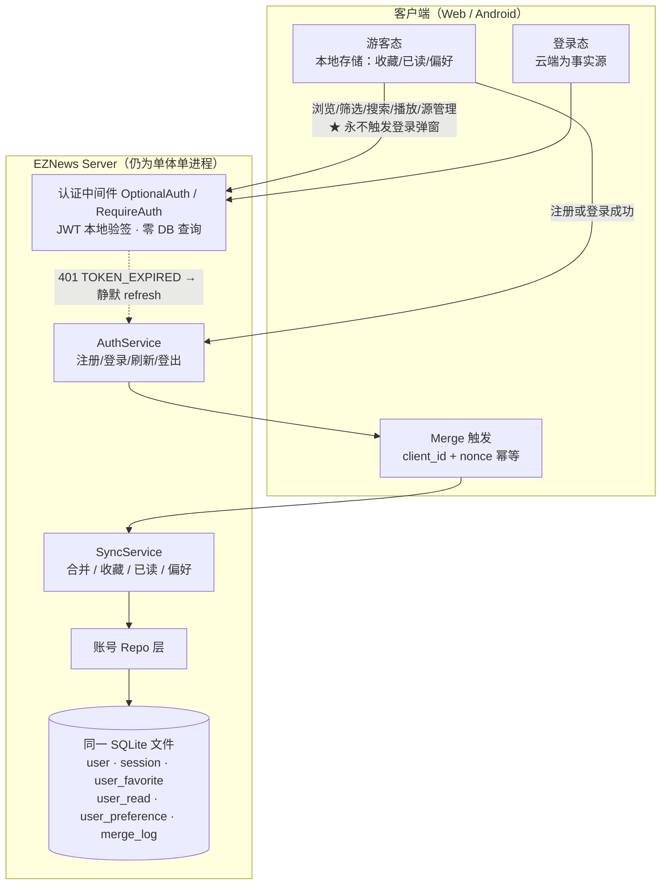

| PRD 硬红线 | 架构如何保障 |
| --- | --- |
| R1 浏览/播放路径禁止登录弹窗 | 认证中间件分两类：**`OptionalAuth`**（业务查询接口：有 token 则解析、无 token 放行）与 **`RequireAuth`**（仅 `/me/**`）。业务接口**永远不返回登录要求** |
| R2 登录入口仅顶栏与设置面板 | 纯前端约束；服务端无"强制登录"响应类型 |
| R3 游客点收藏立即本地生效 | 客户端先写本地存储；**登录态**才调用 `POST /me/favorites`。服务端无"游客收藏"接口，天然不冲突 |
| R4 登录不清空本地数据 | 合并是**并集**语义（§9.4），且本地副本保留为离线缓存 |
| R5 登出回游客态功能不受限 | 登出仅删 session + 清本地同步快照；业务接口为 `OptionalAuth`，无区别 |

### 9.2 认证与凭证机制

#### 9.2.1 凭证规格

| 项 | 规格 | 架构理由 |
| --- | --- | --- |
| Access Token | **JWT（HS256）**，2 小时 | 服务端本地验签，**高频路径零 DB 查询**（PRD §3.5） |
| Access payload | `sub`(user_id) · `tv`(token_version) · **`sid`(session_id)** · `iat` · `exp` · `iss=eznews` · `typ=access` | `tv` 支撑全局登出；**`sid` 支撑精确定位会话（DEC-14）**，使登出不依赖任何传输通道 |
| Refresh Token | **32 字节随机串**（`crypto/rand`），30 天滑动续期 | 不透明、不可伪造 |
| Refresh 存储 | 库内**仅存 SHA-256 哈希**（`ux_session_rt` 唯一索引） | 拖库后无法冒用 |
| 刷新轮换 | 每次刷新**轮换新串**并作废旧串（旧 hash 挪入 `prev_refresh_token_hash`），带 **reuse 检测** | 泄露可检测 |
| **reuse 检测处置** | **两级判定（DEC-7，见 §9.2.2 算法）**：<br>① **宽限重放**（60s 内 + 同一 `client_id`）→ 幂等下发新凭据，**不惩罚用户**；<br>② **疑似泄露**（超窗或不同 `client_id`）→ 撤销全部 session + `token_version+1` + 强制重登 | 只拒绝本次刷新则泄露凭证仍可用，检测形同虚设；但无宽限窗口会误伤移动端弱网重试（Android 尤为常见） |
| 全局登出 / 改密 | `user.token_version += 1`，验签后比对 `tv` 不符即拒 | **替代 Redis 黑名单**（PRD-DEC-2 明确要求） |
| **会话定位（DEC-14）** | Access Token 携带 **`sid`** = `session.id`；登出 / 踢下线直接按 `sid` 定位会话行 | **断开「登出必须拿到 refreshToken」的依赖**：无论 `refreshCookie` / `refreshTokenInBody` 怎么配，登出一定生效；`sid` 仅在登出时读取，**热路径仍 0 次 DB 查询**，不触碰资源目标 |
| JWT 密钥 | `auth.jwtSecret`（环境变量注入）；缺省**启动时自动生成并落盘**到 `data/jwt_secret` | 自托管开箱即用；重启后已签发 token 仍有效 |
| 密码哈希 | **Argon2id**，`m=19 MiB, t=2, p=1`，16 字节随机盐，**PHC 字符串**格式 | OWASP 首选；参数随哈希存储，未来调参不影响存量密码 |

**DEC-14 的实现约束（三条，缺一不可）**：

1. **`sid` 必须在会话生命周期内稳定 —— 刷新轮换必须原地 UPDATE，禁止 delete + insert。** 这是**行身份不变量**，同时撑着两件事：DEC-7 的宽限判定（`prev_*` 两列就在本行上）与 DEC-14 的 `sid` 稳定性。**一旦改成删插，两个修复会同时静默失效**：
   - `sid` 每次刷新都变 → 用**刷新前的旧 access token** 登出时，只会作废那一行已作废的旧记录，**真正的活跃会话存活下来**——登出再次静默失效，而且因为"明明修过"更难排查；
   - `prev_refresh_token_hash` 失去落点，DEC-7 的 60s 宽限窗口无法判定。
   附带收益：原地 UPDATE 不产生行churn，Janitor 清理压力与索引体积都更小（对齐"省资源"总目标）。
2. **登出必须校验 `session.user_id == claims.sub` 后再删除。** 这是防御纵深：`session` 表已用 `INTEGER PRIMARY KEY AUTOINCREMENT`（rowid 不复用），但仍应以 `sub` 兜底，杜绝任何 id 混淆导致的**跨用户误删会话**。
3. **缺失 `sid` 的老 token 走回退路径。** 验签通过但无 `sid` 时，回退到"按 refreshToken（body 或 Cookie）定位 session"；两者都拿不到则返回 `204` 并仅清客户端态（不静默失败，记 `warn` 日志）。
4. **登出返回 `204`，幂等且不泄露会话存在性。** 即使该行已不存在（已过期 / 已被 reuse 处置撤销）也返回 `204`——若返回 `404` 就等于对外提供一个"会话存在性探测"接口。登出**只销毁当前会话**，不动其他设备（批量下线属 P2）。

> **热路径开销为 0**：`sid` 只在登出时读取，验签仍是纯本地计算，不触碰「高频路径零 DB 查询」与「<150 MB」两条资源红线。

#### 9.2.2 登录 / 刷新链路

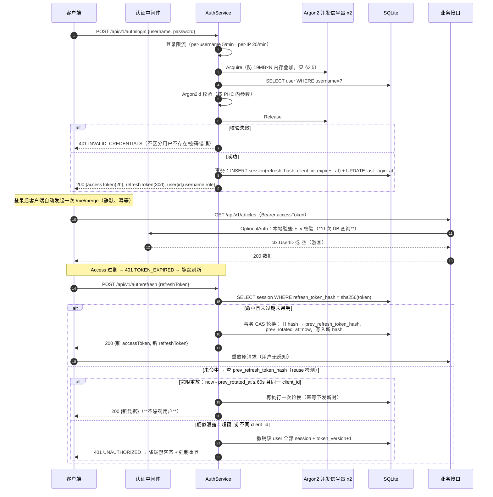

#### 9.2.2.1 refresh reuse 两级判定算法（DEC-7）

```
h := hex(sha256(refreshToken))

// ① 正常路径：命中当前有效 token
if s := FindSessionByHash(h); s != nil && !s.Expired() && !s.Revoked() {
    rotate(s)                    // 事务内 CAS：旧 hash → prev_*，写入新 hash
    return 200, TokenPair{newAccess, newRefresh}
}

// ② reuse 检测：命中"上一代" hash
if s := FindSessionByPrevHash(h); s != nil {
    withinGrace := now - s.PrevRotatedAt <= auth.refreshReuseGraceSec (60s)
    sameClient := s.ClientID == req.ClientID
    if withinGrace && sameClient {
        rotate(s)                // 幂等：再轮换一次并下发新对（服务端只存 hash，无法还原旧明文）
        return 200, TokenPair{newAccess, newRefresh}     // 不惩罚
    }
    // 疑似泄露
    RevokeAllSessions(s.UserID)
    BumpTokenVersion(s.UserID)
    return 401, UNAUTHORIZED
}

// ③ 完全不认识
return 401, UNAUTHORIZED
```

| 设计点 | 说明 |
| --- | --- |
| 为何"宽限重放"是**再轮换一次**而非返回原串 | 服务端**只存 hash**，无法还原旧明文 token；再轮换一次可达到等价效果（客户端拿到可用凭据，旧串彻底作废），且天然幂等 |
| 为何只保留**一代** prev | 60 秒窗口内几乎不可能出现两代轮换；保留一代即可覆盖弱网重试场景，实现简单 |
| 并发安全 | 轮换用 `UPDATE session SET ... WHERE id=? AND refresh_token_hash=?`（CAS），`RowsAffected()==1` 才算成功，防并发重复轮换 |
| 撤销范围 | `RevokeAllSessions` 删除该 user 全部 session 行；`token_version+1` 使已签发 Access Token 一并失效 |
| 配置项 | `auth.refreshReuseGraceSec`（默认 **60**） |

#### 9.2.3 凭证存储位置

| 端 | Access Token | Refresh Token | 说明 |
| --- | --- | --- | --- |
| Web | **内存**（JS 变量 / zustand），不落盘 | `httpOnly + Secure + SameSite=Lax` Cookie，Path 限定 `/api/v1/auth`（须覆盖 refresh 与 logout） | **官方仅支持同源部署**（反代同域），见下方 DEC-12 |
| Android | 内存 | **EncryptedSharedPreferences**（Keystore 加密） | 系统级加密 |

> **DEC-12（Web 部署形态）**：官方支持形态 = **同域反代 + httpOnly Cookie**（这也是"Go 单体 + 单文件 DB"自托管的自然形态）。
> **跨域部署不为官方支持**：功能可正常运行，但 refreshToken 只能降级存 localStorage，存在 XSS 风险，由部署者自担；
> **不为 5% 的跨域场景设计额外的跨域认证方案**。文档保留风险标注，但实现上只保证同源路径正确。

### 9.3 认证中间件设计

| 中间件 | 应用范围 | 行为 |
| --- | --- | --- |
| `OptionalAuth` | 文章/源/音频等**全部业务接口** | 有 `Authorization: Bearer` 则验签并注入 `ctx.UserID`；无则作为**游客放行**。**永不返回 401 要求登录** |
| `RequireAuth` | 仅 `/api/v1/me/**` | 无 token 或验签失败 → 401；正常则注入 `ctx.UserID` |
| `APIKeyAuth` | 仅 `/api/v1/ingest/**` | 见 §3.2（与账号体系**完全独立**，采集器不使用账号体系） |

**401 语义区分（PRD §5.1 要求）**：

| `code` | 触发 | 客户端动作 |
| --- | --- | --- |
| `TOKEN_EXPIRED` | JWT `exp` 已过但签名有效 | **静默**调用 `/auth/refresh` → 成功后重放原请求 |
| `UNAUTHORIZED` | 签名无效 / `tv` 不符 / refresh 失败 / reuse 命中 | 丢弃凭证，**降级为游客态** + 轻提示（不弹窗阻断） |

并发刷新保护：客户端用**单飞（single-flight）**保证并发请求只触发一次 refresh，避免 refresh token 被并发轮换导致互踢。

### 9.4 游客数据合并（Merge Policy v1）—— 本版最关键设计

#### 9.4.1 冲突消解规则

| 数据类型 | 合并语义 | 冲突消解 | 墓碑 |
| --- | --- | --- | --- |
| 收藏 | **并集** | `(user_id, article_id)` 唯一键；比较 `updated_at`，**较新者胜出** | ✅ 必需 |
| 已读 | **并集** | 同上 | ✅ 必需 |
| 偏好 | **整包 KV 覆盖** | **服务端有值 → 以服务端为准**；无值 → 写入本地值作初始 | ❌ 不需要 |
| 播放历史 | — | 本期不做（PRD §6.2 预留，新增 `user_playback` 表即可，Merge Policy 无需修改） | — |

> 收藏用并集而非"服务端为准"的理由：收藏是用户明确表达的正向意图，直接丢弃会造成不可逆的丢失感；并集损失最小，配合墓碑可正确表达"取消收藏"。

#### 9.4.2 幂等与请求/响应

**请求** `POST /api/v1/me/merge`

```json
{
  "clientId": "c-7f3a91d2e4b8",
  "nonce": "n-9e2b4c6a",
  "favorites": [
    { "articleId": 88421, "deleted": false, "updatedAt": 1730000000000 },
    { "articleId": 88422, "deleted": true,  "updatedAt": 1730000100000 }
  ],
  "reads": [
    { "articleId": 88421, "deleted": false, "updatedAt": 1730000200000 }
  ],
  "preferences": { "tts.voice": "101001", "tts.speed": "1.0", "ui.density": "comfortable" }
}
```

**响应**

```json
{
  "applied": true,
  "replayed": false,
  "favorites": { "received": 20, "added": 18, "merged": 2, "skipped": 0 },
  "reads":      { "received": 35, "added": 30, "merged": 5, "skipped": 0 },
  "preferenceApplied": true,
  "snapshotCursor": "MTczMDAwMDAwMDAwMDow"
}
```

- `replayed: true` 表示命中 `merge_log` 的 `(user_id, client_id, nonce)`，**直接回放历史结果**，数据不重复写入（US-ACC-03：重复登录收藏数恒为 20）。
- `added` = 新增行；`merged` = 命中且本地更新被采纳；`skipped` = 命中但云端更新（LWW 判负）。

#### 9.4.3 合并链路时序

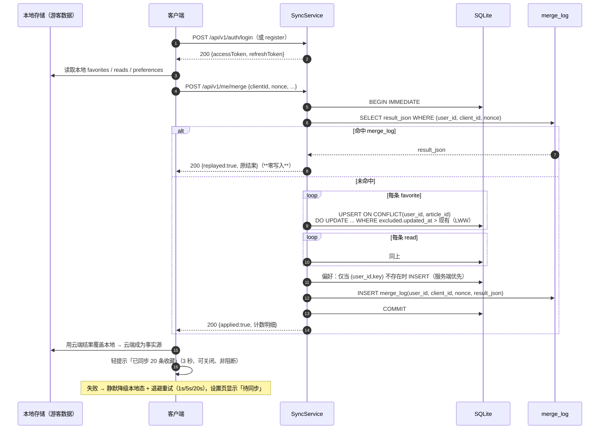

**关键实现约束**

1. 整个 merge 在**一个 `BEGIN IMMEDIATE` 事务**内完成（含 merge_log 写入），保证幂等与原子。
2. `nonce` 由客户端**每批次生成一次并持久化至成功**；重试沿用同一 nonce。
3. `client_id` 首次启动生成并持久化（reinstall 重置）。
4. 合并失败**不影响登录态**（PRD §4.2）。
5. 单批上限：`favorites`/`reads` 各 ≤ 5000 条，超出返回 413（自托管单人场景远超需求）。

### 9.5 越权防护与账号接口清单

**架构级约束**：所有 `/api/v1/me/**` 的 `user_id` **一律从 JWT `sub` 取**，handler 层不接收任何来自路径/查询参数/请求体的 `user_id`。代码评审以此为准则。

| 方法 | 路径 | 说明 | 鉴权 |
| --- | --- | --- | --- |
| POST | `/api/v1/auth/register` | 注册（username + password，email 选填） | 游客 |
| POST | `/api/v1/auth/login` | 登录，返回双 token | 游客 |
| POST | `/api/v1/auth/refresh` | refreshToken 换新 accessToken | 游客 |
| POST | `/api/v1/auth/logout` | 登出，销毁当前 session | 🔒 |
| GET | `/api/v1/me` | 当前账号基本信息 | 🔒 |
| DELETE | `/api/v1/me` | 注销（**需密码二次确认** → 物理删除 + 级联） | 🔒 |
| PATCH | `/api/v1/me/password` | 修改密码（触发 `token_version+1`） | 🔒 |
| GET | `/api/v1/me/preferences` | 拉取偏好 KV | 🔒 |
| PUT | `/api/v1/me/preferences` | 整包写入偏好 KV | 🔒 |
| POST | `/api/v1/me/merge` | **游客数据幂等合并** | 🔒 |
| GET | `/api/v1/me/favorites` | 收藏列表（支持 `since` 增量游标） | 🔒 |
| POST | `/api/v1/me/favorites` | 收藏 / 取消收藏（含墓碑） | 🔒 |
| GET | `/api/v1/me/reads` | 已读列表（支持 `since` 增量游标） | 🔒 |
| POST | `/api/v1/me/reads` | 标记已读 / 取消已读 | 🔒 |
| GET | `/api/v1/me/sessions` | 会话列表（P1） | 🔒 |
| DELETE | `/api/v1/me/sessions/{id}` | 踢下线（P2 预留） | 🔒 |

> 比 PRD §5.1 的 15 个多出 `DELETE /api/v1/me`（PRD §8.4 要求提供注销，但未列入接口清单，此处补齐；PRD v1.1.1 DEC-8 已确认）。

**`DELETE /api/v1/me` 注销语义（DEC-8，4 条硬约束）**

| # | 约束 | 实现 |
| --- | --- | --- |
| ① | **必须携带当前密码二次确认** | 请求体 `{"password": "..."}`；校验失败 → `401 INVALID_CREDENTIALS`。防误操作与 CSRF |
| ② | **级联范围严格限定** | 删除 `user` + `session` + `user_favorite` + `user_read` + `user_preference` + `merge_log`；**绝不动** `article` / `source` / `audio` 等全局数据 |
| ③ | 返回 **`204 No Content`** | 客户端清本地凭证与同步快照，回游客态 |
| ④ | **不可逆** | 服务端无软删除/恢复路径；UI 必须明确提示"收藏与已读将一并清除" |

> 实现备注：`DELETE` 携带请求体在部分老旧代理下可能被剥离。本项目客户端与服务端均为自研，采用 `DELETE` + body；若部署环境出现剥离，退路为 `X-Confirm-Password` 请求头（二选一，服务端同时接受）。

### 9.6 收藏/已读的增量同步（复用 §5 游标语义）

| 项 | 设计 |
| --- | --- |
| 游标 | **与文章列表完全统一**：复合键 `(updated_at, id)`，opaque base64url |
| 请求 | `GET /api/v1/me/favorites?since=<cursor>&limit=200` |
| 响应 | `{items:[{articleId, deleted, updatedAt}], nextCursor, hasMore, serverTimeMs}` |
| 索引 | `idx_fav_sync (user_id, updated_at, id)` / `idx_read_sync` |
| 客户端 | 冷启动全量拉一次（limit 200，循环至 hasMore=false）→ 本地按 articleId 合并（墓碑条目本地删除）→ 之后用 `since` 增量 |
| 触发时机 | 冷启动、下拉刷新、回到前台（与文章增量刷新同一时机，一次 RTT 可并行发两个请求） |

> ### ⚠️ DEC-11：墓碑项**必须**随增量流返回（实现强制项）
>
> 若把"取消收藏"实现为**物理删除**，该行会从增量流中彻底消失 —— 其他设备**永远收不到"对方取消了收藏"**，
> 删除操作无法跨端同步，且极易在优化时被误当成 bug 修掉。
>
> **强制要求**：
> 1. `deleted_at` 非空（即 `deleted=true`）的记录**必须保留在增量结果中**，由客户端落**本地删除**；
> 2. 查询条件**不得**追加 `AND deleted_at IS NULL`；
> 3. 唯一清理时机是文章本身被归档删除（`ON DELETE CASCADE`），此时客户端按 §4.6 自行剔除本地残留；
> 4. 该约束已同步写入 `openapi.yaml` 的 `StateItem` 描述与响应示例（含 `deleted:true` 样例）。

**偏好同步**：KV 整包，无游标；客户端冷启动时 `GET /me/preferences` 全量覆盖本地，本地写入走 `PUT /me/preferences`（整包覆盖，天然幂等）。

### 9.7 对既有设计的影响评估

| 既有设计 | 是否受影响 | 说明 |
| --- | --- | --- |
| §3 Ingest 契约 | **无影响** ✅ | 采集器用 `X-Api-Key`，与账号体系**完全独立**两套鉴权，互不干扰 |
| §4 文章/音频表 | **无影响** ✅ | 账号数据为**新增表**，不改既有表结构（`source` 仅加可空 `owner_user_id`，本期恒 NULL 不影响查询计划） |
| §5 增量游标 | **复用** ✅ | 收藏/已读沿用同一 `(updated_at, id)` 游标语义 |
| §6 TTS 合成 | **无影响** ✅ | 音频缓存键仍是 `(article_id, voice, speed)`，与用户无关；**游客同样享受音频服务端缓存**（PRD §1 对照表） |
| §1.3 资源预算 | **+< 5 MB** | 常驻内存预期 ~25–45 MB → ~30–50 MB，仍在 150 MB 内；高频路径 DB 查询 +0 |
| §3.7 限流 | **扩展** | 复用同一进程内令牌桶，新增 `login` 维度（per-username 5/min、per-IP 20/min）；仍无 Redis |
| §2.5 内存峰值 | **新增约束** | Argon2id 并发信号量（默认 2） |
| 部署形态 | **无影响** ✅ | 仍为单二进制 + 单 SQLite 文件，无新增中间件 |

### 9.8 安全要点清单

| 项 | 措施 |
| --- | --- |
| 密码 | Argon2id + PHC；明文仅存在于单次请求内存；**禁止**写入任何日志（含请求体日志） |
| 传输 | 生产必须 HTTPS（部署层反代提供） |
| 凭据泄露 | JWT 密钥、TTS 密钥仅服务端持有；refresh token 库内仅存哈希 |
| 暴力破解 | 进程内失败计数（per-username / per-IP）+ 暂时锁 15 分钟；重启后计数清空（可接受，单机自托管） |
| 注册 | `auth.registrationEnabled`（默认 true）；单人自托管注册首账号后建议置 false |
| 越权 | `/me/**` 强制从 token 取 user_id（§9.5） |
| 注销 | `DELETE /me` 物理删除 + 级联 |
| CLI | `eznews admin reset-password <username>` 替代邮件找回（PRD §2.4） |
| 日志脱敏 | `password` / `token` / `Authorization` 头 / `Cookie` 一律不落日志 |

---

## 10. 核心链路时序图

### 10.1 链路一：外部采集器批量入库

```mermaid
sequenceDiagram
    autonumber
    participant C as 外部采集器
    participant MW as 中间件链
    participant H as IngestHandler
    participant S as IngestService
    participant TX as SQLite 事务
    participant W as Worker/Janitor

    C->>MW: POST /api/v1/ingest/articles/batch<br/>X-Api-Key + items[200]
    MW->>MW: MaxBytes(4MB) → 全局令牌桶 → key 令牌桶 → items 数校验
    alt 任一层不通过
        MW-->>C: 413 / 429 (Retry-After)
    else 通过
        MW->>H: ctx(keyID)
        H->>H: JSON 绑定 + 结构校验 + 字段校验
        alt 结构/字段错误
            H-->>C: 400 VALIDATION_FAILED + details[]
        else 校验通过
            H->>S: IngestBatch(items)
            S->>TX: BEGIN IMMEDIATE
            S->>TX: 批量 SELECT 构造 mapExt / mapUrl
            loop 每条 item（最多 200）
                S->>S: 规范化 URL → urlHash；计算 contentHash
                alt 未命中
                    S->>TX: INSERT（updated_at=now）→ created
                else 命中且 contentHash 变化
                    S->>TX: UPDATE ... WHERE content_hash<>? → updated
                else 命中且无变化
                    S->>TX: UPDATE last_seen_at only → skipped
                end
            end
            S->>TX: COMMIT
            TX-->>S: ok
            S-->>H: IngestReceipt{created,updated,skipped,failed,results}
            H-->>C: 200 OK + 回执
        end
    end
    Note over W: 后台 Janitor 每 1h 做归档与音频 LRU（与写入无耦合）
```

### 10.2 链路二：客户端增量拉取

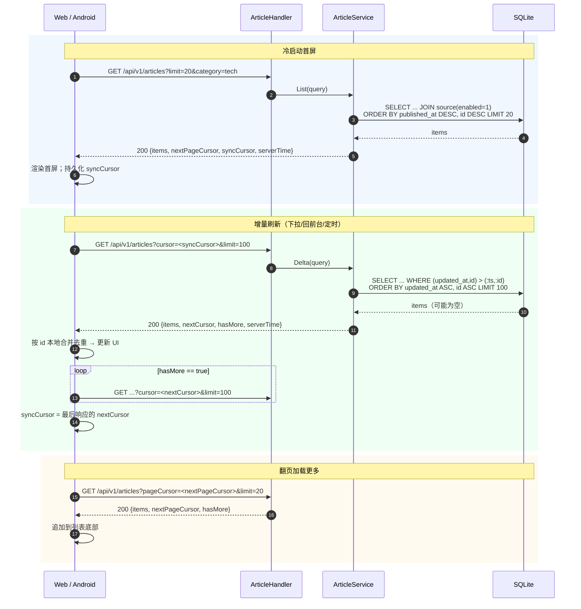

### 10.3 链路三：TTS 合成与播放

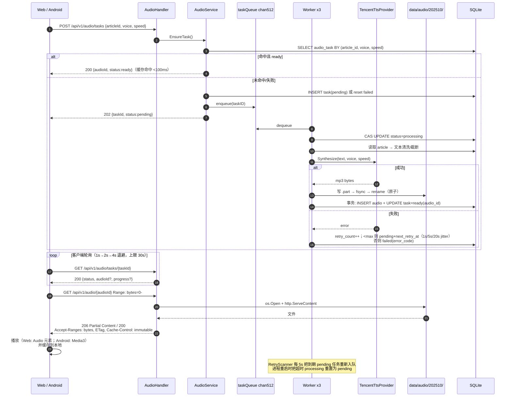

---

## 11. Web 端设计

### 11.1 页面与组件

| 层 | 组成 |
| --- | --- |
| 布局 | `AppShell`（顶栏 + 侧栏 + 内容区 + 底部播放器） |
| 路由 | `/`（首页卡片流）、`/article/:id`（详情）；来源管理为**模态/抽屉**（PRD-F-WEB-05） |
| 首页 | `TopBar`（搜索 + 管理来源 + **账号区**）、`CategoryTabs`、`NewsList` → `NewsCard`、`SkeletonCard`、`EmptyState` |
| 播放器 | `PlayerBar`（mini：进度/播放暂停/语速）、`PlayQueue`（展开：队列/上一条/下一条） |
| 来源管理 | `SourceManager` → `SourceForm`（默认源开关 + 自定义源增删改） |
| **账号（v1.1）** | `AuthModal`（登录/注册二合一）、`AccountPanel`（设置面板内：账号信息 / 修改密码 / 会话列表 / 注销）、`SyncBadge`（「待同步」标记） |

> **登录入口红线（PRD R1/R2）**：仅两处 —— ① 顶栏右侧「登录」**文本按钮**；② 设置面板账号区。
> **禁止**在卡片流、播放控件、收藏按钮、详情页出现任何登录弹窗/遮罩/注册墙。

### 11.2 关键状态

| 状态 | 方案 | 持久化 |
| --- | --- | --- |
| 文章列表 / 增量 | `@tanstack/react-query`（`useInfiniteQuery` + 手动增量同步） | 内存 |
| `syncCursor` | zustand | `localStorage` |
| **认证态（v1.1）** | `authStore`：accessToken 存**内存**；refreshToken 由服务端写入 `httpOnly` Cookie | 内存 / Cookie |
| `clientId` / 合并 `nonce` | `authStore` | `localStorage`（reinstall 重置 clientId） |
| **收藏 / 已读（v1.1 双态）** | 游客：zustand（Set\<id\> + 墓碑 Set）；登录：react-query 读写 `/me/**`，本地保留为**离线缓存** | 游客 `localStorage`；登录态云端为事实源 |
| **偏好（v1.1）** | 游客：zustand；登录：`GET/PUT /me/preferences` 整包 | 同上 |
| 播放器（当前/队列/进度/语速） | zustand | 内存（语速存 `localStorage`，登录后同步到云端 KV） |
| 源启停 | react-query mutation → 失效 `sources` | 服务端 |

### 11.3 播放实现要点

- 使用原生 `<audio>`：`src = /api/v1/audio/{audioId}`，浏览器自动处理 Range 与缓冲，**不引入** howler/Tone.js。
- 语速切换：播放器端 `playbackRate`（0.75/1.0/1.25/1.5）用于**即时**变速；若用户希望服务端用不同 `speed` 重新合成（音质更佳），则提交新 task（缓存键含 speed）。
- 连续播放：`PlayQueue` 顺序取下一篇 → `EnsureTask` → 拿到 `audioId` → 播放。
- 响应式断点严格按 PRD §8.3。

### 11.4 账号与合并（Web 端实现要点，v1.1）

| 关注点 | 实现 |
| --- | --- |
| Token 注入 | `fetch` 封装统一注入 `Authorization: Bearer <accessToken>`（内存中取）；**不落 localStorage** |
| 401 处理 | 拦截器识别 `code`：`TOKEN_EXPIRED` → **单飞**调用 `/auth/refresh`（Cookie 自动携带 refreshToken）→ 成功后重放原请求；`UNAUTHORIZED` → 清空内存 token，降级游客态 + 轻提示 |
| **单飞 single-flight（DEC-10，实现强制项）** | 并发 401 只触发**一次** refresh，其余请求挂起等待结果。**非建议项，必须实现**：列表 + 详情 + 音频并发请求时该 bug 极易复现，refresh token 被并发轮换会导致互相踢下线 |
| 登录后合并 | 登录/注册成功 → 立即 `POST /me/merge`（读本地 `localStorage` 的收藏/已读/偏好 + `clientId` + `nonce`）；**无弹窗、无确认** |
| 合并失败 | 静默降级本地态 + 退避重试（1s/5s/20s）；设置面板显示 `SyncBadge`「待同步」；**不阻塞任何功能** |
| 事实源切换 | 合并成功后，收藏/已读/偏好改由 `/me/**` 读写；本地副本保留为离线缓存 |
| 登出 | `POST /auth/logout` + 清内存 token + 清本地同步快照（保留游客本地数据，不删用户数据） |
| 游客收藏 | 点击立即写本地并更新 UI（PRD R3）；若已登录则同时调 `POST /me/favorites` |
| 部署形态（DEC-12） | **官方仅支持同源部署**（同域反代 + httpOnly Cookie）。跨域部署**不为官方支持**：可运行但 refreshToken 降级 localStorage，XSS 风险由部署者自担，**不为其设计额外认证方案** |

---

## 12. Android 端设计

### 12.1 模块与包划分（单 module，按包分层）

```
com.eznews
├── data/remote      # Retrofit 接口、OkHttp、DTO、错误解析、AuthInterceptor、TokenRefresher(单飞)
├── data/repository  # ArticleRepository / SourceRepository / AudioRepository
│                    # AuthRepository / SyncRepository（v1.1）
├── data/local        # PrefsDataStore（偏好+游标+音频索引）、AudioCache（文件 LRU）
│                    # SecurePrefs（EncryptedSharedPreferences，存 refreshToken）、LocalStateStore（游客收藏/已读）
├── player           # PlaybackService(MediaSession) / PlayerController / PlaybackQueue
├── di               # AppContainer（手写 DI，不引入 Hilt）
└── ui               # Compose：home / detail / player / sources / auth / settings / components / theme
```

| 关注点 | 方案 | 对齐需求 |
| --- | --- | --- |
| 后台/锁屏播报 | `PlaybackService` 继承 `MediaSessionService`（Media3），`ForegroundService` type=`mediaPlayback` | F-AND-01 |
| 通知栏控制 | `MediaSession` + `MediaStyle` 通知（▶/⏸/⏮/⏭），锁屏可见 | F-AND-02 |
| 音频焦点 | `ExoPlayer.setAudioAttributes(USAGE_MEDIA, CONTENT_TYPE_NEWS)` + `setHandleAudioBecomingNoisy(true)` + `AudioFocusRequest`；`AUDIOFOCUS_LOSS_TRANSIENT` 暂停、`GAIN` 恢复 | F-AND-03 |
| 离线缓存 | 下载完成的音频写入 `cacheDir/audio/{audioId}.mp3`；索引存 DataStore（LRU 上限 200 条 / 200 MB）；播放器用 `CacheDataSource` 复用 | F-AND-04（P1） |
| 增量刷新 | `SwipeRefresh`（Compose `PullRefresh`）+ `onResume` 触发；复用 §5.4 算法 | F-AND-05 |
| 省电兼容 | 不注册任何周期任务；仅在播放时持有前台服务，播放结束即 `stopForeground` | F-AND-06 |
| 本地偏好 | DataStore：收藏/已读集合（含墓碑）、`syncCursor`、`clientId`/`nonce`、默认音色/语速 | F-AND-07（v1.1 双态：游客本地 / 登录云端） |
| **账号与同步（v1.1）** | `SecurePrefs` 存 refreshToken（Keystore 加密）；登录后自动 `POST /me/merge`；详见 §12.3 | F-ACC-01/02/03 |

### 12.2 网络层约定

- `OkHttp`：`connectTimeout=10s`、`readTimeout=15s`、`callTimeout=30s`；音频请求单独用长 readTimeout 的 client。
- 统一拦截器：注入 `X-Request-Id`、日志（release 关闭 body 日志）、按 `code` 字段解析业务错误。
- 失败重试：仅对幂等 GET 重试 1 次；`429` 按 `Retry-After` 退避。
- 音频下载用 `Range` 分块或直接流式写文件（避免整文件入内存）。
- **Bearer 注入**：`AuthInterceptor` 从内存 `TokenHolder` 取 accessToken 注入；无 token 时不注入（游客请求正常放行）。

### 12.3 账号与合并（Android 端实现要点，v1.1）

| 关注点 | 实现 |
| --- | --- |
| Token 存储 | accessToken：**内存** `TokenHolder`；refreshToken：**EncryptedSharedPreferences**（Keystore 加密，AES-256 GCM） |
| 401 处理 | `AuthInterceptor` 识别 `code`：`TOKEN_EXPIRED` → **单飞** `TokenRefresher`（`Mutex` 保证并发只刷新一次，**DEC-10 强制项，非建议**）→ 重放；`UNAUTHORIZED` → 清凭据、降级游客态 + Snackbar 轻提示 |
| 登录后合并 | 登录/注册成功 → 协程自动 `POST /me/merge`（读 `LocalStateStore` + `clientId` + `nonce`）；**无弹窗、无确认** |
| 合并失败 | WorkManager **不用于周期同步**；改为冷启动/回到前台时退避重试 + 设置页 `SyncBadge`「待同步」标记 |
| 事实源切换 | 合并成功后收藏/已读写云端；本地 DataStore 保留为离线缓存 |
| 游客收藏 | 点击立即写 `LocalStateStore` 并更新 UI（PRD R3）；已登录则同时调 `POST /me/favorites` |
| 登出 | `POST /auth/logout` + 清 `SecurePrefs` + 清同步快照 |
| 离线 | 无网络时一切本地操作照常；恢复网络后按同一退避策略自动重试 |
| UI 入口 | 顶栏头像/「登录」入口 + 设置页账号区（与 Web 完全一致的 R1/R2 红线） |

---

## 13. 配置与运维

### 13.1 `config.example.yaml`

```yaml
server:
  addr: ":8080"
  readTimeout: 15s
  writeTimeout: 60s        # 音频传输需要较长写超时
  shutdownTimeout: 30s

db:
  path: ./data/eznews.db
  busyTimeoutMs: 5000
  cacheSizeKB: 16000
  checkpointIntervalMin: 5

auth:
  # —— 采集器 ingest 鉴权（与账号体系完全独立）——
  apiKeys:
    - id: crawler-01
      key: ${EZNEWS_API_KEY_1}      # 强烈建议用环境变量注入
  requireKeyForRead: false

  # —— 账号体系（v1.1.2）——
  jwtSecret: ${EZNEWS_JWT_SECRET}   # 缺省时启动时自动生成并落盘到 data/jwt_secret
  accessTokenTTL: 2h                # JWT Access Token 有效期
  refreshTokenTTL: 720h             # 30 天，滑动续期
  registrationEnabled: true         # 单人自托管：注册首账号后建议置 false
  argon2:                           # ★ 单位是 KiB，不是 MiB
    memory: 19456                   # = 19 MiB；低内存设备（256MB NAS）可下调至 12288（12 MiB）
    time: 2
    threads: 1
  argon2MaxConcurrency: 2           # ★ DEC-9：保住 <150MB 总目标的关键开关（非可选优化）
  argon2QueueTimeoutMs: 3000        # 信号量排队超时 → 503 SERVICE_BUSY + Retry-After
  refreshReuseGraceSec: 60          # DEC-7：同 client_id 的 refresh 重放宽限期
  loginLimitPerUser: "5/m"          # 登录失败限流（复用进程内令牌桶）
  loginLimitPerIP: "20/m"
  lockoutDuration: 15m              # 连续失败后的暂时锁定时长
  # Refresh Token 传输方式：同源部署（DEC-12）依赖 httpOnly Cookie；跨域部署需响应体返回
  refreshCookie: true
  refreshTokenInBody: true
  refreshCookiePath: /api/v1/auth            # ★ 必须覆盖 refresh 与 logout 两个端点，不能窄到 /auth/refresh

ingest:
  maxBatchItems: 200
  maxBodyBytes: 4194304             # 4 MB
  storeContent: false               # PRD-Q3：默认不存正文
  autoCreateSource: false
  defaultTimezone: UTC
  trackParamBlacklist: ["utm_*", "spm", "from", "ref", "share_*", "hmsr"]

ratelimit:
  globalRps: 100
  globalBurst: 150
  perKeyRps: 50
  perKeyBurst: 100

tts:
  provider: tencent                 # tencent | ali | xunfei
  fallbackProvider: ""
  credentials:                      # 仅服务端持有，绝不下发客户端
    secretId: ${EZNEWS_TTS_SECRET_ID}
    secretKey: ${EZNEWS_TTS_SECRET_KEY}
    appId: ${EZNEWS_TTS_APP_ID}
  defaultVoice: "101001"            # 腾讯云音色示例
  defaultSpeed: 1.0
  format: mp3
  sampleRate: 16000
  maxChars: 800
  concurrency: 3
  queueSize: 512
  maxRetries: 3
  timeout: 30s

audio:
  dir: ./data/audio
  maxTotalBytes: 2147483648         # 2 GiB（待确认 Q-A4）
  maxAgeDays: 30
  accessFlushIntervalSec: 60

retention:
  enabled: true
  days: 90

janitor:
  intervalMin: 60

search:
  enableFts: true

log:
  level: info                       # debug | info | warn | error
  format: json                      # slog JSON
```

**账号配置项的环境变量对照（容器化部署的唯一注入路径）**：

| YAML 键 | 环境变量 | 默认值 |
| --- | --- | --- |
| `auth.jwtSecret` | `EZNEWS_JWT_SECRET` | 缺省自动生成并落盘 `data/jwt_secret` |
| `auth.accessTokenTTL` | `EZNEWS_AUTH_ACCESS_TOKEN_TTL` | `2h` |
| `auth.refreshTokenTTL` | `EZNEWS_AUTH_REFRESH_TOKEN_TTL` | `720h` |
| `auth.registrationEnabled` | `EZNEWS_AUTH_REGISTRATION_ENABLED` | `true` |
| `auth.argon2.memory` | `EZNEWS_AUTH_ARGON2_MEMORY` | `19456`（**KiB**） |
| `auth.argon2.time` | `EZNEWS_AUTH_ARGON2_TIME` | `2` |
| `auth.argon2.threads` | `EZNEWS_AUTH_ARGON2_THREADS` | `1` |
| `auth.argon2MaxConcurrency` | `EZNEWS_AUTH_ARGON2_MAX_CONCURRENCY` | `2` |
| `auth.argon2QueueTimeoutMs` | `EZNEWS_AUTH_ARGON2_QUEUE_TIMEOUT_MS` | `3000` |
| `auth.refreshReuseGraceSec` | `EZNEWS_AUTH_REFRESH_REUSE_GRACE_SEC` | `60` |
| `auth.loginLimitPerUser` | `EZNEWS_AUTH_LOGIN_LIMIT_PER_USER` | `"5/m"` |
| `auth.loginLimitPerIP` | `EZNEWS_AUTH_LOGIN_LIMIT_PER_IP` | `"20/m"` |
| `auth.lockoutDuration` | `EZNEWS_AUTH_LOCKOUT_DURATION` | `15m` |
| `auth.refreshCookie` | `EZNEWS_AUTH_REFRESH_COOKIE` | `true` |
| `auth.refreshTokenInBody` | `EZNEWS_AUTH_REFRESH_TOKEN_IN_BODY` | `true` |
| `auth.refreshCookiePath` | `EZNEWS_AUTH_REFRESH_COOKIE_PATH` | `/api/v1/auth` |

> 实现注意：`EZNEWS_AUTH_ARGON2_MEMORY` 曾因指针类型强转踩坏相邻字段（详见 §2.5 与评审记录），
> 环境变量赋值必须使用与字段宽度匹配的 `ParseUint(…, 32)`，不得做 `(*int)(&uint32Field)` 这类转换。

**Refresh Token 传输通道配置（DEC-12 相关，★ 非可选调参）**：

`refreshCookie` / `refreshTokenInBody` / `refreshCookiePath` 三个键**不属于可选的优化项**——它们决定「客户端能不能拿到 refreshToken」以及「凭证的暴露面有多大」。四种组合的后果：

| `refreshCookie` | `refreshTokenInBody` | 后果 | 判定 |
| --- | --- | --- | --- |
| `true` | `true` | Web 走 httpOnly Cookie、Android 走响应体，两端各取所需 | ✅ **推荐默认** |
| `true` | `false` | 凭证完全不进 JS 可达区，抗 XSS 最强 | ⚠️ 纯 Web 部署可选，**Android 端不可用** |
| `false` | `true` | 跨域 / 纯 API 调用（非官方支持形态） | ⚠️ XSS 风险自担 |
| `false` | `false` | **两端都拿不到 refreshToken → 2 小时后静默掉线** | ❌ **禁止** |

配套的三条硬要求：

1. **`refreshCookiePath` 默认 `/api/v1/auth`（不能窄到 `/api/v1/auth/refresh`）。** Cookie 的 Path 必须**同时覆盖 refresh 与 logout 两个端点**。
   
   ★ **DEC-14 之后，这一条的性质已从「正确性保障」降级为「纵深防御」**：Access Token 携带 `sid`，登出按 `sid` 定位 session，**不再依赖 Cookie 能否送达 logout 端点**。即使后人把它「顺手优化」回窄路径，也**不会再造成安全回归**——只会影响 Cookie 是否被无谓带上。
   
   DEC-14 之前的风险原貌（保留以说明为何不能回退）：若 Path 窄到 `/api/v1/auth/refresh`，浏览器请求 `/api/v1/auth/logout` 时不带该 Cookie → 服务端拿到不到 refreshToken → 定位不到 session → **登出销毁不了任何东西**。后果最严重的场景恰恰是「最安全」的 `refreshTokenInBody=false` 纯 Web 部署：此时 Web 端从不持有 refreshToken，Cookie 是唯一通道 → **用户点了退出、UI 已清空、看起来成功，但服务端 refreshToken 仍有效 30 天**。这是一个伪装成安全增强的**安全回归**。

2. **默认值必须是 `true` + `true`。** Android 原生端不走 Cookie 通道，关掉 `refreshTokenInBody` 会让 Android 端上线即失效。这条最容易被误配：运维看到「只开 Cookie 最安全」就照做，然后 Android App 集体掉线。
3. **`refreshTokenInBody=true` 时 Web 端仍须遵守「仅内存持有」**：响应体里的 token **只存内存，不得持久化**到 localStorage/sessionStorage；持久化通道**只允许 Cookie**——通道可以开两条，持久化路径只能有一条，这样即使开了 body 通道也不给 XSS 留下可乘之机。
4. **两级处置（性质不同，不能一刀切）**：

   | 组合 | 性质 | 处置 |
   | --- | --- | --- |
   | `false` + `false` | **非法**，任何部署形态下都不可用 | **启动 fail-fast 报错退出** |
   | `true` + `false` | **合法**（纯 Web 部署是正确选择），但对 Android 致命 | **启动 WARN 日志，不拦截** |

   `true + false` 只能告警不能拦：服务端**无法在启动时判断该实例是否存在 Android 客户端**，纯 Web 部署选它是正确的，一刀切拒绝会误伤合法部署。

   WARN 文案必须带后果而不只是「不推荐」，否则运维无法自助排查：
   ```
   auth.refreshTokenInBody=false: Android native clients will not be able to refresh sessions
   (login works, but all sessions expire after 2h). Set to true if Android clients are used.
   ```

   `false + false` 的症状是「用户用了 2 小时突然被登出」——不是报错、不崩溃，最难排查且注定在上线后才暴露。与 `KnownFields(true)` 同一条原则：**配置错误应在启动时显式失败，而不是运行时静默降级。**

**配置优先级**：默认值 < YAML 文件 < 环境变量（`EZNEWS_*`，支持 `${VAR}` 占位展开）。
**启动校验（fail-fast）**：`auth.apiKeys` 为空、TTS 凭据缺失、`audio.dir` 不可写、`auth.refreshCookie` 与 `auth.refreshTokenInBody` 同时为 `false` → 立即退出并打印明确错误。

**配置键命名约定（v1.1.2 冻结）**：配置文件与环境变量是**两层独立命名**，不要混用：

| 层 | 命名风格 | 示例 | 说明 |
| --- | --- | --- | --- |
| **YAML 配置键** | `lowerCamelCase`（嵌套块） | `auth.accessTokenTTL`、`auth.argon2.memory` | 与 Go 结构体字段一一对应 |
| **环境变量** | `SCREAMING_SNAKE_CASE` | `EZNEWS_AUTH_ACCESS_TOKEN_TTL`、`EZNEWS_AUTH_ARGON2_MEMORY` | **保持不变**，容器化部署的唯一注入路径 |
| **PRD/文档参数名** | 同 YAML 键 | `registrationEnabled` | PRD-ACCOUNT §10.2 已同步，避免部署者对照时写错 |

**未知键必须 fail-fast（强制项）**：YAML 解析器必须启用严格模式（`yaml.Decoder.KnownFields(true)`）。
`yaml.Unmarshal` 默认**静默忽略**未知字段——若部署者把 `registrationEnabled` 误写成 `registration_enabled`，配置会被无声丢弃并回落默认值 `true`，导致单人自托管场景下注册接口一直开着而无人察觉。这是安全相关的静默失败，必须让它在启动时报错。

**单位陷阱（必读）**：`auth.argon2.memory` 的单位是 **KiB**（`19456` = 19 MiB），与 PRD 早期版本写的 `argon2_memory_mib: 19` 不同。配成 `19` 会让 Argon2id 退化到 19 KiB，几乎无防护强度。**这是全表最容易配错的一项。**

**JWT 密钥管理（v1.1）**：

| 场景 | 行为 |
| --- | --- |
| 显式配置 `auth.jwtSecret` / `EZNEWS_JWT_SECRET` | 直接使用（生产推荐） |
| 未配置 | 启动时用 `crypto/rand` 生成 32 字节 → **落盘** `data/jwt_secret`（权限 `0600`）→ 后续启动复用 |
| 影响 | 密钥变更会使**所有已签发 Access Token 失效**（用户需重新登录，refreshToken 仍有效） |
| 集群/多实例 | 必须显式配置同一密钥（本项目单实例，非必需） |

### 13.2 健康检查与指标

| 端点 | 返回 |
| --- | --- |
| `GET /healthz` | `{"status":"ok","uptimeSec":12345,"version":"0.1.0"}`（不查 DB，供 K8s liveness） |
| `GET /readyz` | 执行 `SELECT 1` + 检查 WAL 可写；失败返回 503 |
| `GET /metrics` | `{"articles":123456,"ingestedToday":812,"ttsSynthesized":33,"ttsCacheHit":210,"ttsFailed":2,"audioBytes":1073741824,"goroutines":18,"heapAllocBytes":12582912}`（P1） |

### 13.3 日志

结构化 JSON（slog），字段：`ts`、`level`、`msg`、`requestId`、`keyID`、`route`、`method`、`status`、`durationMs`、`err` 及事件专属字段（`ingest`: `received/created/updated/skipped/failed`；`tts`: `articleId/voice/provider/chars/durationMs`）。
**脱敏**：`X-Api-Key`、TTS 凭据永不落日志。

### 13.4 部署

```dockerfile
# 多阶段：builder(golang:1.22-alpine) → FROM gcr.io/distroless/static-debian12
# CGO_ENABLED=0 → 静态二进制，无 CGO
# 最终镜像：二进制(~15-25MB) + 配置 ≈ 20-35 MB
```

- 挂载卷：`./data`（DB + 音频）。
- HTTPS 由部署层（Caddy / Nginx / 云 LB）提供，服务端只暴露 HTTP。
- 备份：`sqlite3 .backup` 或直接拷贝 `eznews.db` + `eznews.db-wal`（需先 `PRAGMA wal_checkpoint(TRUNCATE)`）。

---

## 14. 文件清单（工程师编码依据）

### 14.1 服务端（Go）

```
server/
├── go.mod / go.sum
├── Makefile                                  # build / test / lint / migrate
├── Dockerfile / docker-compose.yml / .dockerignore
├── config.example.yaml / README.md
├── cmd/eznews/main.go                        # 入口：装配与生命周期
├── cmd/eznews/admin.go                       # v1.1：CLI `eznews admin reset-password <username>`
├── internal/config/config.go                 # 结构定义
├── internal/config/load.go                   # YAML + env + 校验
├── internal/apierr/code.go                   # 错误码常量与 HTTP 映射
├── internal/apierr/response.go               # envelope 响应写入
├── internal/model/source.go
├── internal/model/article.go
├── internal/model/audio.go
├── internal/model/cursor.go                  # 游标编解码（base64url）
├── internal/util/hash.go                     # sha256 / contentHash
├── internal/util/urlnorm.go                  # URL 规范化
├── internal/util/id.go                       # requestId / nanoid
├── internal/util/text.go                     # TTS 文本清洗与截断
├── internal/auth/jwt.go                      # v1.1：JWT(HS256) 签发与验签
├── internal/auth/claims.go                   # Claims：sub / tv / sid / iat / exp / iss / typ
├── internal/auth/argon2.go                   # v1.1：Argon2id PHC 编解码与校验
├── internal/auth/token.go                    # 32B 随机 refresh token + SHA-256
├── internal/auth/semaphore.go                # v1.1：Argon2id 并发信号量（默认 2，见 §2.5）
├── internal/store/db.go                      # 打开 + PRAGMA
├── internal/store/migrate.go                 # 版本迁移执行器
├── internal/migrations/001_init.sql          # source/article/audio_task/audio/user(含 owner FK)
├── internal/migrations/002_account.sql       # v1.1：session/favorite/read/preference/merge_log
├── internal/migrations/003_fts.sql           # P1：FTS5 虚表与触发器
├── internal/repo/source_repo.go
├── internal/repo/article_repo.go
├── internal/repo/audio_repo.go
├── internal/repo/user_repo.go                # v1.1：user / session
├── internal/repo/user_state_repo.go          # v1.1：favorite / read / preference / merge_log
├── internal/service/ingest_service.go        # ★ 去重判定核心
├── internal/service/article_service.go       # 列表/增量/详情
├── internal/service/source_service.go
├── internal/service/audio_service.go         # 任务编排 + 缓存
├── internal/service/cursor.go                # 水位计算（now - overlap）
├── internal/service/auth_service.go          # v1.1：注册/登录/刷新/登出/改密
├── internal/service/sync_service.go          # v1.1：★ 合并（幂等）+ 收藏/已读/偏好
├── internal/httpapi/router.go                # 标准库 ServeMux + 中间件链
├── internal/httpapi/handler_ingest.go
├── internal/httpapi/handler_article.go
├── internal/httpapi/handler_source.go
├── internal/httpapi/handler_audio.go
├── internal/httpapi/handler_health.go
├── internal/httpapi/handler_auth.go          # v1.1：/auth/register|login|refresh|logout
├── internal/httpapi/handler_me.go            # v1.1：/me/**（★ 强制从 token 取 user_id）
├── internal/httpapi/dto/common.go            # envelope / 分页
├── internal/httpapi/dto/ingest.go
├── internal/httpapi/dto/article.go
├── internal/httpapi/dto/source.go
├── internal/httpapi/dto/audio.go
├── internal/httpapi/dto/auth.go              # v1.1
├── internal/httpapi/dto/me.go                # v1.1
├── internal/httpapi/middleware/requestid.go
├── internal/httpapi/middleware/logging.go
├── internal/httpapi/middleware/recover.go
├── internal/httpapi/middleware/bodylimit.go
├── internal/httpapi/middleware/apikey.go     # ★ X-Api-Key 鉴权（采集器）
├── internal/httpapi/middleware/authn.go      # v1.1：OptionalAuth / RequireAuth（账号）
├── internal/httpapi/middleware/ratelimit.go  # ★ 进程内令牌桶（含登录维度）
├── internal/provider/tts/provider.go         # 接口 + SynthRequest
├── internal/provider/tts/text.go             # 组装与清洗（复用 util/text）
├── internal/provider/tts/tencent.go          # 默认实现
├── internal/provider/tts/ali.go              # P1 预留（骨架）
├── internal/provider/tts/manager.go          # 选路 + 健康标记 + 回退
├── internal/worker/pool.go                   # TTS worker pool
├── internal/worker/retry.go                  # 退避 scanner + 重启恢复
├── internal/worker/janitor.go                # 归档 + 音频 LRU + vacuum
├── internal/observe/log.go                   # slog 初始化
└── internal/observe/metrics.go               # 内存计数器（P1）
```

### 14.2 Web 端

```
web/
├── package.json / vite.config.ts / tsconfig.json
├── tailwind.config.ts / postcss.config.js / index.html / .env.example
├── src/main.tsx / src/App.tsx / src/router.tsx
├── src/styles/index.css                      # Tailwind 指令 + Noto Sans SC
├── src/api/client.ts                         # fetch 封装 + Bearer 注入 + 401 单飞刷新
├── src/api/types.ts                          # 由 openapi.yaml 生成的类型（或手写同步）
├── src/api/articles.ts / sources.ts / audio.ts / auth.ts / me.ts
├── src/hooks/useArticles.ts                  # 首屏 + 增量 + 翻页
├── src/hooks/useSources.ts
├── src/hooks/usePlayer.ts                    # audio 元素 + 队列
├── src/hooks/useLocalPrefs.ts                # localStorage 收藏/已读/游标（游客态）
├── src/store/prefs.ts / src/store/playerStore.ts / src/store/authStore.ts
├── src/components/layout/AppShell.tsx / Sidebar.tsx / TopBar.tsx
├── src/components/news/NewsList.tsx / NewsCard.tsx / CategoryTabs.tsx
├── src/components/news/EmptyState.tsx / SkeletonCard.tsx
├── src/components/player/PlayerBar.tsx / PlayQueue.tsx
├── src/components/sources/SourceManager.tsx / SourceForm.tsx
├── src/components/auth/AuthModal.tsx / AccountPanel.tsx / SyncBadge.tsx
├── src/components/common/Button.tsx / Modal.tsx / Switch.tsx / SearchBox.tsx / Badge.tsx / Tabs.tsx
└── src/pages/HomePage.tsx / ArticlePage.tsx
```

### 14.3 Android 端

```
android/
├── settings.gradle.kts / build.gradle.kts / gradle.properties
├── app/build.gradle.kts / proguard-rules.pro
├── app/src/main/AndroidManifest.xml          # 前台服务、网络、通知权限
├── app/src/main/res/values/strings.xml / themes.xml
└── app/src/main/java/com/eznews/
    ├── EZNewsApp.kt
    ├── di/AppContainer.kt
    ├── data/remote/ApiService.kt             # Retrofit 接口
    ├── data/remote/AuthApi.kt                # v1.1：/auth/* 与 /me/** 接口
    ├── data/remote/HttpClient.kt             # OkHttp 配置 + 拦截器
    ├── data/remote/AuthInterceptor.kt / TokenRefresher.kt   # v1.1：Bearer 注入 + 401 单飞刷新
    ├── data/remote/dto/ArticleDto.kt / SourceDto.kt / AudioDto.kt / Envelope.kt
    │                                          / AuthDto.kt / MeDto.kt（v1.1）
    ├── data/repository/ArticleRepository.kt / SourceRepository.kt / AudioRepository.kt
    │                    / AuthRepository.kt / SyncRepository.kt（v1.1）
    ├── data/local/PrefsDataStore.kt          # 偏好 + syncCursor + 音频索引
    ├── data/local/LocalStateStore.kt         # v1.1：游客态收藏/已读（含墓碑）+ clientId/nonce
    ├── data/local/SecurePrefs.kt             # v1.1：EncryptedSharedPreferences 存 refreshToken
    ├── data/local/AudioCache.kt              # 文件缓存 + LRU
    ├── player/PlaybackService.kt             # MediaSessionService + 前台服务
    ├── player/PlayerController.kt            # 与 UI 的桥接
    ├── player/PlaybackQueue.kt
    ├── ui/MainActivity.kt / navigation/NavGraph.kt / theme/Theme.kt
    ├── ui/home/HomeScreen.kt / HomeViewModel.kt
    ├── ui/detail/DetailScreen.kt / DetailViewModel.kt
    ├── ui/player/PlayerScreen.kt / MiniPlayerBar.kt
    ├── ui/sources/SourceScreen.kt
    ├── ui/auth/LoginScreen.kt / AuthViewModel.kt     # v1.1
    ├── ui/settings/AccountPanel.kt / SyncBadge.kt    # v1.1
    └── ui/components/NewsCard.kt / CategoryTabs.kt / EmptyState.kt / SearchBar.kt
```

### 14.4 文档

```
docs/PRD.md
docs/ARCHITECTURE.md                          # 本文
docs/api/openapi.yaml                         # 完整 OpenAPI 3.1 契约
```

---

## 15. 依赖包清单

### 15.1 服务端（Go 1.22+）

| 包 | 版本 | 用途 | 体积/资源影响 |
| --- | --- | --- | --- |
| `modernc.org/sqlite` | latest | SQLite 驱动（**纯 Go、无 CGO**） | 二进制 **+5~8 MB** |
| `golang.org/x/time/rate` | latest | 令牌桶限流 | ~15 KB |
| `gopkg.in/yaml.v3` | ^3.0 | 配置文件解析 | ~120 KB |
| `github.com/golang-jwt/jwt/v5` | ^5.2 | **v1.1**：JWT(HS256) 签发与验签 | **+~200 KB**；常驻内存可忽略 |
| `golang.org/x/crypto/argon2` | latest | **v1.1**：Argon2id 密码哈希（**纯 Go、无 CGO**） | **+~100 KB**；无常驻开销（瞬时 19 MB 由信号量限制，见 §2.5） |
| `github.com/tencentcloud/tencentcloud-sdk-go/tencentcloud/tts` | latest | 腾讯云 TTS | **+2~5 MB**（可选：自签实现替换，见 Q-A5） |
| 标准库 | — | `net/http`、`log/slog`、`database/sql`、`crypto/*`、`sync`、`os`、`context` | 0 |
| `mattn/go-sqlite3`（可选备选） | latest | CGO 版驱动，性能更高 | 需 cgo 工具链 |
| `github.com/stretchr/testify`（仅测试） | ^1.9 | 断言 | 不进产物 |

> 生产依赖**仅 5 个**（SQLite 驱动、限流、YAML、JWT、Argon2）+ 1 个 TTS SDK。
> 账号体系**未引入**任何中间件：无 Redis、无 MQ、无 OAuth 库、无邮件库。

### 15.2 Web 端

| 包 | 版本 | 用途 | gzip 体积影响 |
| --- | --- | --- | --- |
| `react` / `react-dom` | ^18.2 | UI 框架 | ~45 KB |
| `react-router-dom` | ^6.26 | 路由 | ~11 KB |
| `@tanstack/react-query` | ^5.x | 请求缓存/重试/刷新 | ~13 KB |
| `zustand` | ^4.5 | 轻量状态 | ~1.2 KB |
| `lucide-react` | ^0.4x | 图标（tree-shaking） | ~1–3 KB |
| `clsx` + `tailwind-merge` | latest | 类名处理 | ~1.5 KB |
| `tailwindcss` / `postcss` / `autoprefixer` | ^3.4 / - / - | 构建期 | 0（产物仅用到的类） |
| `vite` / `@vitejs/plugin-react` / `typescript` | ^5 / ^4 / ^5 | 构建 | 0（devDeps） |
| ❌ `@mui/material` + `@emotion/*` | — | **明确不引入** | 省 ~100 KB gzip |

### 15.3 Android 端

| 依赖 | 版本 | 用途 | APK 体积影响 |
| --- | --- | --- | --- |
| `androidx.activity:activity-compose` / `androidx.navigation:navigation-compose` | latest | Compose 宿主与导航 | ~0.4 MB |
| `androidx.compose.material3` + `compose-bom` | 2024.x | UI | ~1.5–2.5 MB |
| `androidx.lifecycle:lifecycle-runtime-compose` / `viewmodel-compose` | latest | 状态 | ~0.2 MB |
| `androidx.media3:media3-exoplayer` / `media3-session` | ^1.4 | 播放 / MediaSession / 通知 | ~1.2–1.8 MB |
| `com.squareup.retrofit2:retrofit` + `converter-kotlinx-serialization` | ^2.11 | HTTP | ~0.15 MB |
| `com.squareup.okhttp3:okhttp` + `logging-interceptor` | ^4.12 | 网络 | ~0.5 MB |
| `org.jetbrains.kotlinx:kotlinx-serialization-json` | ^1.7 | 序列化 | ~0.1 MB |
| `io.coil-kt:coil-compose` | ^2.6 | 图片加载 | ~0.4 MB |
| `androidx.datastore:datastore-preferences` | ^1.1 | 本地偏好/游标/索引/游客收藏已读 | ~0.1 MB |
| `androidx.security:security-crypto` | ^1.1 | **v1.1**：EncryptedSharedPreferences 存 refreshToken | ~0.1 MB |
| ❌ `androidx.room:*` | — | **M1–M4 不引入**（待确认 Q-A3） | 省 ~0.5 MB + 编译开销 |
| ❌ `androidx.work:work-runtime` | — | 不做周期拉取（D3） | 省 ~0.3 MB |

---

## 16. 任务分解（按里程碑组织）

> 里程碑 M1–M5，对应 5 个任务（**上限 5 个**）。依赖尽量收敛到 T01，使 T02–T04 可并行推进。
> **v1.1 调整**：账号体系并入 **M4（T04）**；Web 与 Android 双端合并为 **M5（T05）**，内部按 M5a/M5b 两个可并行子项推进。

| 任务 | 里程碑 | 名称 | 主要交付物（文件数） | 依赖 | 优先级 |
| --- | --- | --- | --- | --- | --- |
| **T01** | M1 | **基础设施 + 存储层 + Ingest 契约实现** | 配置/日志/错误码/model/util/store/migrations(001 含 user 表)/repo(article,source)/service(ingest)/httpapi 骨架 + 中间件（apikey、ratelimit、requestid、logging、recover、bodylimit）/handler_ingest + `/healthz`（约 30 个文件） | — | **P0** |
| **T02** | M2 | **查询与源管理 API** | `handler_article` / `handler_source` / `service/article_service` + `service/source_service` / `dto/article` + `dto/source` / `service/cursor` / 种子默认源 / FTS 可选（约 10 个文件） | T01 | **P0** |
| **T03** | M3 | **TTS 合成与音频服务** | `provider/tts/*` / `worker/pool` + `worker/retry` + `worker/janitor` / `service/audio_service` / `repo/audio_repo` / `handler_audio`（约 12 个文件） | T01（可并行 T02） | **P0** |
| **T04** | M4 | **★ 账号体系与数据同步（v1.1）** | `auth/*`（jwt、argon2、token、semaphore）/ `migrations/002_account.sql` / `repo/user_repo` + `repo/user_state_repo` / `service/auth_service` + `service/sync_service` / `middleware/authn` / `handler_auth` + `handler_me` / `dto/auth` + `dto/me` / `cmd/eznews/admin.go` CLI（约 16 个文件） | T01（可并行 T02/T03） | **P0** |
| **T05** | M5 | **Web 端 + Android 端（含登录与合并 UI）** | **M5a** `web/` 全部 + 账号组件（约 33 个文件）；**M5b** `android/` 全部 + 账号与同步（约 30 个文件）。两个子项可并行 | T02 + T03 + T04 | **P0** |

### 16.1 T01 / T04 详细子项

**T01（M1）**

1. 项目骨架：`go.mod`、`Makefile`、`Dockerfile`、`config.example.yaml`
2. `config` + `observe/log`（slog JSON）+ `apierr`（错误码与 envelope）
3. `model` + `util`（hash / urlnorm / id / text）
4. `store/db.go`（PRAGMA）+ `store/migrate.go` + `migrations/001_init.sql`（**含 `user` 表**，供 `source.owner_user_id` 外键引用）
5. `repo/article_repo.go`（含去重查询、批量查重、UPSERT 判定）+ `repo/source_repo.go`
6. `service/ingest_service.go`（★ 内容指纹 + 三态回执 + 单事务批写）
7. `httpapi/router.go` + 6 个中间件 + `handler_ingest.go` + `handler_health.go`
8. `cmd/eznews/main.go`（装配 + 优雅退出）
9. 单元测试：URL 规范化、contentHash、去重三态、游标编解码

**T04（M4）★ v1.1**

1. `auth/jwt.go` + `auth/claims.go`：HS256 签发/验签，`tv` 比对；密钥缺省自动生成落盘
2. `auth/argon2.go`：PHC 编解码，`m=19MiB,t=2,p=1`，16B 随机盐
3. `auth/token.go`：32B 随机 refresh token + SHA-256
4. `auth/semaphore.go`：Argon2id 并发信号量（默认 2）
5. `migrations/002_account.sql`：session / user_favorite / user_read / user_preference / merge_log + 索引
6. `repo/user_repo.go`（user、session、轮换、revokeAll）+ `repo/user_state_repo.go`（favorite/read/preference/merge_log）
7. `service/auth_service.go`：注册 / 登录（**限流 + Argon2id 信号量，超时 503**）/ 刷新（**轮换 + DEC-7 两级 reuse 判定**）/ 登出 / 改密（`token_version+1`）
   - 轮换必须"旧 hash **挪入** `prev_refresh_token_hash`"而非置空，并写 `prev_rotated_at`
   - 宽限判定：`now - prev_rotated_at <= auth.refreshReuseGraceSec(60)` **且** 同 `client_id` → 再轮换一次并幂等下发；否则撤销全部 session + `tv+1`
8. `service/sync_service.go`：**★ `/me/merge` 幂等合并**（单事务 + LWW UPSERT + 墓碑 + merge_log 回放）
9. `middleware/authn.go`：`OptionalAuth` / `RequireAuth`；401 区分 `TOKEN_EXPIRED` / `UNAUTHORIZED`
10. `handler_auth.go` + `handler_me.go` + `dto/auth.go` + `dto/me.go`（★ `/me/**` 一律从 token 取 `user_id`）
11. `cmd/eznews/admin.go`：`eznews admin reset-password <username>`
12. 单元测试：PHC 往返、JWT 过期与 `tv` 失效、**合并幂等（重复 nonce 收藏数不翻倍）**、墓碑不复活、越权访问被拒、
    **reuse 宽限重放 vs 疑似泄露两条路径**、**墓碑项出现在增量流中**、账号配置项 snake_case 加载

### 16.1 T01 详细子项

1. 项目骨架：`go.mod`、`Makefile`、`Dockerfile`、`config.example.yaml`
2. `config` + `observe/log`（slog JSON）+ `apierr`（错误码与 envelope）
3. `model` + `util`（hash / urlnorm / id / text）
4. `store/db.go`（PRAGMA）+ `store/migrate.go` + `migrations/001_init.sql`
5. `repo/article_repo.go`（含去重查询、批量查重、UPSERT 判定）+ `repo/source_repo.go`
6. `service/ingest_service.go`（★ 内容指纹 + 三态回执 + 单事务批写）
7. `httpapi/router.go` + 6 个中间件 + `handler_ingest.go` + `handler_health.go`
8. `cmd/eznews/main.go`（装配 + 优雅退出）
9. 单元测试：URL 规范化、contentHash、去重三态、游标编解码

### 16.2 验收要点

| 里程碑 | 验收标准 |
| --- | --- |
| M1 | 用 curl 带正确/错误 `X-Api-Key` 调 batch ingest，回执计数正确；重复提交同一批（无变化）→ `skipped=200, updated=0`，且 `updated_at` 不变；超限 → 413/429 |
| M2 | 首屏翻页与增量游标行为符合 §5；停用源的文章不出现在默认列表 |
| M3 | 首次合成走云 TTS 并落盘；第二次请求同一 `(articleId,voice,speed)` <100 ms 返回 ready；Range 请求返回 206 |
| **M4（v1.1）** | ① 注册→登录→拿双 token；② 带 token 与不带 token 访问 `/articles` **都返回 200**（游客不被拦截）；③ **重复 `/me/merge`（同 nonce）收藏数不翻倍**且第二次 `replayed=true`；④ 游客取消收藏的条目合并后**不复活**；⑤ 改密后旧 accessToken 立即失效（`tv` 不符）；⑥ **reuse 两级判定**：60s 内同 `client_id` 重放旧 refreshToken → 返回 `200` 新凭据且**不被踢下线**；不同 `client_id` 或超窗 → 全部会话被撤销 + `tv+1`；⑦ 并发 8 次登录内存峰值仍 <150 MB（信号量生效，超出部分 `503 SERVICE_BUSY`）；⑧ **墓碑随增量流**：A 设备取消收藏后，B 设备增量拉取能收到 `deleted=true` 并本地移除；⑨ 注销需密码二次确认，返回 `204`，且 `article`/`source` 全局数据未受影响 |
| **M5（v1.1）** | **M5a**：Web 首屏 <2s（本地）；下拉/刷新增量正确合并；播放可用；**游客点收藏立即生效且无登录弹窗**；登录后自动合并并出现轻提示。**M5b**：Android 后台/锁屏连续播放；通知栏控制生效；来电让出焦点后恢复；登录后自动合并；断网时本地操作不受影响 |

### 16.3 任务依赖图

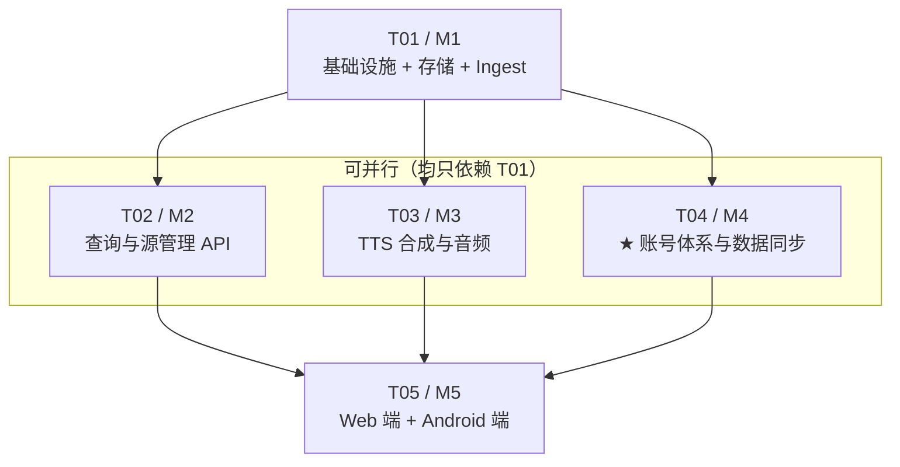

---

## 17. 共享知识（跨端约定）

1. **统一响应结构**：`{"code": "...", "message": "...", "data": {...}, "requestId": "..."}`。HTTP 状态码表示传输层结果，`code` 表示业务结果；`data` 在失败时可为 `null` 或含 `details[]`。
2. **错误码**：见 §3.6；新增错误码必须同步更新 `openapi.yaml`。
3. **时间**：**存储**用 INTEGER epoch 毫秒（UTC）；**传输**用 ISO 8601 UTC（`...Z`，毫秒精度）。客户端显示时按本地时区格式化。
4. **分页命名**：`limit`（每页条数）、`cursor`（增量水位）、`pageCursor`（分页游标）、`nextCursor` / `nextPageCursor`、`syncCursor`（服务端水位）、`hasMore`。**不使用 `offset`/`page`**（深翻页性能差）。
5. **ID 策略**：文章/音频/任务/源用 SQLite `AUTOINCREMENT` 的 int64；`requestId` 用 22 字符 base64url 随机（不引入 uuid 依赖）；源的 `key` 为稳定业务键（小写 kebab/snake）。
6. **日志格式**：slog JSON，字段见 §13.3；**禁止**记录 API Key、TTS 凭据、密码、token、完整请求体（除 debug 且已脱敏）。
7. **配置管理**：YAML 文件 + `EZNEWS_*` 环境变量覆盖；密钥强制走环境变量；启动 fail-fast 校验。
8. **类型同步**：Web 端 `src/api/types.ts` **由 `docs/api/openapi.yaml` 生成**（`openapi-typescript`），禁止手写漂移；Android DTO 手写但需与契约逐字段对齐（或后续接入同一生成器）。
9. **API 版本**：所有业务接口前缀 `/api/v1`；`/healthz`、`/readyz`、`/metrics` 不带前缀。
10. **端到端约定**：客户端**不得**实现 TTS；**不得**假设服务端会推送；**必须**按 `id` 本地去重合并增量结果。
11. **安全**：全部 SQL 使用参数化（禁止字符串拼接）；输入长度严格按 §3.3 上限；TTS 凭据、JWT 密钥仅存在于服务端进程内存/环境变量。
12. **Git 忽略**：`server/data/`、`*.db`、`*.db-wal`、`*.db-shm`、`data/jwt_secret`、`.env`、`web/dist`、`.apk`。

**账号体系（v1.1）—— 跨端强制约定**：

13. **三套鉴权互不干扰**：① 采集器 `POST /api/v1/ingest/**` 用 `X-Api-Key`；② 业务查询用 `OptionalAuth`（Bearer，可缺省）；③ `/api/v1/me/**` 用 `RequireAuth`。**ingest 不使用账号体系**，账号体系不影响 ingest 契约。
14. **401 语义区分**：`TOKEN_EXPIRED` → 客户端**静默** refresh 并重放（单飞，避免并发轮换互踢）；`UNAUTHORIZED` → 丢弃凭证、**降级游客态 + 轻提示**，**绝不弹阻断式登录窗**。
15. **越权红线**：所有 `/api/v1/me/**` 的 `user_id` **一律从 JWT `sub` 取**，handler 不接收任何来自路径/查询/请求体的 user_id。
16. **增量游标统一**：收藏/已读同步复用 §5 的复合键 `(updated_at, id)` 游标与 `since`/`nextCursor`/`hasMore` 命名，语义与文章列表完全一致。
17. **合并幂等**：客户端传 `clientId` + `nonce`（每批次生成一次并持久化至成功）；服务端 `merge_log` 唯一键 `(user_id, client_id, nonce)` 命中则**直接回放**结果、零写入。
18. **冲突消解**：收藏/已读 = **并集 + LWW(`updated_at`) + 墓碑 `deleted_at`**；偏好 = **整包 KV，服务端有值以服务端为准**。Web 与 Android 语义**必须一致**（US-ACC-06）。
19. **游客优先**：业务接口（浏览/筛选/搜索/播放/源管理）**永远不返回"需要登录"**；登录入口仅顶栏与设置面板两处（PRD R1/R2）。
20. **凭证存储**：Web accessToken 存内存、refreshToken 存 `httpOnly` Cookie（跨域降级 localStorage 需标注风险）；Android refreshToken 存 `EncryptedSharedPreferences`。**禁止**写入日志。

---

## 18. 待明确事项（需用户拍板）

| 编号 | 问题 | 推荐默认值 | 影响面 | 若采纳备选的影响 |
| --- | --- | --- | --- | --- |
| **Q-A1** | **服务端语言与框架** | **Go 1.22 + 标准库 net/http + modernc.org/sqlite** | 全项目 | 选 Node.js：内存升至 ~60–90 MB、镜像 ~120 MB，但可共享 TS 类型；选 Python：内存与镜像最不达标 |
| **Q-A2** | **PRD Q2–Q6 的架构侧确认**（~~Q1~~ 已作废） | Q2–Q6 全部采纳 PRD 推荐值：腾讯云（Q2）/ 不存正文（Q3）/ 90 天归档（Q4）/ minSdk 26（Q5）/ 限流开启（Q6）。**Q1 已被 PRD-ACCOUNT.md 推翻**，账号体系按 §9 落地 | 全局 | 若 Q3 改为存正文：DB 增长约 5–10 倍，需调整 `retention.days` 与备份策略 |
| **Q-A3** | **Android 是否需要 Room** | **M5 阶段不引入**。偏好/游标用 DataStore；音频离线索引用 DataStore JSON（上限 200 条） | Android | 若需"离线阅读文章列表"（远超 F-AND-04），则引入 Room（APK +0.5 MB、编译变慢），并需设计本地与增量游标的合并冲突策略 |
| **Q-A4** | **音频目录与容量上限** | 目录 `./data/audio`；`maxTotalBytes = 2 GiB`；`maxAgeDays = 30`；清理至 90% 滞回 | 磁盘 / 运维 | 容量调大需相应磁盘规划；调小（如 512 MB）会提高 TTS 重复合成率与费用 |
| **Q-A5** | **TTS SDK 还是自签实现** | **先用腾讯云官方 Go SDK**（省事、稳定）；若最终镜像体积压力大，再替换为约 200 行的 TC3 自签 HTTP 实现（可省 2–5 MB） | 服务端体积 | 自签实现需自行维护签名逻辑与错误码映射 |
| **Q-A6** | **Web 是否引入 MUI** | **不引入**。Tailwind + 自研 8 个基础组件 | Web 体积 | 引入 MUI 可加快开发，但产物 +~100 KB gzip 且引入运行时样式开销 |
| **Q-A7** | **Android UI：Compose vs XML** | **Jetpack Compose + Material3** | Android | XML 方案 APK 略小但与 Media3/现代状态管理集成代码量更大 |
| **Q-A8** | **SQLite 驱动：modernc（无 CGO）vs mattn（CGO）** | **modernc.org/sqlite**（交叉编译与部署最简单） | 构建链 | mattn 需 cgo/musl 工具链，写入性能约高 20–30%，但当前目标（500 篇/秒）modernc 已远超 |
| **Q-A9** | **客户端读取接口是否需要鉴权** | **否**（`auth.requireKeyForRead=false`）；自托管场景建议置于内网/反向代理后 | 安全 | 若部署在公网且无反代，应开启读取鉴权或至少加 IP 白名单 |
| **Q-A10** | **是否启用 FTS5 搜索（P1）** | **启用**，tokenizer 用 `trigram`；SQLite < 3.42 时降级为 `LIKE` | 搜索体验 | 不启用则搜索退化为 `LIKE '%kw%'`，10 万行内仍可接受 |
| ~~Q-A11~~ | Argon2id 参数与并发上限 | ✅ **已拍板（DEC-9）**：并发信号量 2 + 排队超时 3s → `503`；`m` 可降至 12 MiB | — | 已落 §2.5 与 §13.1，无需再确认 |
| ~~Q-A12~~ | JWT 密钥缺省策略 | ✅ **已拍板**：未配置时自动生成并落盘 `data/jwt_secret`（0600） | — | 已落 §13.1 |
| ~~Q-A13~~ | refresh reuse 检测处置 | ✅ **已拍板（DEC-7）**：两级判定 —— 60s 内同 client_id = 宽限重放；否则撤销全部 session + `tv+1` | — | 已落 §9.2.2.1，session 表已加 `prev_*` 两列 |
| ~~Q-A14~~ | 是否补 `DELETE /api/v1/me` | ✅ **已拍板（DEC-8）**：补入，密码二次确认 + 级联限定 + 返回 `204` | — | 已落 §9.5 |
| ~~Q-A15~~ | `auth.registrationEnabled` 默认值 | ✅ **已拍板**：默认 `true` | — | 已落 §13.1 |
| ~~Q-A16~~ | 偏好同步（F-ACC-03）是否本期做 | ⛔ **已取消该待确认项（DEC-13）：本期做** | — | PRD §6.1 自始已列入本期范围，此处消除歧义 |

### 18.1 已在本设计中修正/细化的 PRD 点（提请确认）

| 项 | PRD 原文 | 本设计 | 理由 |
| --- | --- | --- | --- |
| 去重命中行为 | "更新已有记录，刷新 `updated_at`" | **细分为 `updated`（有变化）/ `skipped`（无变化，不刷新 `updated_at`）** | 否则增量游标被"无变化重投"污染，退化为全量拉取（详见 §3.4.1） |
| 游标依据 | "`updated_at` 或自增 `id`" | **复合键 `(updated_at, id)`** | 解决同一毫秒多条记录的边界 |
| 时间戳存储 | 未指定 | **INTEGER epoch 毫秒**，API 输出 ISO 8601 | 索引紧凑、比较快、无时区歧义 |
| 音频文件名 | 未指定 | `{audioDir}/{yyyyMM}/{audioId}.mp3` | 便于按月清理、避免单目录文件过多 |
| 合成任务调度 | "进程内轻量执行器" | **channel 队列 + 3 worker + CAS 抢占 + 5s 退避 scanner** | 无 MQ 依赖，重启可恢复 |

### 18.2 PRD-ACCOUNT.md §9 差异清单 —— 架构落点逐条对照

> 下表按 PRD-ACCOUNT.md §9 的 15 条编号逐条给出架构侧落点，供评审时核对"是否遗漏"。

| # | 差异项 | 类型 | 架构落点 |
| --- | --- | --- | --- |
| 1 | Q1「不需要账号」推翻 → 游客可用 + 可选登录 | ⛔ 推翻 | §9 全章；§18 的 Q-A2 已标注作废 |
| 2 | F-USR-03 收藏/已读 → 双态 | 🔄 | §4.3（`user_favorite`/`user_read` 含墓碑）、§9.4 合并、§11.2 / §12.1 双端状态 |
| 3 | F-USR-05 偏好同步 P2 → **P1** | 🔄 | §4.3 `user_preference` KV 表、§9.6 增量同步、列入 T04 |
| 4 | F-AND-07 本地偏好 → 游客态 + 离线缓存 | 🔄 | §12.1 `LocalStateStore` + `SecurePrefs`、§12.3 |
| 5 | F-WEB-06 本地偏好 → 同上 | 🔄 | §11.2 状态表、§11.4 |
| 6 | 数据实体 +6 张表 | ➕ | §4.3 完整 DDL + §4.4 ER 图 |
| 7 | 安全性：密码/会话/越权/限流/注销 | ➕ | §9.8 安全要点、§9.3 中间件、§9.5 越权红线 |
| 8 | 资源：账号 +<5 MB，高频零 DB 查询 | 🔄 | §2.5 Argon2 并发信号量、§9.7 影响评估、§1.3 预算 |
| 9 | 技术栈明确为 Go 单体 + `AuthService` 抽象 | 🔄 | §2.1 选型结论、§7.2 `AuthService` 类图 |
| 10 | 配置项增加 `auth.*` | ➕ | §13.1 配置示例（jwtSecret / TTL / argon2 / 限流） |
| 11 | CLI `eznews admin reset-password` | ➕ | §14.1 `cmd/eznews/admin.go`、T04 子项 11 |
| 12 | `source.owner_user_id` 预留 | ➕ | §4.2 source DDL + `idx_source_owner`；本期恒 NULL |
| 13 | UI：顶栏登录入口 + 设置面板账号区 | ➕ | §11.1（Web）、§12.3（Android），均遵守 R1–R5 |
| 14 | 术语：游客态 / Merge Policy v1 / tombstone / token_version | ➕ | §9.1 / §9.2 / §4.3.1 |
| 15 | US-ACC-01 ~ 06 用户故事 | ➕ | §9.4.2 幂等、§16.2 M4 验收要点逐条对应 |

**架构侧主动补充（PRD 未明确、本设计补齐）**：

| 补充项 | 位置 |
| --- | --- |
| Argon2id 并发信号量（防 19 MB × N 内存叠加） | §2.5 |
| refresh token **reuse 检测**的处置动作（撤销全部会话） | §9.2.1 / Q-A13 |
| `DELETE /api/v1/me` 注销接口补入清单（PRD §8.4 要求但未列接口） | §9.5 / Q-A14 |
| 客户端 401 **单飞**刷新（防并发轮换互踢） | §9.3 / §11.4 / §12.3 |
| 文章归档删除对 `user_favorite`/`user_read` 的级联影响 | §4.6 |
| JWT 密钥缺省自动生成与落盘策略 | §13.1 / Q-A12 |
| 过期 session 清理并入既有 Janitor（不新增定时器） | §4.6 |

### 18.3 PRD v1.1.1 补充决策（DEC-7 ~ DEC-13）架构落点

> PM 已全数采纳并回写 PRD-ACCOUNT.md（v1.1.1）。下表为每条决策在本设计中的**具体落点**，工程师按此实现。

| 决策 | 结论 | 架构落点 | 对设计的影响 |
| --- | --- | --- | --- |
| **DEC-7** | reuse 检测加 **60s 同 client_id 宽限窗口** | §4.3 `session` 表**新增 2 列**（`prev_refresh_token_hash`、`prev_rotated_at`）+ 部分索引 `idx_session_prev`；§9.2.2.1 完整判定算法；§9.2.2 时序图已改两级分支 | **表结构变更**：轮换由"置空"改为"挪入 prev_*"；只保留一代 |
| **DEC-8** | 注销 `DELETE /api/v1/me`，密码二次确认 + 级联限定 + `204` | §9.5 新增 4 条硬约束表；openapi 该端点改为 `204` + `requestBody{password}` | 接口语义变更 |
| **DEC-9** | Argon2id 并发信号量，超时 **`503 SERVICE_BUSY`**（非 429） | §2.5 重写；§13.1 配置项为 `argon2MaxConcurrency` / `argon2QueueTimeoutMs` / `argon2.memory`（v1.1.2 起统一 camelCase） | 错误码与配置名变更 |
| **DEC-10** | 401 single-flight **升格为实现强制项** | §9.3、§11.4（Web）、§12.3（Android）均已标注"强制项，非建议" | 仅措辞强化，无结构变更 |
| **DEC-11** | **墓碑项必须随增量流返回** | §9.6 新增强制要求块（4 条）；openapi `StateItem` 描述 + 示例含 `deleted:true` | 实现强制项，防被"优化"掉 |
| **DEC-12** | Web **官方仅支持同源部署** | §9.2.3 表下加注；§11.4 部署形态行改写 | 明确不为跨域设计额外方案 |
| **DEC-13** | 偏好同步**本期做** | §18 待确认表 Q-A16 划掉；T04 任务已含 `user_preference` 与两个接口 | 无变更（原设计已包含） |
| **DEC-14** | **JWT 增 `sid` 声明，根除「登出静默失效」** | §9.2.1 payload 增 `sid` + 新增三条实现约束；§13.1 硬要求第 1 条降级为纵深防御；§4.3 session DDL 标注 `id` 即 `sid`；openapi `/auth/logout` 补说明 | 新增接口语义，成本极低，热路径 0 开销 |

**本轮架构侧的表结构变更清单（仅 DEC-7 一处）**：

```sql
-- 002_account.sql：session 表新增 2 列（置于建表语句内）
prev_refresh_token_hash TEXT,     -- 上一代 refresh token 的 hash（轮换时挪入）
prev_rotated_at         INTEGER,  -- 上一代被轮换的时刻（60s 宽限窗口起算点）

CREATE INDEX IF NOT EXISTS idx_session_prev ON session(prev_refresh_token_hash)
  WHERE prev_refresh_token_hash IS NOT NULL;
```

---

## 附录 A：变更记录

| 版本 | 日期 | 说明 |
| --- | --- | --- |
| v0.1 | — | 首轮架构设计：冻结 ingest 契约（PRD-Q7），完成技术选型、数据模型、TTS 机制、任务分解 |
| **v1.1** | — | **账号体系增补**（依据 `PRD-ACCOUNT.md`）：新增第 9 章（双态模型 / JWT+Refresh / Merge Policy v1 / 越权红线）；数据模型 +6 张表 + `source.owner_user_id`；新增 `auth` 包与 `OptionalAuth`/`RequireAuth` 中间件；新增 Argon2id 并发内存控制（§2.5）；任务分解重排为 M4=账号体系、M5=双端；原第 9–17 章顺延为第 10–18 章。**ingest 契约（第 3 章）未做任何变更**，采集器侧无影响。 |
| **v1.1.1** | — | **响应 PM 的 DEC-7 ~ DEC-13 补充决策**：① `session` 表新增 `prev_refresh_token_hash` + `prev_rotated_at` 两列与部分索引，支撑 refresh reuse 的 60s 同设备宽限判定（§9.2.2.1 完整算法）；② `DELETE /api/v1/me` 落 4 条硬约束并返回 `204`；③ Argon2id 信号量超时改为 **`503 SERVICE_BUSY`**，账号配置项统一为 **snake_case**（对齐 PRD §10.2）；④ 401 single-flight 与"墓碑随增量流"标为**实现强制项**；⑤ Web 明确**官方仅支持同源部署**；⑥ 待确认项 Q-A11~A16 全部关闭。详见 §18.3。 |
| **v1.1.2** | — | **配置键命名统一（团队决策：代码不迁就文档）**：① §13.1 全表改为 **lowerCamelCase**，`argon2` 参数收进嵌套块并标注单位 **KiB**（`19456` = 19 MiB，非 MiB）；② 新增「配置键命名约定」小节，明确 **YAML 键 camelCase / 环境变量 SCREAMING_SNAKE_CASE 两层独立**；③ **未知键 fail-fast 列为强制项**（`KnownFields(true)`），杜绝 `registrationEnabled` 写错风格时被静默丢弃导致注册接口常开的安全相关静默失败；④ §2.5 与 §18.3 的账号配置项引用同步修正。 |
| **v1.1.3** | — | **补齐环境变量层与传输通道语义**：① §13.1 环境变量对照表扩至 16 行（13 账号 + 3 传输通道）；② 新增「Refresh Token 传输通道配置」四组合后果矩阵与三条硬要求（默认须 `true`+`true`、持久化路径只允许 Cookie、`false`+`false` 启动 fail-fast）；③ 启动校验清单加入该 fail-fast 项。对应 PRD-ACCOUNT v1.1.4 §10.2.1。 |
| **v1.1.4** | — | **传输通道两级处置 + Cookie Path 取值修正**：① `false+false` 仍为启动 fail-fast，`true+false` 改为**仅 WARN 不拦截**（无法在启动时判断是否存在 Android 客户端，一刀切会误伤纯 Web 合法部署），WARN 文案须带后果；② `refreshCookiePath` 默认值由 `/api/v1/auth/refresh` 修正为 **`/api/v1/auth`**——JWT 不含 session id，logout 只能靠 refreshToken 定位 session，窄路径会使「最安全」的纯 Web 配置下**登出无法销毁 session（refreshToken 仍有效 30 天）**，属伪装成安全增强的安全回归；③ §9.2.3 token 存储表的 Path 描述同步。对应 PRD-ACCOUNT v1.1.5 §10.2.1。 |
| **v1.1.5** | — | **DEC-14：JWT 增 `sid` 声明，根除「登出静默失效」**：① Access payload 增加 `sid`(= `session.id`)，登出/踢下线按 `sid` 定位会话，**断开对 refreshToken 与传输通道的依赖**；② 新增三条实现约束（轮换须原地 UPDATE 保 `sid` 稳定、登出须校验 `session.user_id == claims.sub`、无 `sid` 老 token 走回退路径）；③ §13.1 硬要求第 1 条由「正确性保障」降级为「纵深防御」并保留风险原貌说明；④ session 表 DDL 标注 `id` 即 `sid`。对应 PRD-ACCOUNT v1.1.6。 |
| **v1.1.6** | — | **DEC-14 行身份不变量收紧 + 登出语义统一**：① 明确「refresh 轮换必须原地 UPDATE、禁止 delete+insert」为**行身份不变量**，并写明违反它会使 DEC-7 与 DEC-14 **同时静默失效**（旧 token 登出只作废已作废行，活跃会话存活）；② 登出响应由 `200 + Envelope` 改为 **`204`**，幂等且不泄露会话存在性（避免成为会话存在性探测接口）；③ 补「登出只销毁当前会话，不动其他设备」。对应 PRD-ACCOUNT v1.1.6 §7.2。 |
