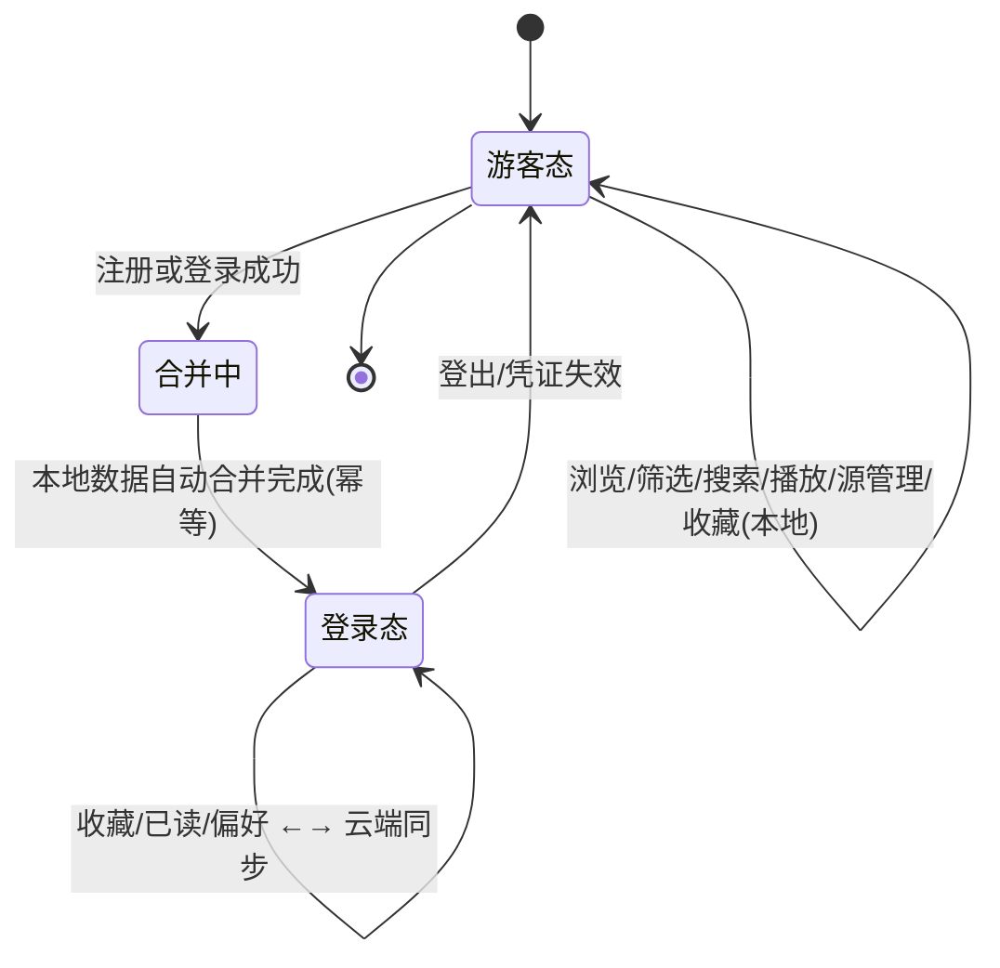
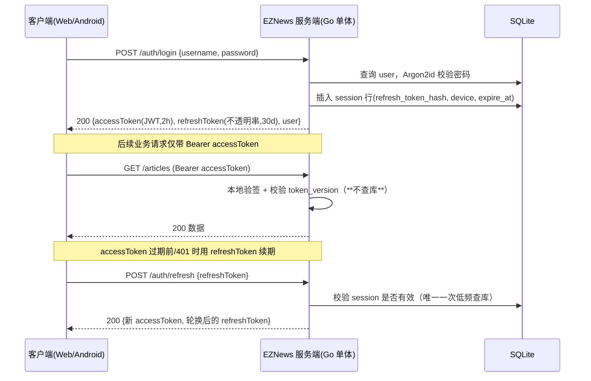
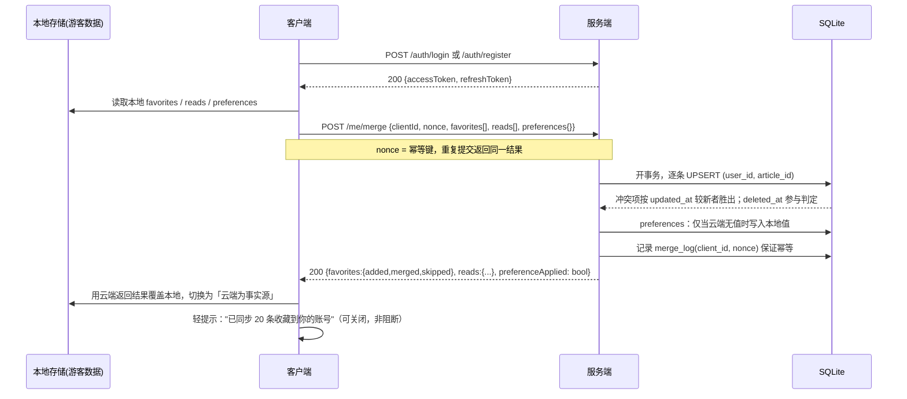
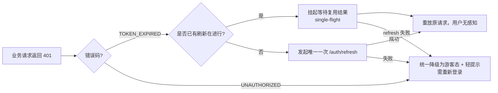
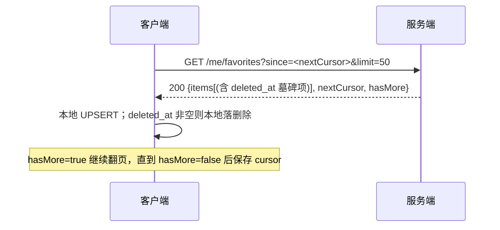
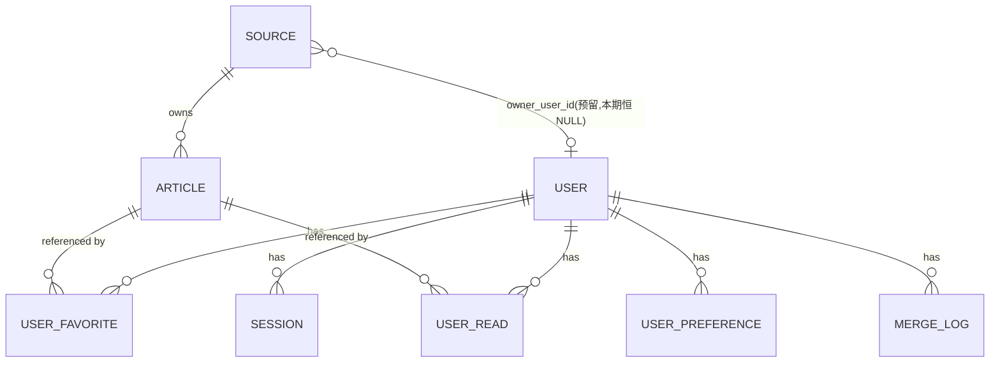

# EZNews 账号体系 增量 PRD（游客可用 + 可选登录）

> 文档类型：**增量 PRD**（**v1.1.7**）｜ 语言：简体中文
> 主文档：`docs/PRD.md`（v1.1，账号体系部分以本文档为准）
> 触发变更：用户在 v1.0 PRD 产出后要求「**把账号体系一块做了，不过不登录也可以使用当前的大部分功能。后续再设计登录后能用的功能。**」
> **v1.1.1 变更**：响应架构师评审，补齐 5 项实现前必须冻结的决策（DEC-7 ~ DEC-11）与 2 项范围结论（DEC-12 ~ DEC-13），详见 **§10.1**。
> **v1.1.2 变更**：对齐架构落地实现——§3.2 补全 DEC-7 的实现方式说明（再轮换语义 + `session` 保留前一代哈希），并新增宽限重放的次数护栏建议。产品语义无变化。
> **v1.1.3 变更**：§10.2 配置键改为 **camelCase + `argon2:` 嵌套块**与实现对齐（snake_case 写法作废）；补齐**环境变量层** `SCREAMING_SNAKE_CASE` 命名；标注 `argon2.memory` 单位为 **KiB**（易配错项）；新增「配置校验要求」——`KnownFields(true)` 防止键名静默漂移。产品需求无变化。
> **v1.1.4 变更**：§10.2 补入 Token 传输通道三键（`refreshCookie` / `refreshTokenInBody` / `refreshCookiePath`），并新增 **§10.2.1 四组合后果矩阵**——明确 `false+false` 为禁止组合且须启动时 fail-fast。产品需求无变化。
> **v1.1.5 变更**：§10.2.1 配置组合改为**两级处置**（`false+false` fail-fast / `true+false` 启动 WARN），并标注 `refreshCookiePath` 须覆盖 refresh 与 logout 两端点。产品需求无变化。
> **v1.1.7 变更**：① 修订 DEC-7 前置契约——明确 **`POST /auth/refresh` 必须携带 `client_id`**，否则宽限判定无从比对、会退化回纯误伤模式；② 新增 **DEC-7 验收用例 T1~T5** 与回归红线（据实测，此前 `RotateSession` 为 delete+insert 且 `prev_*` 两列未建，DEC-7 宽限窗口实际未生效）。产品需求无变化。 —— Access Token 增加 `sid`（session_id）声明，使**登出不依赖 refreshToken 传输通道**，根治"登出后凭证仍有效 30 天"的安全回归；`refreshCookiePath: /api/v1/auth` 降级为纵深防御。已落定为**正式决策**，并补齐 `sid` 稳定性要求（session 行必须原地 UPDATE）+ 未采纳时的兜底条款；§7.2 同步 DEC-7 两列与行身份不变量。产品需求无变化。
> 本期交付范围：**仅 PRD + 架构设计**，不写代码。

---

## 0. 变更摘要与设计总纲

### 0.1 一句话结论

账号体系从「无账号」升级为「**游客可用 + 可选登录**」双态：**登录是增强，不是门槛**——不登录可用 90% 功能，登录后只获得本期 3 项高价值增强（收藏/已读/偏好跨设备同步），其余登录后能力留到后续版本，但**架构预留位已在本文档冻结**。

### 0.2 贯穿本次设计的八大原则（源自用户总体产品原则）

| 用户原则 | 本次设计的落地体现 |
| --- | --- |
| 轻量 | 无 Redis、无 MQ、无 OAuth 集群、无邮件服务依赖；账号数据落在**同一个 SQLite 文件**； Access Token **无状态校验不查库** |
| 满足功能 | 完整覆盖注册/登录/刷新/登出/会话/数据合并全链路，不留半成品 |
| 有设计感 | 登录入口克制（顶栏头像/“登录”文本入口），**无打断式弹窗**、无强制注册墙 |
| 用户愿意用 | 游客可执行除"跨设备同步"外全部操作；登录后**静默自动合并**本地数据，零选择零打断 |
| 交互逻辑清晰 | 全局只有两种状态（游客/登录），状态切换规则集中定义于「Merge Policy v1」，Web 与 Android 语义完全一致 |
| 资源占用低 | 账号体系增加的常驻内存目标 **< 5 MB**；高频路径零 DB 查询 |
| 足够健壮 | 合并**幂等可重入**；token 可失效；密码 Argon2id；刷新失败有明确恢复路径 |
| 符合最佳实践 | OWASP 密码存储建议、Bearer + Refresh 双 token、`httpOnly`/加密存储、注销版本号、`owner_user_id` 预留 |
| 二八定律 | 登录后本期仅做 3 项（20% 投入覆盖 80% 价值），其余明确列入「预留但本期不做」并说明**不改架构即可追加** |

---

## 1. 游客态 / 登录态 功能对照表

> 图例：✅ 可用 ｜ ✅✅ 可用且**跨设备同步** ｜ 🔒 需登录 ｜ ⛔ 不可用

| 能力域 | 具体功能 | 游客 | 登录用户 | 备注 |
| --- | --- | --- | --- | --- |
| 浏览 | 新闻列表浏览 / 分页 / 下拉刷新 | ✅ | ✅ | 核心能力，**永远不对游客设限** |
| 浏览 | 分类 / 新闻源筛选 | ✅ | ✅ | 同上 |
| 浏览 | 关键词搜索（F-QRY-05） | ✅ | ✅ | 同上 |
| 浏览 | 文章详情 | ✅ | ✅ | 同上 |
| 语音 | 请求合成 / 播放 / 暂停 / 语速 | ✅ | ✅ | 音频**服务端缓存**，游客同样享受"一次合成多次复用" |
| 语音 | 连续播报队列 | ✅ | ✅ | 队列本期为客户端本地队列 |
| 源管理 | 查看源列表 / 默认源开关 | ✅ | ✅ | 本期源为**服务端全局共享**数据 |
| 源管理 | 新增/编辑/删除自定义源 | ✅ | ✅ | 自托管场景下视为"管理员配置"，见 §7 预留说明 |
| 状态标记 | 收藏 / 取消收藏 | ✅（仅本设备） | ✅✅ | 游客存 localStorage / DataStore；登录后同步云端 |
| 状态标记 | 已读标记 | ✅（仅本设备） | ✅✅ | 同上 |
| 偏好 | 音色 / 语速 / 列表密度等偏好 | ✅（仅本设备） | ✅✅ | 同上 |
| 播放历史 | 本地播放历史 | ⛔（本期不做） | ⛔（本期不做） | 列入 §6.2 预留 |
| 账号 | 查看/编辑账号资料、修改密码 | 🔒 | ✅ | — |
| 账号 | 会话管理（当前设备列表） | 🔒 | ✅ | — |
| 账号 | 强制下线其他设备 | 🔒 | ⛔ | P2，表结构已预留 |

### 1.1 「游客永不被打断」的硬性交互规则（设计红线）

| 规则 | 说明 |
| --- | --- |
| R1 | **禁止**在浏览、筛选、播放路径上出现登录弹窗/半屏遮罩/注册墙 |
| R2 | 登录入口固定两处：顶栏「登录」文本按钮、设置面板「登录/注册」；**不随内容穿插出现** |
| R3 | 游客点击收藏/已读：**必须立即生效于本地**，不得先要求登录；仅在做同步时提示"登录后可跨设备同步"（可关闭的轻提示，非阻断） |
| R4 | 登录成功后**不得清空**游客本地数据；合并完成前本地数据仍可读 |
| R5 | 登出后回到游客态，功能不受任何限制（仅失去同步能力） |

---

## 2. 登录方式选型（结论）

### 2.1 选型结论

> **主方案：用户名 + 密码（Argon2id 存储），邮箱为「选填」字段，不做强制邮箱验证。**
> 备用/远期：邮箱验证码（仅当部署者自行配置了 SMTP 时作为一个可开关的 P2 增强，本期不实现）。

### 2.2 候选方案评估表

| 方案 | 额外基础设施 | 自托管友好度 | 资源开销 | 结论 |
| --- | --- | --- | --- | --- |
| **用户名 + 密码** ✅ | **无** | 极高（单机可用） | 极低 | **选定（主方案）** |
| 邮箱验证码 / 邮件找回 | 需 SMTP 服务、域名、送达率保障 | 低（自托管常无邮件通道；国内发信易被限） | 低但运维高 | ❌ 本期不做，降级替代见 §2.4 |
| 第三方 OAuth（微信/GitHub/Google） | 需公网回调地址 + 各平台应用申请 | 低（自托管常无公网域名） | 中（额外 SDK/发现端点） | ❌ 排除，与"轻量自托管"冲突 |
| 手机号 + 短信验证码 | 需短信服务商、需付费、需资质 | 极低 | 中 + 成本 | ❌ 排除（有费用与合规负担） |
| 纯本地免注册( v1.0 方案 ) | 无 | — | — | ⛔ 已被本次变更取代（无法实现跨设备） |

### 2.3 选用户名 + 密码的理由

1. **零外部依赖**：不需要 SMTP、不需要公网回调、不需要第三方凭证，完全契合"Go 单体 + SQLite 单文件"的自托管形态。
2. **部署即开箱**：用户拉起服务 → 注册第一个账号 → 使用；无需任何前置配置，符合"二八定律"下的最小可用闭环。
3. **资源最省**：仅一次 Argon2id 哈希计算（见 §7.2 参数，单次约 19 MB 内存峰值，仅发生在注册/登录瞬间），无常驻开销。
4. **离线/内网可用**：家庭 NAS、内网部署场景下仍能注册登录，不会因无公网而失效。

### 2.4 密码找回的降级路径（替代邮件找回）

由于不依赖邮件服务，密码找回采用**自托管最佳实践**：

| 手段 | 说明 |
| --- | --- |
| 管理员 CLI | 提供 `eznews admin reset-password <username>` 命令行工具，部署者本机执行，直接重置密码（覆盖 90% 自托管找回场景） |
| 恢复码（P1） | 注册时生成一次性恢复码，用户自行保存；可用恢复码自助重置 |
| 邮箱找回（P2，可选启用） | 若部署者配置了 SMTP，可通过配置项 `auth.email_enabled=true` 开启；未配置则该能力不出现（**能力随设施降级，不影响主体**） |

---

## 3. 会话与凭证机制

### 3.1 总体方案：无状态 Access Token + 低频 Refresh Token

### 3.2 凭证规格表

| 项 | 规格 | 理由 |
| --- | --- | --- |
| Access Token | JWT（HS256），payload 含 `sub`(user_id)、`tv`(token_version)、`exp`、**`sid`(session_id)** | 服务端验签即可，**高频路径零 DB 查询**，最省资源。`sid` 仅在登出时使用，不影响热路径开销 |
| Access 有效期 | **2 小时** | 平衡被盗用风险与刷新频率（每 2h 仅 1 次查库，可忽略） |
| Refresh Token | 32 字节随机串，**库内仅存 SHA-256 哈希** | 不透明随机串无法伪造；存哈希避免拖库后被冒用 |
| Refresh 有效期 | **30 天，滑动续期**（每次刷新换新串并轮换旧串，带 reuse 检测） | 长期在线体验 + 轮换泄露检测 |
| **Refresh reuse 检测后的处置** ⭐ | 区分两种情况： ① **宽限重放**（同一 refresh token 在 **60 秒**内且**同一 `client_id`** 再次出现）→ 判定为网络重试，**重新轮换一次并下发新的一对凭据**（见下方实现说明），不惩罚用户； ② **疑似泄露**（超出宽限窗口，或不同 `client_id` 使用了同一旧 token）→ **撤销该用户全部 session + `token_version+1` + 强制重新登录**（OWASP / RFC 6819 建议） | 只拒绝本次刷新则泄露凭证仍可在别处使用，检测形同虚设；但无宽限窗口会因移动端弱网重试误伤正常用户（对 Android 尤为关键），故加 60s 同设备宽限 |
| 签名密钥 | `auth.jwtSecret` 配置项（环境变量注入），缺省时**启动时自动生成并落盘** | 自托管开箱即用；生产可显式配置 |
| 登出 | **从 Access Token 的 `sid` 声明定位并销毁对应 `session` 行** + 客户端丢弃本地凭证。**不依赖 Cookie 或响应体中的 refreshToken** | 使登出与传输通道解耦，见下方 DEC-14 |
| 全局登出 / 改密 / 泄露处置 | `user.token_version += 1`，Access 验签时比对 `tv` 不符即拒 | **无需 token 黑名单，无需 Redis** |
| **并发刷新保护（客户端）** ⭐ | **单飞（single-flight）**：同一客户端实例内并发 401 **只触发一次** `/auth/refresh`，其余请求挂起等待并复用结果；refresh 失败则统一降级游客态 | 否则多请求并发刷新会并发轮换 refresh token，互相把对方踢下线 |

> ⭐ **DEC-7 实现说明（v1.1.2）**：宽限重放的"返回已轮换凭据"在实现上只能做成**再执行一次轮换并下发新的一对**——因为服务端只存 SHA-256 哈希，**无法还原旧明文 token**，拿不出"上一次轮换后那个串"。再轮换一次对客户端完全等价（拿到可用凭据、旧串彻底作废）且天然幂等，产品语义不变。
> 配套要求：`session` 表必须保留**前一代** token 哈希（而非轮换时置空），否则无法判定宽限窗口。

> ⭐ **DEC-7 前置契约（v1.1.7 增补）：宽限判定依赖请求侧携带 `client_id`。**
>
> 宽限与否的判据是「**发起重放的一方是不是同一个客户端实例**」。服务端只有拿到请求方的 `client_id`，才能与 `session.client_id` 比对；**若 `/auth/refresh` 不传 `client_id`，服务端无法区分"同设备重试"和"他人冒用"，只能一律按泄露处置 —— 那样 DEC-7 的宽限窗口等于不存在，退化回纯误伤模式。**
>
> | 要求 | 说明 |
> | --- | --- |
> | `POST /auth/refresh` 请求体**必须携带** `client_id` | 与登录时写入 `session.client_id` 的值一致；Web 与 Android 均须发送 |
> | 缺失处理 | 未携带时**按疑似泄露处置**（保守侧），不得默认放行宽限 |
> | 安全定位 | `client_id` **不是秘密**（设备本地可读），该机制的作用是**消除网络重试造成的误伤**，不是防盗用防线；防盗用仍由 token 轮换分叉保证 |
>
> #### DEC-7 验收用例（必须覆盖，否则该缺陷不会出现在任何常规测试里）
>
> | # | 步骤 | 期望结果 |
> | --- | --- | --- |
> | T1 | 登录取得 `(AT1, RT1)`；用 `RT1` 刷新得到 `RT2` | 正常轮换 |
> | T2 | **60 秒内**，同一 `client_id` 重放 `RT1` | ✅ 返回新凭据对；**该用户其他设备会话不受影响**；不触发强制重登 |
> | T3 | 超过 60 秒后，同一 `client_id` 重放 `RT1` | ⛔ 判定泄露：全部会话撤销 + 强制重登 |
> | T4 | 60 秒内，**不同 `client_id`** 重放 `RT1` | ⛔ 判定泄露：全部会话撤销 + 强制重登 |
> | T5 | `POST /auth/refresh` 不传 `client_id` | ⛔ 按疑似泄露处置（保守侧） |
>
> **回归红线**：T2 若产生"其他设备被踢下线"的结果，即为 **DEC-7 未生效**，不得放行。
> 该缺陷的用户可见签名是——**Android 弱网下偶发的全设备掉线，难以复现**。测试若只覆盖 T3/T4 会完全漏掉 T2。
>
> 🛡️ **护栏建议（工程实现阶段的可选项）**：由于每次重放都会产生一次轮换与一次 DB 写入，若客户端出现重试循环（缺陷或弱网抖动），理论上可在 60 秒窗口内反复轮换。建议在宽限重放路径加**轻量计数护栏**：同一 `prev_refresh_token_hash` 在窗口内重放超过 **10 次**即停止轮换、返回 `429 Too Many Requests` + `Retry-After`，由客户端退避。**60 秒窗口本身已做时间收敛，且 single-flight 已消除同实例并发重放，故此护栏为防御性措施而非必需项**——是否实现由架构师按复杂度权衡决定。

> ⭐ **DEC-14（v1.1.6）：Access Token 增加 `sid`（session_id）声明，登出不再依赖 refreshToken。**
>
> **要解决的问题**：若登出靠 refreshToken 反查 session 行，则在 `refreshTokenInBody=false` 的纯 Web 部署下（Web 端从不持有 refreshToken、Cookie 是唯一通道），一旦 Cookie Path 未覆盖 logout 端点，请求就带不上 Cookie → **定位不到 session → 服务端凭证仍有效 30 天**。
> 表现为：用户点了"退出登录"，本地已清、UI 已回首页，**看起来成功，实际留了一个 30 天有效的 refreshToken**。这是一个**伪装成安全增强的安全回归**——运维为了"抗 XSS 最强"选了该组合，换来的却是永远杀不掉的凭证。
>
> **解决方式**：`sid` 进 JWT payload，登出时直接从 Access Token 取 session id 销毁该行，**与传输通道彻底解耦**。
>
> | 影响面 | 评估 |
> | --- | --- |
> | 热路径开销 | **0**。验签仍不查库，`sid` 只在登出时读取 |
> | 安全收益 | 登出在任何部署组合下都真实有效；同时为 P2「踢下线」提供可靠的会话定位依据 |
> | 改动量 | 签发时多写一个 claim + 登出逻辑改用 `sid` 查询 |
>
> 这是**根治**而非文档规避：Cookie Path 取 `/api/v1/auth` 仍作为防线保留（纵深防御），但**登出的正确性不再依赖它是否配置正确**。
>
> #### ⚠️ `sid` 的稳定性要求（DEC-14 生效的前提）
>
> **`sid` 必须在同一次会话的全部轮换中保持不变**，否则它的修复会失效、并把问题藏得更深：
>
> 若轮换采用「删旧行 + 插新行」，session id 会变化 → **轮换前签发的 access token 里的 `sid` 指向已被删除的行** → 登出定位不到任何东西 → 症状与修复前完全一样，但因为"明明已经修过"，反而更难排查。
>
> | 轮换实现 | 做法 | `sid` 是否稳定 |
> | --- | --- | --- |
> | **原地 UPDATE 同一行**（轮换时把旧 hash 移入 `prev_refresh_token_hash`） | session id 不变 | ✅ **推荐，且与 DEC-7 的表设计天然一致** |
> | 删旧行 + 插新行 | 需额外引入稳定的 `family_id`，`sid` 取 `family_id` | 需额外字段 |
>
> **好消息**：DEC-7 已经把 `prev_refresh_token_hash` / `prev_rotated_at` 设计在 **session 行自身**上，这在语义上就要求了原地 UPDATE。因此**按现有设计演进，`sid = session.id` 天然稳定，无需引入 session family 概念**。
>
> **不变量（写入 CODE 约束）**：
> 1. refresh 轮换**必须原地更新** session 行，禁止 delete + insert；
> 2. `sid` 一经签发在该会话生命周期内不再改变；
> 3. 登出以 `sid` 定位 session，**幂等**——即使该行已不存在（已过期/已被 reuse 处置撤销）也返回 `204`，不因"查不到"而报错或泄露会话是否存在；
> 4. 登出**只销毁当前会话**，不影响该用户其他设备的会话（批量下线属 P2）。
>
> #### 兜底条款
>
> 若实现侧因故**未能采纳 DEC-14**，则本 PRD 必须如实记录降级后的真实行为——特别是「在 `refreshTokenInBody=false` 组合下，登出可能无法真正销毁服务端凭证」这一限制，并在 §3.3 与部署文档中显著标注。**不允许既不根治、也不记录。**

### 3.3 凭证存储位置

| 端 | Access Token | Refresh Token | 说明 |
| --- | --- | --- | --- |
| Web | 应用内存（JS 变量 / 状态管理），**不落盘** | `httpOnly + Secure + SameSite=Lax` Cookie（**同源部署**） | Cookie 模式可防 XSS 窃取；内存态避免持久化泄露 |
| Android | 内存 | **EncryptedSharedPreferences**（Keystore 加密） | 系统级加密存储，符合移动端最佳实践 |

> ⭐ **部署形态结论：官方仅支持「同源部署」**（Web 静态资源与 API 通过同一域名 + 反向代理提供，这也是"Go 单体 + 单文件 DB"自托管的自然形态）。
> **跨域部署（前端与 API 不同域）不为官方支持方案**：此时 refreshToken 无法使用 `httpOnly` Cookie，只能降级存 `localStorage`，存在 XSS 窃取风险。
> 若用户确有跨域需求：允许运行（功能不受限），但必须由部署者自担风险，并在部署文档中明确标注该风险；**不为其设计额外的跨域认证方案**（避免为 5% 场景增加 50% 复杂度，符合二八定律）。

### 3.4 多设备管理

- `session` 表天然支持**同账号多设备并存**（每条 refresh 记录带 `device_name` / `last_seen_at`）。
- 本期（P1）：`GET /me/sessions` 展示当前账号的活跃会话列表。
- P2（预留，表已就位）：`DELETE /me/sessions/{id}` 踢下线、远程登出。
- **无需额外基础设施**：全部落在同一 SQLite 文件。

### 3.5 资源开销评估（对 §7 非功能目标的影响）

| 项目 | 评估 |
| --- | --- |
| 常驻内存增加 | **< 5 MB**（仅 JWT 密钥与少量缓存），满足原 PRD「< 150 MB」总目标 |
| 高频请求额外 DB 查询 | **0 次**（JWT 无状态校验） |
| Refresh 频率 | 约 1 次 / 2 小时 / 客户端，SQLite 完全无压力 |
| Argon2id 开销 | 仅注册/登录瞬时发生（单次 ≈ 19 MB 峰值、数十 ms），无常驻成本 |
| **Argon2id 并发内存峰值** ⭐ | **必须限流，否则会击穿总内存目标**：并发 N 次登录 = `19 MB × N`。8 次并发即 152 MB，叠加基线将**突破 150 MB 总目标**。 措施：新增**并发信号量 `auth.argon2MaxConcurrency`，默认 2**，峰值约 `19×2 ≈ 38 MB`。 超出的请求**排队等待**（默认最长 3 秒），超时返回 `503 SERVICE_BUSY` + `Retry-After`。 极低内存设备（如 256 MB NAS）可将 `auth.argon2.memory` 下调至 **`12288`**（12 MiB），此时并发 2 峰值约 24 MB。 |

---

## 4. 游客数据 → 账号数据 合并策略（本次最关键设计）

### 4.1 问题陈述

游客态下，收藏/已读/偏好**只存在本地**（Web localStorage / Android DataStore）。用户一旦注册或登录，这些本地数据必须与云端账号数据合而为一，且**Web 与 Android 行为语义完全一致**。

### 4.2 决策结论（Merge Policy v1）

| 决策点 | 结论 |
| --- | --- |
| 何时触发 | 登录/注册成功**返回凭证后立即由客户端自动发起**，无需用户确认 |
| 是否打断用户 | **不打断**。无选择弹窗、无"是否上传"询问 |
| 是否幂等 | **是**。携带 `client_id` + 幂等键，重复调用（重登/重试/多端）**不会重复写入也不会翻倍** |
| 本地数据是否保留 | 保留本地副本作为**离线缓存**；登录后**云端成为唯一事实源（Source of Truth）**，本地跟随云端更新 |
| 失败如何处理 | 合并失败**不影响登录态**；本地保留 marker，下次冷启动/下拉刷新自动重试（退避重试） |
| 登出后 | 清除本设备与该账号关联的同步快照，回到纯净游客态（避免跨账号串数据） |

### 4.3 分数据类型的冲突消解规则

| 数据类型 | 合并语义 | 冲突消解规则 | 是否需要墓碑(tombstone) |
| --- | --- | --- | --- |
| **收藏** | **并集**（Union） | `(user_id, article_id)` 唯一键；比较两侧 `updated_at`，**较新者胜出**；删除用 `deleted_at` 表达（防止"本地删了又被旧数据复活"） | ✅ 必需 |
| **已读** | **并集**（Union） | 同上；`read=1` 视为"已发生的事实"，采用并集更不容易丢用户意图 | ✅ 必需 |
| **偏好（音色/语速/播放设置等）** | **整包 KV 覆盖** | **服务端有记录 → 以服务端为准**（云端多设备，"最后一次设置"更可信）；服务端无记录 → 写入本地值作为初始值 | ❌ 不需要 |
| **播放历史** | — | 本期不做（见 §6.2 预留），无合并需求 | — |

> **为什么收藏用「并集 + LWW」而不是「以服务端为准」**：收藏是"用户曾明确表达过的正向意图"，直接丢弃会造成不可逆的数据丢失感；并集对用户损失最小，配合 tombstone 可正确表达"取消收藏"。

### 4.4 端到端合并流程

### 4.5 典型场景端到端用户故事

> **场景**：用户先在游客态收藏了 20 条新闻，随后注册并登录。

| 编号 | 用户故事 | 预期结果（验收标准） |
| --- | --- | --- |
| US-ACC-01 | 作为游客态收藏了 20 条新闻的用户，我希望**注册登录这 20 条自动进入我的账号**，以便我不想手动重新收藏一遍。 | 登录后底部出现 3 秒轻提示「已同步 20 条收藏」；收藏列表立即可见这 20 条；无弹窗、无选择、无等待阻塞。 |
| US-ACC-02 | 作为同一账号在**另一台设备**登录的用户，我希望看到刚才那 20 条收藏，以便换设备继续看。 | 新设备登录后拉取 `GET /me/favorites`，完整返回这 20 条，顺序按云端 `updated_at` 倒序。 |
| US-ACC-03 | 作为担心数据被弄乱的用户，我希望**重复登录不会让收藏翻倍**，以便我放心多次切换账号/重装 App。 | 相同 payload 重复提交（相同 `nonce`）返回幂等结果；收藏数**恒为 20**。 |
| US-ACC-04 | 作为在游客态取消过某条收藏的用户，我希望登录同步后那条**不会"复活"**，以便我的操作被尊重。 | 本地 tombstone（`deleted_at`）随合并上传；即使云端/他人设备存在旧的正向记录，也按 `updated_at` 较新的删除意图胜出。 |
| US-ACC-05 | 作为网络不好的用户，我希望**合并失败时不影响我继续用**，以便不卡在同步页。 | 合并失败静默降级为本地态 + 后台退避重试；应用功能完全可用；设置页显示「待同步」标记。 |
| US-ACC-06 | 作为 Web 与 Android 双端用户，我希望**两天的合并语义完全一样**，以便我不困惑。 | 两端共用同一份 Merge Policy v1（字段/冲突规则/错误码/返回值结构一致），仅底层存储介质不同。 |

### 4.6 双端统一语义约定

| 约定 | Web | Android |
| --- | --- | --- |
| 游客本地存储 | localStorage / IndexedDB | DataStore / Room（本地表） |
| 客户端标识 | `client_id`（首次启动生成，持久化， reinstall 重置） | 同左 |
| 幂等键 | `nonce`（每次合并批次生成一次，持久化至成功） | 同左 |
| 合并调用 | 登录后自动 1 次 + 失败退避重试 | 同左 |
| 事实源切换 | 合并成功后云端为准 | 同左 |

---

## 5. 会话态下的API 与交互补充

### 5.1 账号相关接口清单（供架构师设计）

| 方法 | 路径 | 说明 | 游客可否调用 |
| --- | --- | --- | --- |
| POST | `/api/v1/auth/register` | 注册（username + password，email 选填） | ✅ |
| POST | `/api/v1/auth/login` | 登录，返回双 token | ✅ |
| POST | `/api/v1/auth/refresh` | 用 refreshToken 换新 accessToken | ✅ |
| POST | `/api/v1/auth/logout` | 登出，销毁当前 session | 🔒 |
| GET | `/api/v1/me` | 当前账号基本信息 | 🔒 |
| PATCH | `/api/v1/me/password` | 修改密码（触发 token_version+1） | 🔒 |
| GET | `/api/v1/me/preferences` | 拉取偏好 KV | 🔒 |
| PUT | `/api/v1/me/preferences` | 整包写入偏好 KV | 🔒 |
| POST | `/api/v1/me/merge` | **游客数据幂等合并**（核心） | 🔒 |
| GET | `/api/v1/me/favorites` | 收藏列表（分页） | 🔒 |
| POST | `/api/v1/me/favorites` | 收藏/取消收藏（含 tombstone） | 🔒 |
| GET | `/api/v1/me/reads` | 已读列表（支持 `since` 增量游标） | 🔒 |
| POST | `/api/v1/me/reads` | 标记已读/取消已读 | 🔒 |
| GET | `/api/v1/me/sessions` | 会话列表（P1） | 🔒 |
| DELETE | `/api/v1/me/sessions/{id}` | 踢下线（P2 预留） | 🔒 |
| **DELETE** | **`/api/v1/me`** ⭐ | **注销账号**：校验密码确认后**物理删除** user 行，并级联删除 favorites / reads / preferences / sessions / merge_log；成功后立即失效全部凭证并回游客态 | 🔒 |

> ⭐ 注销接口补充约束（原 §8.4 仅有承诺、缺接口，此处补齐闭环）：
> 1. **必须二次确认**：请求体需携带当前密码（`password`），防止误操作与 CSRF 误删；
> 2. **级联范围**：仅删除该用户的账号态数据；**不删除** `article` / `source` / `audio` 等全局共享数据；
> 3. 成功返回 `204 No Content`，客户端清空本地凭证与同步快照并回到游客态；
> 4. 注销**不可逆**（不做软删除/冷静期），但需在 UI 上明确提示"收藏与已读将一并清除"。

> 所有 `/me/**` 统一返回 `401 TOKEN_EXPIRED`（触发静默刷新）与 `401 UNAUTHORIZED`（触发登出回游客态）两种明确错误码，避免客户端误判。

### 5.2 401 处理策略（不打断用户）

> ⭐ **单飞（single-flight）为实现强制项**：同一客户端实例内并发 401 只允许触发**一次** `/auth/refresh`，其余请求挂起等待并复用结果。否则多请求并发轮换 refresh token 会互相把对方踢下线（在列表 + 详情 + 音频并发请求的场景下极易复现）。

### 5.3 收藏 / 已读 增量同步的游标语义 ⭐

> 与文章列表 `GET /articles` **完全统一**，两端共用一套分页/增量拉取逻辑，避免客户端写两套合并代码（对齐 US-ACC-06「两端语义完全一致」）。

| 项 | 规格 |
| --- | --- |
| 排序键 | **复合键 `(updated_at, id)`**（避免同毫秒时间戳导致分页漂移/重复） |
| 游标形态 | **不透明串（opaque base64url）**，服务端可内部演进，客户端不得解析 |
| 响应字段 | `items[]` + `nextCursor` + `hasMore` |
| 请求参数 | `since=<cursor>`（增量增量拉取）、`limit`（默认 50，上限 200） |
| 墓碑处理 | `deleted_at` 非空项**必须随结果返回**（不能物理删除后从增量流里消失），否则其他设备的删除操作无法同步 |
| 首次全量 | 客户端无 cursor 时先全量拉取，落库后再按 `since` 增量 |

---

## 6. 本期登录后功能范围（克制）

### 6.1 本期做（3 项，覆盖 80% 价值）

| 编号 | 功能 | 一句话价值 | 优先级 |
| --- | --- | --- | --- |
| F-ACC-01 | **收藏跨设备同步** | 手机上收藏的新闻，电脑上打开就在，不用再找一遍。 | P0 |
| F-ACC-02 | **已读状态跨设备同步** | 电脑上读过的，手机上不再当未读刷屏，减少重复消费。 | P0 |
| F-ACC-03 | **偏好同步（音色/语速/播放设置）** | 一次调好的语音偏好，换设备不用重配。 | P1 |

> ⭐ **DEC-13（v1.1.1）：确认本期做**。架构侧曾以 Q-A16 提出"是否本期做"，结论为**本期做**——KV 表 + 2 个接口（Get/Put）实现成本极低，且能让"换设备不重配"闭环。Q-A16 取消。

### 6.2 预留但本期不做（架构已预留，追加时**不需改造现有表/认证/同步协议**）

| 预留功能 | 为何本期不做 | 架构如何预留（现状即可支撑） |
| --- | --- | --- |
| **播放历史 / 续播进度同步** | 二八定律：使用频次低于收藏/已读 | 新增 `user_playback` 表即可；复用同一套 `(user_id, article_id)` 唯一键 + `updated_at` LWW 冲突规则，Merge Policy v1 与游标语义均无需修改 |
| **自定义源归属个人（多用户隔离）** | 自托管多为单人或小圈子，全局共享更简单 | `source` 表已预留可空字段 `owner_user_id`；本期全部为 NULL 表示全局，未来按 `owner_user_id IS NULL OR owner_user_id = ?` 查询即可渐进隔离 |
| **基于行为的个性化推荐** | 需数据量与算法投入，明显超二八边界 | 收藏/已读结构化数据已入库，未来离线计算直接消费，不需新增埋点 |
| **评论 / 点赞 / 社交** | 社区运营成本高，非工具核心 | 用户身份已建立，评论区只需新增 `comment` 表并挂 `user_id` |
| **订阅推送通知** | 与原 PRD D3「不做推送」冲突 | 本期明确不做；若未来放开，只是新增独立通道模块，不影响认证体系 |
| **多账号切换/快速切换** | 自托管单人场景低频 | `session` 表多设备模型已支持多凭证共存 |
| **邮箱验证 / 找回、OAuth 登录** | 需外部基础设施 | 认证层抽象为单一 `AuthService`，新增 provider 为插件式扩展，不影响 session/token 模型 |
| **用户配额 / TTS 用量限制** | 单人自托管无必要 | user 表预留 `quota_daily_ms` 类字段位；策略层后续可加 |
| **角色权限（admin/user）** | 本期无多用户协作需求 | user 表预留 `role` 字段，默认 `user`，首个注册用户可置 `admin` |

---

## 7. 数据实体定义

> 全部落在**同一个 SQLite 单文件**，与 `source` / `article` / `audio_task` / `audio` 并存。

### 7.1 user（用户）

| 字段 | 类型 | 说明 |
| --- | --- | --- |
| id | INTEGER PK | 自增主键 |
| username | TEXT UNIQUE | 用户名（3–32 字符，大小写敏感） |
| password_hash | TEXT | Argon2id 编码串（含参数与盐，使用 PHC 格式） |
| email | TEXT NULL | **选填**，本期不强制、不验证 |
| role | TEXT | 默认 `user`（admin 预留） |
| token_version | INTEGER | 递增可使全部已签发 Access Token 失效（替代黑名单） |
| created_at / updated_at | DATETIME | 时间戳 |
| last_login_at | DATETIME NULL | 最近登录时间 |

### 7.2 session（会话 / Refresh Token）

| 字段 | 类型 | 说明 |
| --- | --- | --- |
| id | INTEGER PK | 自增主键。**同时作为 Access Token 的 `sid` 声明值（DEC-14），必须在整个会话生命周期内保持不变** |
| user_id | INTEGER FK | 所属用户 |
| refresh_token_hash | TEXT UNIQUE | refresh token 的 SHA-256 哈希（**不明文存储**） |
| prev_refresh_token_hash | TEXT NULL | 上一代 refresh token 哈希（DEC-7，支撑 60s 重放宽限判定） |
| prev_rotated_at | INTEGER NULL | 上一代轮换时刻（宽限窗口起算点） |
| device_name | TEXT NULL | 设备标识（如 "Chrome on Windows" / "Pixel 8"） |
| client_id | TEXT | 客户端实例标识，用于幂等与会话识别 |
| last_seen_at | DATETIME | 最近活动（支持 device_name 展示） |
| expires_at | DATETIME | 过期时间（30 天） |
| revoked_at | DATETIME NULL | 主动登出 / 踢下线（预留 P2） |
| created_at | DATETIME | 签发时间 |
| **索引** | INDEX | `(user_id, expires_at)` |
| **部分索引** | INDEX | `(prev_refresh_token_hash) WHERE prev_refresh_token_hash IS NOT NULL`（仅覆盖有前代记录的少量行） |

> ⚠️ **行身份不变量**：一次会话 = **一行**。refresh 轮换**必须原地 UPDATE 本行**（旧 hash 移入 `prev_refresh_token_hash`），**禁止 delete + insert**。
> 该不变量同时支撑两件事：① DEC-7 的宽限重放判定；② DEC-14 的 `sid = id` 稳定性。一旦改为删插，两者都会静默失效。

### 7.3 user_favorite（收藏，含墓碑）

| 字段 | 类型 | 说明 |
| --- | --- | --- |
| id | INTEGER PK | 自增主键 |
| user_id | INTEGER FK | 所属用户 |
| article_id | INTEGER FK | 关联文章 |
| deleted_at | DATETIME NULL | **墓碑**：非 NULL 表示已取消收藏 |
| created_at / updated_at | DATETIME | 更新时间用于 LWW 冲突判定 |
| **唯一键** | UNIQUE | `(user_id, article_id)` —— 保证**幂等合并不会翻倍** |
| **索引** | INDEX | `(user_id, updated_at)` 支持增量拉取 |

### 7.4 user_read（已读）

| 字段 | 类型 | 说明 |
| --- | --- | --- |
| id | INTEGER PK | 自增主键 |
| user_id | INTEGER FK | 所属用户 |
| article_id | INTEGER FK | 关联文章 |
| deleted_at | DATETIME NULL | 墓碑（取消已读），同上语义 |
| created_at / updated_at | DATETIME | LWW 依据 |
| **唯一键** | UNIQUE | `(user_id, article_id)` |
| **索引** | INDEX | `(user_id, updated_at)` 支持 `since` 增量游标 |

### 7.5 user_preference（偏好 KV）

| 字段 | 类型 | 说明 |
| --- | --- | --- |
| user_id | INTEGER PK 部分 | 所属用户 |
| key | TEXT PK 部分 | 偏好键（如 `tts.voice`、`tts.speed`、`ui.density`） |
| value | TEXT | 值（JSON 标量或字符串） |
| updated_at | DATETIME | 更新时间 |
| **主键** | PK | `(user_id, key)` |

> 采用**整包 KV** 而非宽表：新增偏好项无需改表结构，符合"预留扩展位"要求。

### 7.6 merge_log（合并幂等日志）

| 字段 | 类型 | 说明 |
| --- | --- | --- |
| id | INTEGER PK | 自增主键 |
| user_id | INTEGER FK | 所属用户 |
| client_id | TEXT | 客户端实例标识 |
| nonce | TEXT | 幂等键 |
| result_json | TEXT | 合并结果快照（重复提交直接回放） |
| created_at | DATETIME | 时间戳 |
| **唯一键** | UNIQUE | `(user_id, client_id, nonce)` —— 幂等落地保障 |

### 7.7 与原 PRD 实体的关系

---

## 8. 隐私与合规最小化

### 8.1 注册字段（越少越好）

| 字段 | 是否必填 | 理由 |
| --- | --- | --- |
| username | ✅ 必填 | 唯一登录标识 |
| password | ✅ 必填 | 8–128 字符，不做复杂度强制惩罚性规则（NIST 建议：以长度为主） |
| email | ⬜ **选填** | 本期不用于登录、不用于验证；仅为未来找回预留 |
| 手机号 / 实名 / 头像 / 昵称 | ⛔ **不收集** | 与产品目的无必然关联，遵循最小化原则 |

> 明文列出承诺：服务端**不采集**通讯录、位置、设备指纹、广告 ID 等与新闻阅读无关的数据。

### 8.2 密码存储策略

| 项 | 决策 | 理由 |
| --- | --- | --- |
| 算法 | **Argon2id**（不选 bcrypt） | OWASP 首选；具备内存硬度，抗 GPU/ASIC 暴力破解；bcrypt 对内存型攻击防护较弱 |
| 参数 | `m = 19 MiB, t = 2, p = 1`（迭代与内存均可按部署 CPU/内存调整） | OWASP 第二档，兼顾**安全与轻量服务器资源**；单次哈希约数十 ms、峰值 ~19 MB，仅登录/注册瞬时占用 |
| **并发内存上限** ⭐ | **并发信号量 `auth.argon2MaxConcurrency`，默认 2**；超出请求排队等待（默认最长 3 秒），超时返回 `503 SERVICE_BUSY` + `Retry-After`；极低内存设备（如 256 MB NAS）可将 `auth.argon2.memory` 下调至 **`12288`**（12 MiB） | **不设上限会击穿总内存目标**：并发 8 次登录 = `19 MB × 8 = 152 MB`，叠加基线即突破原 PRD「< 150 MB」红线；限流后峰值约 38 MB |
| 盐 | 每用户随机 16 字节，编码进 PHC 字符串 | 防彩虹表 |
| 明文处理 | 仅存在于单次请求内存中，用完即弃 | 避免落日志 |
| 日志红线 | **禁止**将 password / token 写入任何日志（含请求体日志） | 防止凭据泄露 |
| 传输 | 生产部署必须 HTTPS（由反代/网关提供） | 原生 HTTP 仅用于本机/内网调试 |

### 8.3 邮箱验证

> **本期不做强制邮箱验证。** 理由：自托管场景常无邮件通道，强制验证会把"能不能用"卡在"有没有配 SMTP"上，违背轻量与"用户愿意用"。邮箱仅作为选填字段存储，未来若启用邮件找回再另行设计验证流程。

### 8.4 其他安全要点

| 项 | 策略 |
| --- | --- |
| 注册开关 | 配置项 `auth.registrationEnabled`（默认 `true`）；单人自托管可在注册首个账号后置 `false` 锁定（最佳实践） |
| 暴力破解 | 按用户名 + IP 的轻量失败计数与暂时锁（记录在 SQLite，无 Redis；可用内存计数器 + 定期落盘） |
| 越权 | 所有 `/me/**` 强制从 token 取 `user_id`，**不接受**路径/参数传 user_id |
| 数据删除 | `DELETE /api/v1/me` 注销（详见 §5.1）：**密码二次确认** + 物理删除 user 行 + 级联删 favorites / reads / preferences / sessions / merge_log；不动 article / source / audio 等全局数据；返回 `204` |
| 第三方隔离 | TTS 密钥、JWT 密钥仅服务端持有，不下发客户端 |

---

## 9. 与 v1.0 主 PRD 的差异清单（供架构师逐条对照）

> **标注规则**：🔄 修订 ｜ ➕ 新增 ｜ ⛔ 推翻

| 序号 | 位置 | 原内容（v1.0） | 修订后（v1.1） | 类型 |
| --- | --- | --- | --- | --- |
| 1 | §9 待确认 Q1 | 推荐"**不需要账号体系**，收藏/已读/音色用无账号本地偏好" | **推翻**。改为「**游客可用 + 可选登录**」双态；登录为**增强而非门槛**；详见本文档 §1、§4 | ⛔ |
| 2 | §4.5 F-USR-03 | 收藏 / 已读标记 —— **P1，无账号本地偏好** | 修订为 **P1 双态实现**：游客存本地（localStorage / DataStore）；登录后由 F-ACC-01/F-ACC-02 提供跨设备同步。原"无账号"限定词作废 | 🔄 |
| 3 | §4.5 F-USR-05 | 偏好同步 —— **P2（需账号体系，暂不推荐）** | 提升为 **P1 F-ACC-03**（偏好同步：音色/语速/播放设置）；因账号体系一期并入 | 🔄 |
| 4 | §4.6 F-AND-07 | 本地偏好存储（Room / DataStore） | 补充：本地存储作为**游客态与离线缓存**，登录后切换为云端事实源 + Merge Policy v1 | 🔄 |
| 5 | §4.7 F-WEB-06 | 本地偏好存储（localStorage/IndexedDB） | 同上补充 | 🔄 |
| 6 | §6 数据实体 | 仅 Source / Article / AudioTask / Audio | ➕ 新增 **user / session / user_favorite / user_read / user_preference / merge_log**（本文档 §7） | ➕ |
| 7 | §7.3 安全性 | 仅 ingest 鉴权、传输、输入校验、TTS 密钥 | ➕ 新增密码存储（Argon2id）、双 token 会话、越权防护、暴力破解限制、注销删除 | ➕ |
| 8 | §7.1 资源占用 | 单体单进程、内存 < 150 MB 等 | 补充说明：账号体系增加常驻 **< 5 MB**，高频路径零 DB 查询（JWT 无状态），仍在总目标内 | 🔄 |
| 9 | §0 技术栈行 | 服务端：单体服务 + SQLite | 明确为 **Go 单体 + SQLite**（与已确认架构一致），并引入 `AuthService` 作为可选实现的抽象层 | 🔄 |
| 10 | §4.8 F-OPS-02 | 配置管理（TTS 密钥、ingest Key、缓存目录、端口） | ➕ 增加 `auth.jwtSecret`、`auth.registrationEnabled`、`auth.argon2.*` 等账号相关配置项（**键名详见 §10.2**） | ➕ |
| 11 | §4.8 运维 | 原无账号相关运维 | ➕ 新增 CLI `eznews admin reset-password`（替代邮件找回，见 §2.4） | ➕ |
| 12 | §6.1 Source 实体 | 无归属字段 | ➕ 预留可空字段 `owner_user_id`（本期恒 NULL = 全局共享，未来渐进隔离，见 §6.2） | ➕ |
| 13 | §8 UI 约定 | 无账号入口 | ➕ 新增：顶栏「登录」入口 + 设置面板账号区；规则见 §1.1「游客永不被打断」R1–R5（Web 与 Android 一致） | ➕ |
| 14 | §10 术语表 | 无 | ➕ 新增：游客态、登录态、Merge Policy v1、tombstone、token_version | ➕ |
| 15 | §3 用户故事 | 无账号相关 | ➕ 新增 US-ACC-01 ~ US-ACC-06（本文档 §4.5） | ➕ |

---

## 10. 决策记录（用户已授权，本节不再抛问题）

| 编号 | 决策 | 若需调整的代价 |
| --- | --- | --- |
| DEC-1 | 登录方式 = **用户名 + 密码**（Argon2id），邮箱选填 | 低。认证层为单一抽象，换 provider 不影响会话模型 |
| DEC-2 | 会话 = **JWT Access(2h, 无状态) + 不透明 Refresh(30d, 存哈希)** | 低。均为标准形态，参数可配置 |
| DEC-3 | 游客数据合并 = **自动静默 + 幂等 + 并集(收藏/已读) + 服务端优先(偏好) + 墓碑** | 中。需在合并实现前调整；实现后再改需考虑存量数据迁移 |
| DEC-4 | 本期登录后功能 = **收藏同步 / 已读同步 / 偏好同步** 三项 | 低。增量追加不改变表结构（新能力走新表） |
| DEC-5 | **不做**邮箱验证、不做 OAuth、不做短信登录 | 低。均已在 §6.2 预留扩展位 |
| DEC-6 | 架构预留决策：`source.owner_user_id` 字段预留但本期不启用隔离（全局共享） | 低。字段为可空，未来按条件查询渐进开启 |

### 10.1 v1.1.1 补充决策（响应架构师评审，实现前必须冻结）

> 来源：software-architect 在落地 `ARCHITECTURE.md` §9 时提出的 5 项 PRD 未明确项 + 2 项待确认项。以下为最终结论，**工程师不得自行发挥**。

| 编号 | 补充决策 | 落地位置 | 结论说明 |
| --- | --- | --- | --- |
| DEC-7 | **Refresh reuse 检测的处置动作** | §3.2 | ✅ 采纳撤销全家 session，但**加 refinement**：60 秒内 + 同一 `client_id` 的重放 → 幂等返回已轮换凭据（移动端弱网重试保护）；超出窗口或不同 client_id → 撤销全部 session + `token_version+1` + 强制重登 |
| DEC-8 | **注销接口补入清单** | §5.1 / §8.4 | ✅ 采纳。`DELETE /api/v1/me`，密码二次确认 + 物理删除 + 级联（favorites/reads/preferences/sessions/merge_log），不动全局数据，返回 `204` |
| DEC-9 | **Argon2id 并发内存峰值** | §3.5 / §7.2 / §10 配置项 | ✅ 采纳。并发信号量 `auth.argon2MaxConcurrency` **默认 2**，排队等待上限 3 秒，超时 `503 SERVICE_BUSY + Retry-After`；低内存设备可将 `auth.argon2.memory` 下调至 `12288`（12 MiB）。**这是保住「<150MB 总目标」的必要措施** |
| DEC-10 | **401 并发刷新保护** | §3.2 / §5.2 | ✅ 采纳 **single-flight**，定为**实现强制项**（非建议项） |
| DEC-11 | **收藏/已读增量游标语义** | §5.3（新增） | ✅ 采纳，与文章列表**完全统一**：复合键 `(updated_at, id)` + opaque base64url + `nextCursor` + `hasMore`；**墓碑项必须随增量流返回**，否则跨端删除无法同步 |
| DEC-12 | **Web 部署形态** | §3.3 | ✅ 明确为「**官方仅支持同源部署**」（反代同域 + httpOnly Cookie）。跨域部署**不为官方支持**：功能可运行但 refreshToken 只能降级存 localStorage，存在 XSS 风险，由部署者自担；不为其设计额外跨域认证方案 |
| DEC-13 | **偏好同步（F-ACC-03）范围确认** | §6.1 | ✅ **确认本期做，取消待确认状态**（原架构侧 Q-A16）。理由：KV 表 + 2 个接口成本极低，且能让"换设备不重配"闭环。本文档 §6.1 自始已将其列入本期范围，此处仅为消除歧义 |

### 10.2 账号相关配置项汇总

> ### ⚠️ 键名以 `config.example.yaml` 为准（v1.1.3）
>
> 本节键名已与实现对齐，采用 **camelCase + `argon2:` 嵌套块**（Go/YAML 惯例）。**较早期版本文档中的 snake_case 写法一律作废**，请部署者勿再照抄旧样例。
>
> **两层命名约定（不要混用）**：
> - **YAML 配置键** = `lowerCamelCase`（如 `auth.argon2.memory`）—— 挂在 `auth:` 块下；
> - **环境变量** = `SCREAMING_SNAKE_CASE`（如 `EZNEWS_AUTH_ARGON2_MEMORY`）—— **容器化部署的唯一注入路径**。
>
> 两者是独立的两层命名，环境变量用于覆盖同名 YAML 配置，不要交叉书写。

| YAML 配置键 | 环境变量 | 默认值 | 说明 |
| --- | --- | --- | --- |
| `auth.jwtSecret` | `EZNEWS_JWT_SECRET` | `${EZNEWS_JWT_SECRET}`，缺省时自动生成并落盘至 `data/jwt_secret` | JWT HS256 签名密钥 |
| `auth.accessTokenTTL` | `EZNEWS_AUTH_ACCESS_TOKEN_TTL` | `2h` | Access Token 有效期 |
| `auth.refreshTokenTTL` | `EZNEWS_AUTH_REFRESH_TOKEN_TTL` | `720h`（30 天） | Refresh Token 有效期，滑动续期 |
| `auth.registrationEnabled` | `EZNEWS_AUTH_REGISTRATION_ENABLED` | `true` | **注册开关**。单人自托管建议注册首个账号后置 `false` 锁定 |
| `auth.argon2.memory` | `EZNEWS_AUTH_ARGON2_MEMORY` | **`19456`** | ⚠️ **单位是 KiB，不是 MiB**。`19456` = 19 MiB。低内存设备（如 256 MB NAS）可下调至 **`12288`**（12 MiB）。**这是全表最容易配错的一项** |
| `auth.argon2.time` | `EZNEWS_AUTH_ARGON2_TIME` | `2` | Argon2id 迭代次数 |
| `auth.argon2.threads` | `EZNEWS_AUTH_ARGON2_THREADS` | `1` | Argon2id 并行度 |
| `auth.argon2MaxConcurrency` | `EZNEWS_AUTH_ARGON2_MAX_CONCURRENCY` | `2` | **并发哈希信号量**，保住「<150MB 总目标」的关键开关（DEC-9） |
| `auth.argon2QueueTimeoutMs` | `EZNEWS_AUTH_ARGON2_QUEUE_TIMEOUT_MS` | `3000` | 信号量排队超时，超时返回 `503 SERVICE_BUSY` + `Retry-After` |
| `auth.refreshReuseGraceSec` | `EZNEWS_AUTH_REFRESH_REUSE_GRACE_SEC` | `60` | 同 `client_id` 的 refresh 重放宽限期（DEC-7） |
| `auth.loginLimitPerUser` | `EZNEWS_AUTH_LOGIN_LIMIT_PER_USER` | `"5/m"` | 单用户失败次数限流 |
| `auth.loginLimitPerIP` | `EZNEWS_AUTH_LOGIN_LIMIT_PER_IP` | `"20/m"` | 单 IP 失败次数限流（注意 **`IP` 全大写**） |
| `auth.lockoutDuration` | `EZNEWS_AUTH_LOCKOUT_DURATION` | `15m` | 触发限流后的锁定时长 |
| `auth.refreshCookie` | `EZNEWS_AUTH_REFRESH_COOKIE` | `true` | 是否下发 `httpOnly` Cookie。**同源 Web 端的推荐通道**（DEC-12） |
| `auth.refreshTokenInBody` | `EZNEWS_AUTH_REFRESH_TOKEN_IN_BODY` | `true` | 是否在登录/刷新**响应体**中返回 refreshToken。**Android 原生端必需**（原生 App 不使用 Cookie 通道） |
| `auth.refreshCookiePath` | `EZNEWS_AUTH_REFRESH_COOKIE_PATH`（**待实现补齐**） | `/api/v1/auth` | Cookie 作用域路径。**必须同时覆盖 `refresh` 与 `logout` 两个端点**（DEC-14 后登出已不再依赖 Cookie，此项作为**纵深防御**保留） |

> ⚠️ **单位陷阱（必读）**：`auth.argon2.memory` 的单位是 **KiB**（`19456` = 19 MiB），**不是 MiB**。这是全表最容易配错的一项——若照抄成 `19`，Argon2id 会被配成 19 KiB，**密码防护形同虚设且不报任何错**。低内存设备下调时请换算后再填（12 MiB = `12288`）。

### 10.2.1 Token 传输通道开关（DEC-12 落地，非可选调参）

> ⭐ 这三个键不属于"性能调参"那一档，而是**决定 Web 端能不能保住登录态、以及凭证暴露面有多大**。放在同一张表里会被当成可选优化，故单列一节。

**四种组合的后果（部署者必须理解）：**

| `refreshCookie` | `refreshTokenInBody` | 后果 | 结论 |
| --- | --- | :-: | --- |
| `true` | `true` | Web 走 Cookie、Android 走响应体，**两端各取所需** | ✅ **推荐默认** |
| `true` | `false` | 凭证完全不进 JS 可达区域，**抗 XSS 最强** | ⚠️ **最易误配**：纯 Web 部署才可选，Android 端必失效 |
| `false` | `true` | 跨域 / 纯 API 场景（**非官方支持**，见 §3.3）；token 落客户端存储 | ⚠️ XSS 风险自担 |
| `false` | `false` | **两端都拿不到 refreshToken** → 2 小时后静默掉线 | ⛔ **禁止** |

**配套要求：**

1. **默认组合必须是 `true` + `true`** —— 因为 Android 原生端无法使用 Cookie 通道，关掉 `inBody` 等于让 Android 端上线即失效。
2. **Web 端在 `inBody=true` 时仍必须遵守 §3.3**：响应体中的 refreshToken **仅在内存中持有，不得持久化**到 localStorage/sessionStorage；持久化通道只允许 Cookie。**通道可以开两条，持久化路径只能有一条**（不变量，而非禁令）。
3. **`true` + `false` 是最容易被误配的一条** —— 它的问题是**它看起来像"更安全的选择"**：运维看到"凭证完全不进 JS 可达区，抗 XSS 最强"会本能地选它，而它对 Android 端是致命的，且失败表现是"**能正常登录、2 小时后集体被登出**"——排查时几乎不会联想到服务端配置。因此它虽然是合法组合，仍需在启动时**显式 WARN**（见下方分级）。
4. **配置组合采用两级处置**：

| 组合 | 处置 | 理由 |
| --- | --- | --- |
| `false` + `false` | **启动 fail-fast 报错退出** | 非法组合，任何部署形态下都不可用 |
| `true` + `false` | **启动 WARN 日志** | 合法但高危：对纯 Web 部署正常，对 Android 端必失效；无法在启动时判定是否存在 Android 客户端，故只能告警不能拦 |

> 两级处置的统一原则：**让配置错误在启动时显式失败（或至少明确告警），而不是运行时静默降级。** 这与 §10.2 的 `KnownFields(true)` 同源。

#### 配置校验要求（非可选）

`yaml.Unmarshal` 默认**忽略未知字段**。若部署者照抄了旧版 snake_case 键名（如 `registration_enabled: false`），配置会被**无声丢弃并回落默认值**——在"单人自托管注册首账号后关闭注册"的场景下，等于**安全开关没生效而部署者毫不知情**。

因此要求服务端启用 **`KnownFields(true)`**：任何拼写或风格不匹配的配置，**必须在启动时直接报错退出**，而不是运行时静默降级。这是把"文档与实现的键名漂移"从隐蔽失效变成显式报错的最后一道防线。

> 配套实现建议：报错信息需**带上未被识别的键名**（如 `unknown config key: auth.registration_enabled`），让部署者一眼看出是命名风格问题，而非笼统的 parse error。
