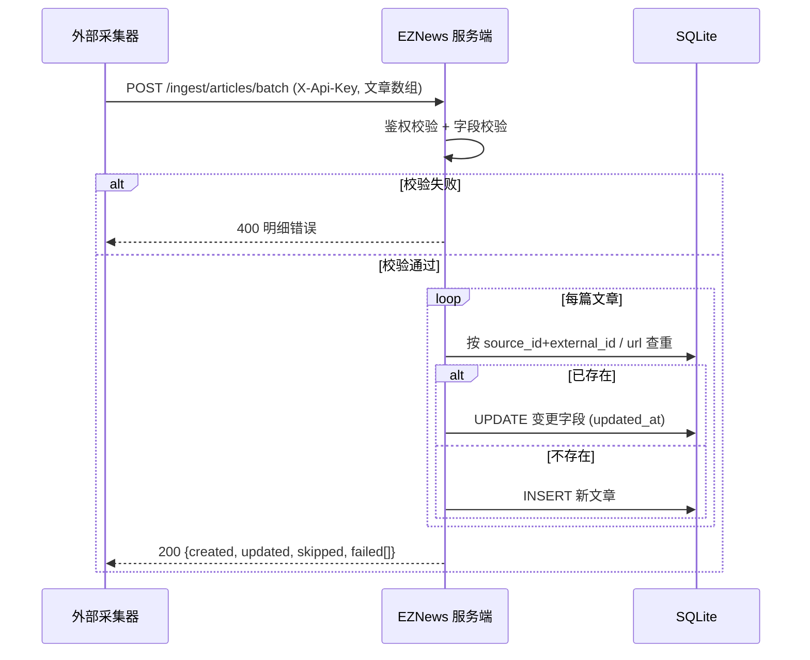
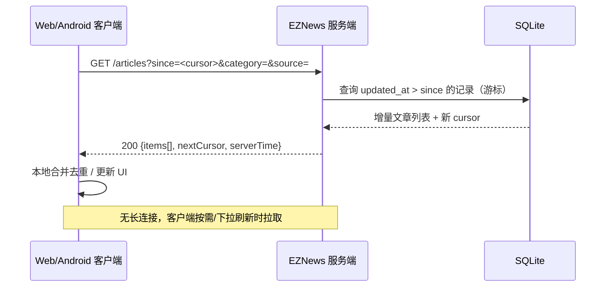
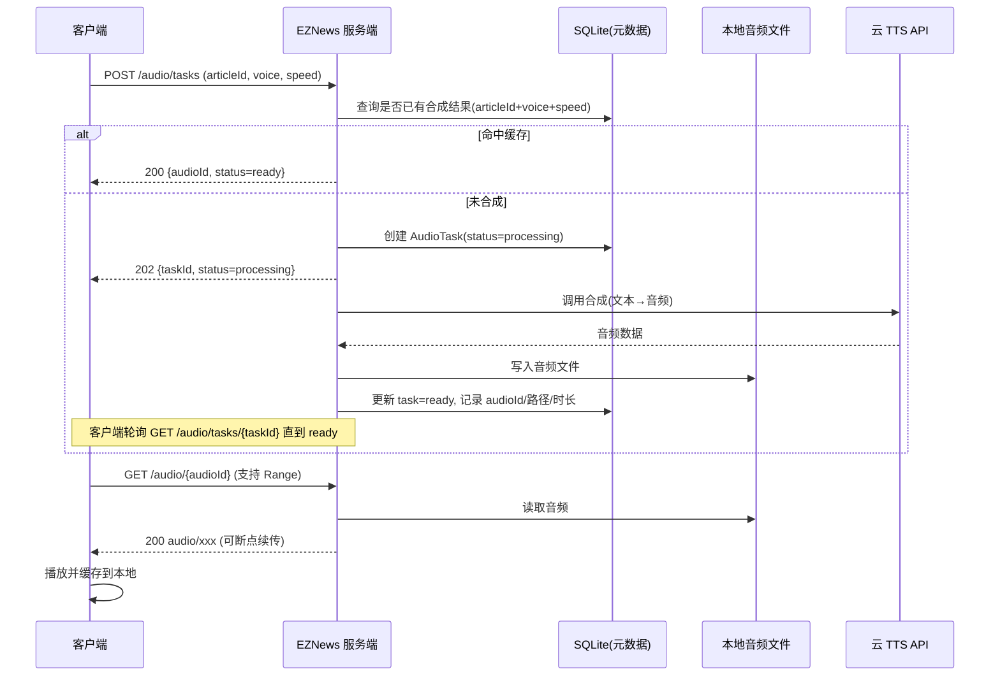

# EZNews 产品需求文档（PRD）

> 文档类型：简单 PRD ｜ 语言：简体中文 ｜ 版本：**v1.1**
> 项目代号：EZNews ｜ 工作区：`D:/dev/project/EZ/EZNews`
> 本期交付范围：**仅 PRD + 架构设计**，不写代码。

---

## 版本与变更说明

| 版本 | 日期 | 变更内容 |
| --- | --- | --- |
| v1.0 | 首轮 | 建立完整 PRD：产品目标、用户故事、功能需求池、关键流程、数据实体、非功能需求、UI 约定、待确认问题。 |
| **v1.1** | 账号体系增补 | 应追加需求「**把账号体系一块做了，不过不登录也可以使用当前的大部分功能，后续再设计登录后能用的功能**」，产品形态由「无账号」修订为「**游客可用 + 可选登录**」双态。<br>➡️ 账号体系详细设计见独立文档：**[`docs/PRD-ACCOUNT.md`](./PRD-ACCOUNT.md)**（含游客/登录功能对照、登录方式选型、会话凭证机制、游客数据合并策略、本期登录后功能范围、账号数据实体、隐私合规、v1.0 差异清单）。<br>🔄 **Q1 答案已修订**：原「不需要账号体系」推翻，改为「**游客可用 + 可选登录**」，详见 PRD-ACCOUNT.md §1、§4。<br>🔄 受影响的既有条目完整清单见 PRD-ACCOUNT.md **§9「与 v1.0 主 PRD 的差异清单」**（共 15 条），架构设计请以该清单逐条对照。<br>ℹ️ 除本章所述外，本文档其余章节内容保持 v1.0 原样，未重写。 |

---

## 0. 项目信息

| 项目 | 内容 |
| --- | --- |
| 原始需求 | 开发一个多端新闻工具程序，含 Web 端与 Android 端；聚合主流新闻网站消息；支持语音播报（语音由服务端合成后推送给客户端）；服务端定时自动收集新闻更新；客户端拉取最新消息。形态为 CS/BS 混合程序。 |
| 目标形态 | 单体（Monolith）服务 + Web 端 + Android 原生端；服务端不采集，仅提供 ingest 接收接口 |
| 技术栈 | 服务端：单体服务 + SQLite（单文件）｜ Web：Vite + React + MUI + Tailwind CSS｜ Android：Kotlin 原生 |
| 语音方案 | 国内云 TTS API（阿里云 / 腾讯云 / 讯飞），服务端合成，支持多实现可切换 |
| 核心约束 | **轻量省资源**：低内存、低 CPU、低依赖、易部署、易运维；**采集与存储分离** |

### 关键决策（已确认，不再推翻）

| 编号 | 决策 |
| --- | --- |
| D1 | Android 使用 **Kotlin 原生**开发 |
| D2 | 语音播报使用**国内云 TTS API**，**服务端合成**，客户端只播放音频，不做端侧朗读；支持多实现可切换 |
| D3 | **不做服务端推送**：无 WebSocket、无 FCM/极光等厂商推送、无长连接；客户端主动 REST 拉取/刷新 |
| D4 | 服务端**不做真实采集**：不爬虫、不解析 RSS、不抓网页；只对外提供 **ingest 接收接口**，采集由**独立采集器（后续独立工具）**完成并调用 ingest 写入 |
| D5 | 存储使用 **SQLite 单文件**，不引入独立数据库服务 |
| D6 | 架构为**单体服务**，一个进程承载全部能力，不做微服务拆分 |
| D7 | 核心目标**节省资源**（详见第 7 章非功能需求） |

---

## 1. 产品目标

**一句话定位**：EZNews 是一个轻量、可自托管的新闻聚合与语音播报工具——外部采集器把新闻写入服务端，Web 与 Android 端即时拉取浏览，并可一键让服务端合成语音、边听边刷。

### 目标原则

1. **轻量省资源优先** — 单体进程 + SQLite 单文件，依赖精简、无重型中间件、无冗余常驻任务；内存与 CPU 占用可控，镜像/部署体积小。
2. **采集与存储分离** — 服务端只做"接收 + 存储 + 查询 + 合成"，采集能力外置为独立采集器工具，通过 ingest 接口写入，服务端对未来采集方式保持无感。
3. **拉模式（Pull）而非推模式** — 客户端主动 REST 拉取，配合增量游标实现"只拉变化"，天然无需长连接，省电省流量。
4. **一次合成、多次复用** — 语音按需合成并缓存，重复请求命中缓存直接返回音频，避免重复调用云 TTS 造成费用与算力浪费。
5. **两端一致、体验可用** — Web 与 Android 共享同一套数据与 API，各端做差异化适配（Web 响应式 + 播放控件；Android 后台/锁屏播报 + 通知栏控制）。

---

## 2. 目标用户与场景

| 用户 | 场景 | 核心诉求 |
| --- | --- | --- |
| 通勤/运动用户 | 早晚通勤、跑步时**听**新闻，不便看屏幕 | Android 后台/锁屏语音播报、连续播放、音频离线缓存 |
| 桌面办公用户 | 工作间隙快速**扫**一眼当天要闻 | Web 端快速浏览、按源/分类筛选、收藏待读 |
| 内容偏好型用户 | 关注特定领域/小众源 | 自定义新闻源增删改、默认源开关、关键词搜索 |
| 自托管/技术用户 | 自己部署一套，把爱看的源聚合起来 | 部署简单、资源占用低、数据在自己手里 |
| **外部采集器（系统角色）** | 定时抓取/解析各源，把标准化新闻写入 EZNews | 稳定、幂等、可批量、有鉴权的 ingest 接口 |

---

## 3. 用户故事

### 3.1 Web 端用户

| 编号 | 用户故事 |
| --- | --- |
| US-W1 | 作为桌面办公用户，我希望打开网页就能看到按时间排序的全部新闻卡片流，以便快速扫一眼当天要闻。 |
| US-W2 | 作为有偏好的用户，我希望按分类或新闻源筛选列表，以便只看我关心的内容。 |
| US-W3 | 作为想听新闻的用户，我希望在列表/详情页点播放按钮让服务端合成语音并播放，以便边做事边听。 |
| US-W4 | 作为回访用户，我希望收藏/标记已读被记住（无需登录），以便下次接着看未读内容。 |
| US-W5 | 作为移动浏览器用户，我希望页面在小屏上自适应（侧栏收折、面板全屏），以便手机浏览同样顺手。 |

### 3.2 Android 端用户

| 编号 | 用户故事 |
| --- | --- |
| US-A1 | 作为通勤用户，我希望锁屏/切后台后新闻仍能继续语音播报，以便解放双手和视线。 |
| US-A2 | 作为播放中的用户，我希望通过通知栏控制暂停/继续/上一条/下一条，以便不解锁就控制播放。 |
| US-A3 | 作为流量敏感用户，我希望已下载的音频可离线播放、其他音频按需下载，以便省流量。 |
| US-A4 | 作为多任务用户，我希望来电或其他音频播放时正确让出/恢复音频焦点，以便不与其他 App 打架。 |
| US-A5 | 作为回访用户，我希望下拉刷新即拉到最新增量新闻，以便快速同步。 |

### 3.3 外部采集器（系统角色）

| 编号 | 用户故事 |
| --- | --- |
| US-C1 | 作为采集器，我希望通过一个带鉴权的接口**批量**提交标准化文章，以便一次写入多个源的更新。 |
| US-C2 | 作为采集器，我希望重复提交同一篇文章时服务端**幂等去重**（同 URL / 同外部 ID），以便多次重跑不产生脏数据。 |
| US-C3 | 作为采集器，我希望提交后能拿到"新增/更新/跳过"的数量反馈，以便自身做日志与重试判断。 |

---

## 4. 功能需求池

> 优先级：**P0 = 必须有（本期）/ P1 = 应该有 / P2 = 可以有（后续）**
> 所属端：服务端 / Web / Android / 采集器-外部

### 4.1 文章数据接收（Ingest API）

| 编号 | 需求名称 | 描述 | 优先级 | 所属端 |
| --- | --- | --- | --- | --- |
| F-ING-01 | 单篇提交 | `POST /api/v1/ingest/articles` 提交单篇标准化文章 | P0 | 服务端 |
| F-ING-02 | 批量提交 | `POST /api/v1/ingest/articles/batch` 一次提交多篇（上限如 200 篇/次） | P0 | 服务端 |
| F-ING-03 | 幂等去重 | 以外部唯一 ID（`source_id + external_id`）或规范化 URL 为去重键，命中则更新而非新增 | P0 | 服务端 |
| F-ING-04 | 字段校验 | 必填校验（title、url、source、published_at 等）+ 字段长度/格式校验，失败返回明细 | P0 | 服务端 |
| F-ING-05 | 鉴权 | 通过 API Key（Header `X-Api-Key`）鉴权，密钥可配置 | P0 | 服务端 |
| F-ING-06 | 提交结果回执 | 返回 `created / updated / skipped / failed` 计数与失败条目原因 | P0 | 服务端 |
| F-ING-07 | 采集器契约文档 | 对外发布 ingest 接口契约（字段、错误码、限流、示例） | P0 | 采集器-外部 |
| F-ING-08 | 限流/保护 | 简单限流（速率/体量上限），保护单体服务不被写爆 | P1 | 服务端 |

### 4.2 新闻源（Source）管理

| 编号 | 需求名称 | 描述 | 优先级 | 所属端 |
| --- | --- | --- | --- | --- |
| F-SRC-01 | 源列表查询 | 返回全部源（含默认源与自定义源）及启停状态 | P0 | 服务端 |
| F-SRC-02 | 新增源 | 新增自定义源：名称、URL、类型（RSS/Atom/API）、分类、备注 | P0 | 服务端 |
| F-SRC-03 | 编辑源 | 修改源名称/URL/类型/分类/描述 | P0 | 服务端 |
| F-SRC-04 | 启停源 | 单源启用/停用（停用后其文章默认不进入默认列表） | P0 | 服务端 |
| F-SRC-05 | 删除源 | 删除自定义源（默认源不可删，可停用） | P1 | 服务端 |
| F-SRC-06 | 默认源与分类 | 内置默认源 + 分类元数据（科技/财经/体育/国际/国内等） | P0 | 服务端 |
| F-SRC-07 | 源管理界面 | Web 端"管理来源"面板：默认源开关、自定义源增删改、添加表单 | P0 | Web |
| F-SRC-08 | 源元数据扩展 | 图标、语言、建议采集频率（供采集器参考） | P1 | 服务端 |
| F-SRC-09 | 源排序与分组 | 源在侧栏的分组/排序偏好 | P2 | Web |

### 4.3 文章查询 API

| 编号 | 需求名称 | 描述 | 优先级 | 所属端 |
| --- | --- | --- | --- | --- |
| F-QRY-01 | 分页列表 | `GET /api/v1/articles` 分页列表，按 `published_at` 倒序 | P0 | 服务端 |
| F-QRY-02 | 多条件过滤 | 按 `source`、`category`、时间区间过滤 | P0 | 服务端 |
| F-QRY-03 | 增量拉取游标 | 基于 `updated_at` 或自增 `id` 的 `since` 游标，只返回变化数据 | P0 | 服务端 |
| F-QRY-04 | 详情查询 | `GET /api/v1/articles/{id}` 返回文章详情 | P0 | 服务端 |
| F-QRY-05 | 关键词搜索 | 对 title/summary 做关键词搜索（SQLite FTS 或 LIKE，择轻量方案） | P1 | 服务端 |
| F-QRY-06 | 批量详情 | 一次按多 id 取详情（减少请求数） | P2 | 服务端 |
| F-QRY-07 | 列表刷新 | Web/Android 端手动刷新与下拉刷新触发增量拉取 | P0 | Web / Android |

### 4.4 TTS 语音播报

| 编号 | 需求名称 | 描述 | 优先级 | 所属端 |
| --- | --- | --- | --- | --- |
| F-TTS-01 | 按需合成 | 客户端请求某文章语音时，**首次**触发服务端调用云 TTS 合成 | P0 | 服务端 |
| F-TTS-02 | 合成缓存与复用 | 合成结果落盘（文件 + 元数据），命中缓存直接返回，**避免重复合成** | P0 | 服务端 |
| F-TTS-03 | 音频获取 | `GET /api/v1/audio/{id}` 返回音频文件（支持 Range/断点续传） | P0 | 服务端 |
| F-TTS-04 | 合成状态查询 | `GET /api/v1/audio/tasks/{taskId}` 返回 排队/合成中/完成/失败 | P0 | 服务端 |
| F-TTS-05 | 触发合成接口 | `POST /api/v1/audio/tasks` 提交待合成任务（按文章 id + 音色/语速） | P0 | 服务端 |
| F-TTS-06 | 音色/语速配置 | 支持配置默认音色与语速，可多实现切换（阿里/腾讯/讯飞） | P1 | 服务端 |
| F-TTS-07 | 播放控件 | Web/Android 播放/暂停/进度/语速切换 | P0 | Web / Android |
| F-TTS-08 | 合成失败处理 | 失败状态 + 重试接口；连续失败可回退备用 TTS 实现 | P1 | 服务端 |
| F-TTS-09 | 缓存清理策略 | 按容量/时间 LRU 清理过老音频，避免磁盘无限增长 | P1 | 服务端 |
| F-TTS-10 | 多篇连续播报（播放队列） | 客户端维护待播列表，逐条请求/播放音频 | P1 | Web / Android |

### 4.5 用户侧功能

| 编号 | 需求名称 | 描述 | 优先级 | 所属端 |
| --- | --- | --- | --- | --- |
| F-USR-01 | 新闻列表浏览 | 卡片流浏览（缩略图/标题/摘要/来源/时间/分类） | P0 | Web / Android |
| F-USR-02 | 分类/源筛选 | 顶部分类 Tab + 侧栏源筛选 | P0 | Web / Android |
| F-USR-03 | 收藏 / 已读标记 | 收藏、已读标记 ~~（原：默认无账号的本地偏好）~~ → **v1.1 修订为「游客本地 + 登录云端同步」双态**，详见 PRD-ACCOUNT.md §4 | P1 | Web / Android |
| F-USR-04 | 搜索入口 | 顶部搜索框，触发 F-QRY-05 | P1 | Web / Android |
| F-USR-05 | 偏好同步 | 多端偏好云同步 ~~（原 P2：需账号体系，暂不推荐）~~ → **v1.1 提升为 P1（F-ACC-03 音色/语速/播放设置同步）**，详见 PRD-ACCOUNT.md §6 | P1 | 服务端 |

### 4.6 Android 端特性

| 编号 | 需求名称 | 描述 | 优先级 | 所属端 |
| --- | --- | --- | --- | --- |
| F-AND-01 | 后台/锁屏播报 | 前台服务（Foreground Service）保障后台持续播放 | P0 | Android |
| F-AND-02 | 通知栏播放控制 | MediaStyle 通知：播放/暂停/上一条/下一条 | P0 | Android |
| F-AND-03 | 音频焦点处理 | 来电/其他音频时暂停并让出焦点，结束后恢复 | P0 | Android |
| F-AND-04 | 离线音频缓存 | 已下载音频本地持久缓存，离线可播 | P1 | Android |
| F-AND-05 | 增量拉取刷新 | 下拉刷新 + 冷启动增量同步 | P0 | Android |
| F-AND-06 | 息屏/省电兼容 | 适配 Doze，避免被系统杀后台 | P1 | Android |
| F-AND-07 | 本地偏好存储 | 收藏/已读/音色偏好存本地（Room / DataStore） | P1 | Android |

### 4.7 Web 端特性

| 编号 | 需求名称 | 描述 | 优先级 | 所属端 |
| --- | --- | --- | --- | --- |
| F-WEB-01 | 响应式布局 | 桌面：卡片 + 侧边栏；移动：侧栏收折、面板改全屏模态 | P0 | Web |
| F-WEB-02 | 播放控件 | 底部/内嵌播放器，含进度、语速、队列 | P0 | Web |
| F-WEB-03 | 空态与加载态 | 骨架屏加载、无数据空态、错误重试 | P0 | Web |
| F-WEB-04 | 交互状态细化 | hover/active/focus 态、按钮禁用态 | P1 | Web |
| F-WEB-05 | 源管理面板 | 复用 F-SRC-07 的模态/抽屉面板 | P0 | Web |
| F-WEB-06 | 本地偏好存储 | 收藏/已读存 localStorage/IndexedDB | P1 | Web |

### 4.8 运维与配置

| 编号 | 需求名称 | 描述 | 优先级 | 所属端 |
| --- | --- | --- | --- | --- |
| F-OPS-01 | 健康检查 | `GET /healthz` 返回进程与 DB 状态 | P0 | 服务端 |
| F-OPS-02 | 配置管理 | TTS 密钥、ingest API Key、缓存目录、端口等通过配置文件/环境变量管理 | P0 | 服务端 |
| F-OPS-03 | 采集频率说明 | 服务端**不调度采集**，仅提供源级建议频率供外部采集器参考 | P0 | 服务端 |
| F-OPS-04 | 结构化日志 | 轻量结构化日志（请求、ingest、TTS 关键事件） | P1 | 服务端 |
| F-OPS-05 | 基础监控 | 关键指标（文章总数、当日入库数、TTS 合成/命中数、错误数） | P1 | 服务端 |
| F-OPS-06 | 一键部署 | 单进程启动 + 单文件 DB，提供 Docker 镜像/单机运行说明 | P0 | 服务端 |

---

## 5. 关键流程描述

### 5.1 外部采集器 → 服务端入库



### 5.2 客户端拉取增量新闻



### 5.3 客户端请求语音播报 → 服务端合成/命中缓存 → 返回音频



> 说明：**不引入任务队列中间件**。合成任务以 `AudioTask` 表记录状态，由单体进程内的轻量执行器（如受限并发 worker）处理，避免额外的常驻组件与资源开销。

---

## 6. 数据实体定义

### 6.1 Source（新闻源）

| 字段 | 类型 | 说明 |
| --- | --- | --- |
| id | INTEGER PK | 自增主键 |
| name | TEXT | 源名称 |
| url | TEXT | 源地址（RSS/Atom/API） |
| type | TEXT | 类型：rss / atom / api |
| category | TEXT | 分类（tech/finance/sports/...） |
| is_default | INTEGER | 是否系统默认源 |
| enabled | INTEGER | 是否启用 |
| suggest_interval | INTEGER | 建议采集间隔（秒，供采集器参考） |
| created_at / updated_at | DATETIME | 时间戳 |

### 6.2 Article（文章）

| 字段 | 类型 | 说明 |
| --- | --- | --- |
| id | INTEGER PK | 自增主键 |
| source_id | INTEGER FK | 所属源 |
| external_id | TEXT | 采集器侧唯一 ID（用于去重） |
| url | TEXT | 原文链接（规范化后做去重键） |
| title | TEXT | 标题 |
| summary | TEXT | 摘要 |
| content | TEXT | 正文（见待确认 Q3，默认仅存摘要/可选正文） |
| category | TEXT | 分类 |
| published_at | DATETIME | 发布时间 |
| created_at | DATETIME | 入库时间 |
| updated_at | DATETIME | 更新时间（增量游标依据） |
| **去重键1** | UNIQUE | `source_id + external_id` |
| **去重键2** | UNIQUE | `url`（规范化） |

### 6.3 AudioTask / Audio（语音任务与音频）

| 实体 | 字段 | 说明 |
| --- | --- | --- |
| AudioTask | id | 任务主键 |
| | article_id | 关联文章 |
| | voice / speed | 音色与语速（缓存键的一部分） |
| | status | pending / processing / ready / failed |
| | error_msg | 失败原因 |
| | created_at / updated_at | 时间戳 |
| | **唯一键** | `article_id + voice + speed`（防重复合成） |
| Audio | id | 音频主键 |
| | task_id | 关联任务 |
| | file_path | 本地音频文件路径 |
| | format | 音频格式（如 mp3） |
| | duration_ms | 时长 |
| | size_bytes | 文件大小（用于缓存清理） |
| | created_at | 时间戳 |

### 6.4 去重规则汇总

| 场景 | 去重键 | 命中行为 |
| --- | --- | --- |
| 文章入库 | `source_id + external_id` | 更新已有记录，刷新 updated_at |
| 文章入库（无 external_id） | 规范化 `url` | 同上 |
| 语音合成 | `article_id + voice + speed` | 直接返回已有音频，不调用云 TTS |

---

## 7. 非功能性需求

### 7.1 资源占用（重点）

| 维度 | 目标 / 策略 |
| --- | --- |
| 进程模型 | **单体单进程**；I/O 密集用轻量异步/协程模型（如 Go goroutine 或 Python async），避免大连接池与重型线程池 |
| 常驻内存 | 目标 **< 150 MB**（含 SQLite 页缓存）；无内置定时采集任务，无空闲轮询 |
| CPU | 空闲时近 0 占用；TTS 合成为突发事件，限制**并发上限（如 2~4）**避免打满 |
| SQLite 写入 | 开启 WAL 模式 + `synchronous=NORMAL`；批量 ingest 使用**单事务批写**；定期 `PRAGMA optimize` |
| 依赖精简 | 不引入 Redis / MQ / 搜索引擎等中间件；搜索优先用 SQLite FTS5（内置）或 LIKE |
| 部署体积 | 单二进制/单容器，无外置 DB；镜像体积目标**尽量小**（如 < 100 MB） |
| 音频缓存 | 落盘 + 容量上限 + LRU 清理，避免磁盘膨胀 |

### 7.2 性能

| 指标 | 目标 |
| --- | --- |
| 列表查询 P95 | < 200 ms（数据量 ≤ 10 万篇） |
| ingest 批量写入 | ≥ 500 篇/秒（本地 SQLite 批事务） |
| TTS 命中缓存响应 | < 100 ms |
| 音频接口 | 支持 Range 断点续传，首字节 < 300 ms |

### 7.3 安全性

| 项 | 策略 |
| --- | --- |
| ingest 鉴权 | API Key（Header），密钥可配置且不入库明文日志 |
| 传输 | 生产建议 HTTPS（由部署层提供） |
| 输入校验 | 严格字段校验与长度限制，防注入（参数化 SQL） |
| TTS 密钥 | 仅服务端持有，绝不下发客户端 |

### 7.4 可扩展性

- **采集与存储分离**：新增采集方式只需实现 ingest 契约，服务端无感，不影响服务端代码。
- **TTS 多实现**：抽象 `TtsProvider` 接口，阿里/腾讯/讯飞可插拔切换。
- **查询 API 版本化**：`/api/v1`，为后续兼容演进预留空间。

### 7.5 兼容性

| 端 | 要求 |
| --- | --- |
| Web | Chrome / Edge / Safari 最新两个大版本；移动浏览器适配 |
| Android | Kotlin 原生；最低支持版本见待确认 Q5（建议 Android 8.0 / API 26） |
| 服务端 | 单一可执行文件/容器，Linux/macOS/Windows 单机可跑 |

---

## 8. UI 设计稿约定

> 沿用既有设计偏好：**中性 slate + 蓝色强调**；**卡片 + 侧边栏工作区**布局；字体 **Noto Sans SC**。

### 8.1 Web 端 —— 桌面布局

```
┌──────────────────────────────────────────────────────────────┐
│ [EZNews]        [ 搜索新闻、来源、关键词…  🔍 ]   [管理来源][我]│
├──────────────┬───────────────────────────────────────────────┤
│ 新闻来源      │ 全部新闻                         2分钟前更新 ▼最新 │
│ 全部新闻 (36) │ ┌ 全部 ┐科技 ┌财经 ┐体育 ┌国际 ┐                 │
│ ── 默认来源 ─ │ ┌───────────────────────────────────────────┐ │
│ 科技日报  [●] │ │ [图] AI 芯片出口新规落地，半导体板块集体走高 │ │
│ 财经早报  [●] │ │      摘要…   财经早报 · 2分钟前 · 财经        │ │
│ 体育快讯  [○] │ └───────────────────────────────────────────┘ │
│ ── 我的来源 ─ │ ┌───────────────────────────────────────────┐ │
│ 少数派    [●] │ │ [图] 新一代折叠屏手机发布…                  │ │
│ 个人博客  [○] │ └───────────────────────────────────────────┘ │
│ + 添加自定义源 │  …（卡片流）                    [ ▼ 底部播放器 ]│
└──────────────┴───────────────────────────────────────────────┘
```

- 卡片：缩略图 + 标题 + 摘要 + 来源徽标/时间/分类（见既有原型）。
- 顶部：全局搜索框 + 分类 Tab；右上"管理来源"入口。

### 8.2 Web 端 —— "管理新闻来源"面板（模态/抽屉）

```
┌───────────────────────────────────┐
│ 管理新闻来源                   [×] │
│ 默认来源（系统预置）                │
│  科技日报  [●]   财经早报 [●]  …    │
│ 自定义来源                          │
│  少数派  https://sspai.com/feed  编辑 删除 │
│  个人博客 https://myblog/atom    编辑 删除 │
│ 添加自定义来源                      │
│  [来源名称]        [RSS ▾]          │
│  [https://example.com/feed.xml]     │
│  [ 添加来源 ]                       │
└───────────────────────────────────┘
```

### 8.3 响应式（移动 Web）

| 断点 | 布局变化 |
| --- | --- |
| ≥ 1024px | 侧栏常驻 + 卡片流双栏/单栏 |
| 768–1023px | 侧栏收折为抽屉，卡片流单栏 |
| < 768px | 侧栏隐藏为顶部菜单；"管理来源"改为**全屏模态**；播放器改底部固定条 |

### 8.4 Android 端页面结构

```
[主页] 顶栏(搜索) + 分类 Tab + 卡片列表 + 下拉刷新
   └ 侧滑抽屉：新闻来源筛选（默认源 / 自定义源开关）
[详情页] 标题 + 来源/时间 + 摘要/正文 + [ ▶ 播放 ] 按钮
[播放器] 底部常驻 mini 播放条 → 展开全屏播放器（进度/语速/队列/上一条/下一条）
[通知栏] MediaStyle 控制：▶/⏸ / ⏮ / ⏭ （锁屏可见）
```

- 复用同一视觉语言：slate 中性色 + 蓝色强调，Noto Sans SC。

---

## 9. 待确认问题（需用户拍板）

| 编号 | 问题 | 我方推荐默认值 |
| --- | --- | --- |
| ~~Q1~~ | ~~是否需要用户账号体系？~~ | **✅ v1.1 已结论（原推荐作废）**：采用「**游客可用 + 可选登录**」双态——不登录可用绝大部分功能（浏览/筛选/搜索/播放/源管理/本地收藏），登录后提供跨设备同步增强。**详见 [`docs/PRD-ACCOUNT.md`](./PRD-ACCOUNT.md)**。 |
| Q2 | 默认接入哪个云 TTS 厂商？ | **默认腾讯云 TTS**（接入简单、音色自然、按量计费），同时抽象 `TtsProvider` 支持阿里云/讯飞切换。最终由用户拍板。 |
| Q3 | 文章是否存储全文？ | **默认仅存标题+摘要**，正文不落地（省存储、省带宽、降低版权风险）；如需要可增加"按需抓正文"开关。 |
| Q4 | SQLite 是否需要定期归档清理？ | **需要**。建议保留最近 N 天（如 90 天）文章 + 音频按容量 LRU 清理，提供配置项；默认归档策略保守，避免误删。 |
| Q5 | Android 最低支持版本？ | **Android 8.0 / API 26**（覆盖率高，且满足前台服务与通知栏播放控制的实现成本与省电平衡）。 |
| Q6 | ingest 是否做限流？ | **建议做轻量限流**（如 100 req/s 与 200 篇/请求），保护单体服务；默认开启，可配置关闭。 |
| Q7 | **ingest 接口契约字段**（采集器与服务的边界）是否由本 PRD 直接定稿？ | 本 PRD 已给出核心字段与去重键；**建议架构师据此产出正式 OpenAPI/契约文档**，再交由采集器侧对齐。此为最关键的跨系统边界，**需用户确认后方可冻结**。 |

---

## 10. 附录：术语表

| 术语 | 含义 |
| --- | --- |
| Ingest | 外部采集器向服务端提交文章数据的接收动作 |
| 采集器 | 独立于本服务的工具，负责实际爬取/解析，通过 ingest 写入（本期不实现） |
| 增量游标 | 客户端基于 `updated_at` / 自增 id 只拉取变化数据的机制 |
| AudioTask | TTS 合成任务，记录合成状态与缓存键 |
| TtsProvider | 云 TTS 实现的抽象接口，支持多厂商切换 |
</content>
</invoke>
